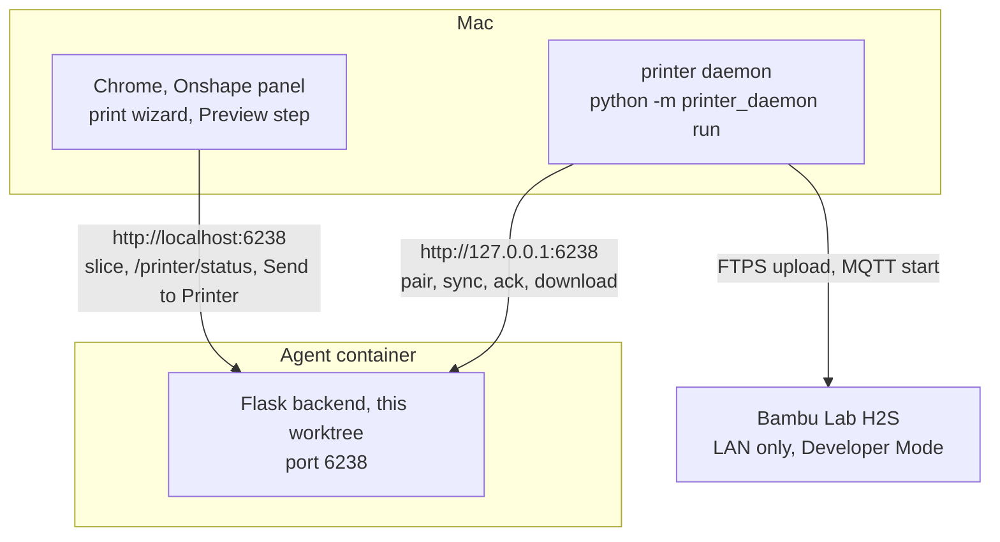

# Testing the printer relay from a Mac

**Backend in the agent container, daemon on the Mac, a real Bambu Lab H2S on the LAN.**

This is the recipe for exercising the whole relay, pairing included, before any of it goes
near a Raspberry Pi. It is the developer companion to [PRINTER_SETUP.md](https://github.com/6238/PenguinCAM/blob/main/docs/PRINTER_SETUP.md),
which is the mentor's guide. Read section 10 of that guide first if the pieces are new to
you.

---

## 1. The shape of the test



Three facts decide everything below:

- **The Mac reaches a server in the container at `127.0.0.1:6238`, and only there.** Port
  6238 is the one the Onshape dev app's redirect URL is pinned to, so whichever server holds
  it owns the Onshape panel. The daemon on the Mac talks to the same address.
- **The Mac cannot see the container's disk.** The worktree lives on the container's own
  volume. The daemon reaches the Mac as one archive served by the container's viewer server
  (section 3). No commit and no push are involved, so a fix to the daemon is a rebuild and a
  re-download away.
- **This branch sits on top of `feature/3d-print-stage1`.** The print wizard, the slicer and
  the Send to Printer item are all in one server, so the whole path is tested from the
  wizard in the Onshape panel, the way a student would use it. When stage-1 takes a bug fix,
  rebase this branch onto it again.

---

## 2. What is in place for this

Nothing here needs a Pi. These are the switches the feature already had, plus what was
added for this test.

**In the daemon** (`print/printer_daemon/`):

- `pair --backend <url>` points it at any backend, and `--config <path>` keeps the config
  file somewhere that needs no `sudo` (the default is `/etc/penguincam-printer/config.toml`).
- `pair --dev` is the only thing that lets the daemon talk plain HTTP. It is recorded in the
  config file as `dev = true`, and only when the URL really is `http://`. `run` warns at
  every start while it is on.
- `pair` on a machine with no `penguincam` user and no `systemd` prints a note for each and
  carries on. Those notes are expected on a Mac.
- The daemon joins the backend URL from its config with the download path a job carries, so
  a backend the browser reaches as `localhost` works with no extra configuration.
- Downloads land in `/var/tmp/penguincam-printer`, which exists and is writable on macOS.
- **Added for this test:** the daemon logs each stage of a job (downloading, uploading,
  starting, waiting) and the outcome it acknowledged, so a terminal on the Mac shows what a
  Pi's journal would.

**In the backend and the wizard:**

- Development mode is Flask's debug flag on and `RAILWAY_ENVIRONMENT` absent. The server
  started as [CLAUDE.md](https://github.com/6238/PenguinCAM/blob/main/CLAUDE.md) describes is in it. In development mode the daemon
  routes accept plain HTTP.
- `PRINTER_DEV_PAIRING_CODE`, read only in development mode, seeds a relay record for that
  code so a daemon can pair without anybody opening Onshape.
- **Added for this test:** `print/static/printer_panel.js` is wired into the print wizard. The
  page loads it after `print_wizard.js`, the wizard exposes the slice's download token and
  accepts `printer` as a remembered split-button choice, the bootstrap carries
  `printerEnabled` (true when the session's Onshape config has a pairing code, never in the
  upload flow), and `wizard.css` styles the status line and the refusal message. The
  details are in section 10 of [PRINTER_SETUP.md](https://github.com/6238/PenguinCAM/blob/main/docs/PRINTER_SETUP.md).

---

## 3. Before the test: get the daemon to the Mac

The daemon is the `print/printer_daemon/` directory and nothing else. `make daemon-tarball` in the
worktree packs it, with a copy of this guide, into `dist/penguincam-printer-daemon.tar.gz`
(`dist/` is git-ignored). The container's viewer server serves the worktree read-only to the
Mac, so the archive is one URL away:

```
http://127.0.0.1:6249/PenguinCAM/.worktrees/printer-relay/dist/penguincam-printer-daemon.tar.gz
```

Open that in the Mac's browser, or fetch it from a Mac terminal:

```
cd ~/Downloads
curl -sSO http://127.0.0.1:6249/PenguinCAM/.worktrees/printer-relay/dist/penguincam-printer-daemon.tar.gz
tar -xzf penguincam-printer-daemon.tar.gz
cd penguincam-printer-daemon
```

The port is the viewer's, the repo's port base plus nineteen. If the URL does not answer, the
viewer is not running; in the container, `open dist/penguincam-printer-daemon.tar.gz` starts
it and queues the download in the Mac's browser in one go.

**After a change to the daemon:** `make daemon-tarball` in the container, download and
unpack again over the old directory, restart `run`. The config file written in 4.3 lives in
your home directory, not in the unpacked tree, so it survives every re-download and pairing
is not repeated.

Nothing on the Mac is run from a git checkout, and the branch does not have to be committed
or pushed for any of this.

---

## 4. Step by step

### 4.1 Put the H2S in LAN-only mode with Developer Mode, and match the profile set

Section 3 of [PRINTER_SETUP.md](https://github.com/6238/PenguinCAM/blob/main/docs/PRINTER_SETUP.md). Note the access code and the IP address
from the printer's screen. Give the printer a DHCP reservation if you have not already.

While you are at the machine, set it up for what PenguinCAM actually slices. The fixed
profile set is in `print/profiles/` and explained in [3D_PRINTING.md](https://github.com/6238/PenguinCAM/blob/main/docs/3D_PRINTING.md):

| The slice asks for | On the printer |
|---|---|
| Generic PETG, nozzle 255 C | PETG on the **external spool**, and the spool set to PETG on the screen |
| Textured PEI Plate, bed 70 C | the **textured** plate on the bed, not the smooth one |
| 0.6 mm High Flow hardened steel nozzle | the 0.6 mm High Flow nozzle fitted |

The daemon starts every print with the AMS off, so the external spool is what prints. The
plate and the material travel inside the sliced file, so neither the daemon nor the relay
can check them: a mismatch shows up as a refused start, or as a part that does not stick.

### 4.2 Install the daemon's dependencies on the Mac

Python 3.11 or newer is required (the daemon reads TOML with the standard library). In the
unpacked `penguincam-printer-daemon` directory:

```
uv venv                                                   # once
uv pip install -r printer_daemon/requirements.txt         # bambulabs_api, requests, tomli-w
uv run python -m unittest discover -s printer_daemon/tests -t . --buffer
```

Every `uv run` below is run from that same directory, so `python -m printer_daemon` finds
the package and `uv run` finds the `.venv`. The suite green on the Mac is itself a result
worth having: the macOS install path had not been run before this.

### 4.3 Pair on the Mac

`pair` talks to the printer, not to the backend, so the backend does not have to be up yet.

```
uv run python -m printer_daemon pair \
    --config ~/penguincam-printer.toml \
    --backend http://127.0.0.1:6238 \
    --dev
```

What to expect:

- It listens for printers for five seconds. On a home network the H2S may well show up in
  the list; pick its number. If nothing is heard, type the IP address and the serial number.
  macOS may ask whether Python can accept incoming connections; either answer works, because
  typing the address is always available.
- It asks for the LAN access code, connects over MQTT and prints the model and name the
  printer reports. If it says the printer did not answer, nothing was saved; check Developer
  Mode and the access code.
- It prints the pairing code and the two YAML lines. **Keep the code**; it is used in every
  step from here on.
- Two notes follow, and both are expected on a Mac: no `penguincam` user, so the file keeps
  your ownership, and no `systemctl`, so nothing was restarted.

`--dev` was needed because the URL is `http://`. Without it `pair` refuses the URL and
writes nothing.

### 4.4 Put this worktree's backend on port 6238

Port 6238 is held by the stage-1 checkout's server today (`/repos/popcornpenguins/PenguinCAM`,
branch `feature/3d-print-stage1`, started by another agent session). It has to be stopped
and this worktree's server started in its place. Either ask the session that owns it, or do
it by hand in the container:

```
pgrep -af frc_cam_gui_app.py         # note the parent pid, the one whose command is "uv run ..."
kill <parent pid>                    # kill -9 if it lingers
curl -sI http://localhost:6238/      # must now fail to connect
```

Then, from a shell that has the Onshape secrets in its environment (a new agent session's
shell does; check with `env | grep -c ONSHAPE_CLIENT_ID`, which must print 1):

```
cd /repos/popcornpenguins/PenguinCAM/.worktrees/printer-relay
EMBED_COOKIES=1 uv run python frc_cam_gui_app.py 2>&1 | tee /tmp/penguincam-relay.log
```

Run it in the background with its output going to that log, then the three checks from the
workspace's own instructions: `curl -sI http://localhost:6238/` answers 200, the log contains
`Session cookie: SameSite=None; Secure`, and the redirect below names the dev client id and
`redirect_uri=http://localhost:6238/onshape/oauth/callback`:

```
curl -s -o /dev/null -D- http://localhost:6238/onshape/auth | grep -i '^location'
```

A client id starting with `VKDK` is the production fallback, which means the secrets never
reached the shell. Flask's reloader means two processes and a doubled banner.

Leave `PRINTER_DEV_PAIRING_CODE` unset for the first run. The point of the next step is to
see the real pairing path work, and the seed would short-circuit it.

### 4.5 Start the daemon on the Mac and watch it pair

```
uv run python -m printer_daemon run --config ~/penguincam-printer.toml 2>&1 | tee ~/penguincam-printer.log
```

It logs a development-mode warning naming the URL, then
`waiting for the pairing code to appear in the team config`, once a minute. It is asking the
backend every thirty seconds and being told 404, which is right: no session has presented
the code yet.

Now present it the real way. Add to the team's `PenguinCAM-config.yaml` in Onshape:

```yaml
printing:
  pairing_code: "XXXX-XXXX"
```

Open PenguinCAM in the Onshape panel in Chrome and click the config refresh link in the
header. That refresh is the whole pairing handshake from the browser's side: loading the YAML
tells the relay the code exists. Within thirty seconds:

- the daemon logs `paired with the backend`, and from then on syncs every five seconds;
- the backend log shows `Printer daemon paired for code XXXX-XXXX`;
- in the same Chrome, `http://localhost:6238/printer/status` returns JSON with `paired`,
  `online` and a `status` block whose `state` is `idle` and whose `printer` names the H2S.
  That is the status line's data; the wizard that renders it is on the other branch.

From the Mac, without disturbing the running daemon:

```
uv run python -m printer_daemon status --config ~/penguincam-printer.toml
```

It should say the token is set, the printer is answering, and the backend is reachable with
`online=True`.

That is the authentication flow tested end to end: code minted on the Mac, presented through
Onshape, exchanged for a signed token, token used on every sync.

### 4.6 Send a real print from the wizard

In the Onshape panel, open the print wizard and go through Setup, Parts and Layout to
Preview, and slice. Under the slice summary the status line reads `Printer idle`, and the
split button at the bottom has grown a caret. Open it and choose **Send to Printer**. The
main button takes that label and remembers it, as it does for Drive.

In order:

1. The status line reads `Sending to printer`, and the backend log shows
   `Printer job j<id> queued`.
2. The daemon's next sync picks it up. Its log shows `downloading the sliced file`,
   `uploading to the printer as <name>-j<id>.gcode.3mf`, `starting the print`, and
   `start accepted; waiting for the printer to report` that name. The status line reads
   `Printer starting <name>`.
3. The H2S starts the print. The daemon sees its own file name in the printer's report and
   logs `job j<id> acknowledged: ok`; the backend log shows the same acknowledgement, and
   the status line reads `Printing <name>, 3 percent, 31 min left`.

A refused send shows its reason in the error box under the summary, in the same words the
status line uses, and the item is disabled with that text as its tooltip while the printer
is busy or offline.

The deadlines are the real ones: three minutes for the daemon to pick the job up, fifteen
for the printer to confirm it, one minute for the start command to show up in the printer's
report. A job that misses one is logged as expired on the backend and acknowledged as failed
on the daemon, and the status line shows the failure for ten minutes.

### 4.7 Capture the printer's own status document

This is the one thing the built feature is still waiting on. The state mapping in
`print/printer_daemon/printer.py` was written against the library's documented field names, and
`print/printer_daemon/tests/fixtures/h2s_status.json` is provisional until it comes from a real
H2S. The smoke test prints the raw document and pins the fixture. It talks to the printer
directly, no backend involved, and **it starts a print**:

```
PENGUINCAM_PRINTER_IP=<ip> \
PENGUINCAM_PRINTER_SERIAL=<serial> \
PENGUINCAM_PRINTER_ACCESS_CODE=<access code> \
PENGUINCAM_SMOKE_FILE=part.gcode.3mf \
uv run python printer_daemon/tests/smoke_test.py
```

Stop the daemon before running it, so the two are not both talking MQTT to the printer, and
keep the output. It answers verification tasks 1, 2 and 4 from the spec.

---

## 5. When something is off

**`Refusing a plain-HTTP backend URL`** from `pair` or `run`: `--dev` was not given, or the
config file was edited by hand and lost `dev = true`. Re-run `pair` with `--dev`.

**The daemon reports 403 `HTTPS required`**: the backend is not in development mode. Either
`FLASK_ENV=production` is set in its shell, or `RAILWAY_ENVIRONMENT` is. Neither belongs in
the container.

**The daemon waits for the pairing code forever**: the relay has not seen the code. The YAML
was not refreshed (click the header link, then wait up to thirty seconds), the code in the
YAML differs from the one `status` prints, or the backend has restarted since the refresh.
Any file edit in the worktree restarts it, because the reloader is on, and the in-memory
relay starts empty. Click the refresh link again. To make restarts painless once the real
path has been seen working, start the backend with `PRINTER_DEV_PAIRING_CODE=XXXXXXXX`
(eight symbols, no dash needed) and the code is seeded on every request.

**`the backend rejected our token; re-pairing`** after a backend restart: expected in the
container, where `FLASK_SECRET_KEY` is unset and every start makes a new key. The daemon
re-pairs by itself as soon as the code is presented again.

**No status line under the slice summary, no caret on the split button**: the page was
loaded before the YAML with the code was, or the code is not in the YAML the session holds.
Click the config refresh link in the header, which reloads the page, and check Chrome's
console for lines starting `printer panel:`, which name any selector the panel could not
find.

**The status line is there but the menu has no Send to Printer**: the wizard has not
exposed the download token, which happens only after a slice succeeds. Slice first.

**The panel in Onshape no longer logs in** after the server switch: the new server was
started from a shell without the Onshape secrets. A server without them still answers 200,
which is why the port check alone is not enough; the `/onshape/auth` redirect check in 4.4
tells the two apart.

**Two daemons, one code**: the backend refuses a second exchange while the first daemon is
alive, by design. If a stale `run` is still going somewhere, stop it, or wait two minutes.

---

## 6. What to bring back

- Whether the daemon's suite passed on macOS.
- The pairing code's journey: the three log lines in 4.5, or where it stopped.
- The job id and the daemon log from 4.6, and whether the H2S printed the part, including
  whether a thumbnail-less `.gcode.3mf` loaded cleanly.
- What the status line showed at each step, against the table in section 7 of
  [PRINTER_SETUP.md](https://github.com/6238/PenguinCAM/blob/main/docs/PRINTER_SETUP.md).
- The raw status document from 4.7, to replace the provisional fixture.
- Anything `bambulabs_api` 2.6.6 did not understand about the H2S. The `use_ams=False`
  start and the state mapping are the two places a first real print is most likely to
  disagree with the code.
