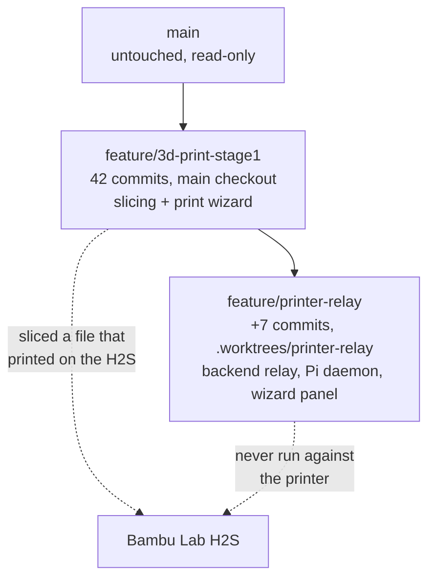

# 3D printing: where we left off, 2026-09-14

Notes for picking this up after a break. Nothing here is pushed; both branches are local
only, `main` is untouched. Fuller background: the spec
[2026-09-13-3d-print-slicing-design.md](https://github.com/6238/PenguinCAM/blob/main/docs/specs/2026-09-13-3d-print-slicing-design.md), the relay
spec [2026-09-13-bambu-printer-relay-design.md](https://github.com/6238/PenguinCAM/blob/main/docs/specs/2026-09-13-bambu-printer-relay-design.md),
and the developer guide [3D_PRINTING.md](https://github.com/6238/PenguinCAM/blob/main/docs/3D_PRINTING.md).

## The two branches



- `feature/3d-print-stage1` lives in the main checkout `/repos/popcornpenguins/PenguinCAM`.
- `feature/printer-relay` is cut on top of it, in the linked worktree
  `/repos/popcornpenguins/PenguinCAM/.worktrees/printer-relay`. Work there; do not check it
  out in the main checkout.
- Neither branch has been pushed, and no pull request exists. Nothing is merged.

## What is actually proven

Slicing works, end to end, on real hardware:

- A `.gcode.3mf` produced by `feature/3d-print-stage1` — the current profile set, Bambu Lab
  H2S with the 0.6 mm High Flow nozzle, Generic PETG, textured PEI plate — printed
  successfully on the team's H2S.
- The archive carries no thumbnail, and that turned out not to matter: the file loaded
  cleanly.
- Bambu Studio opens the file but ignores the slice, offering to re-slice it as if it were a
  bare mesh; Orca Slicer reads it properly. Noted, not a problem: prints go through the relay
  or through Orca. Not worth time.
- Orca Slicer was installed on the Mac by hand, not with `make install`, so the macOS
  install script is still unexercised.

## What is not proven

**The printer relay has never talked to the printer.** Everything on
`feature/printer-relay` — the backend routes, the in-memory relay, the Raspberry Pi daemon,
the Send to Printer item in the wizard — has only unit tests. No pairing handshake, no job,
no MQTT start has ever run against the H2S.

The procedure for testing it from the Mac, with the daemon on the Mac instead of a Pi, is
written and ready: [PRINTER_DEV_TESTING.md](https://github.com/6238/PenguinCAM/blob/main/docs/guides/PRINTER_DEV_TESTING.md). It is a step-by-step
recipe — get the daemon tarball to the Mac, pair, present the code through the Onshape YAML,
send a job from the wizard. Section 6 lists what to bring back. Also still open from it:
`print/printer_daemon/tests/fixtures/h2s_status.json` is provisional, written from the
library's documentation rather than a real H2S; section 4.7's smoke test captures the real
document (it starts a print).

## Resuming in the worktree

```
cd /repos/popcornpenguins/PenguinCAM/.worktrees/printer-relay
make test-quick          # unit tests, no Orca slice
make test                # the above plus a real Orca slice
```

The development server, per the
workspace `CLAUDE.md` (`/repos/popcornpenguins/CLAUDE.md`), binds port 6238 from whichever checkout starts it, and
nothing is running on it now. Start it from the worktree when testing the relay:

```
EMBED_COOKIES=1 uv run python frc_cam_gui_app.py
```

Then the three checks in that file: 200 on `/`, `Session cookie: SameSite=None; Secure` in
the log, and an `/onshape/auth` redirect naming the dev client id.

## Open questions

1. Does `make install` work on macOS? Never run — Orca was installed by hand.
2. The Railway plan's vCPU and memory, against `MAX_RUNNING` in `print/jobs.py`.

## Next piece of work

**Onshape integration: get the model from Onshape instead of the hardcoded STL.** Today the
print path slices one fixed part, `print/sample_part.stl`, and the delivered file is always
named `sample_part.gcode.3mf` (`print/routes.py`). The wizard's Parts step exists but has
nothing real to choose from. That is the next feature, and it is a brainstorm-first job, not
a straight build.
