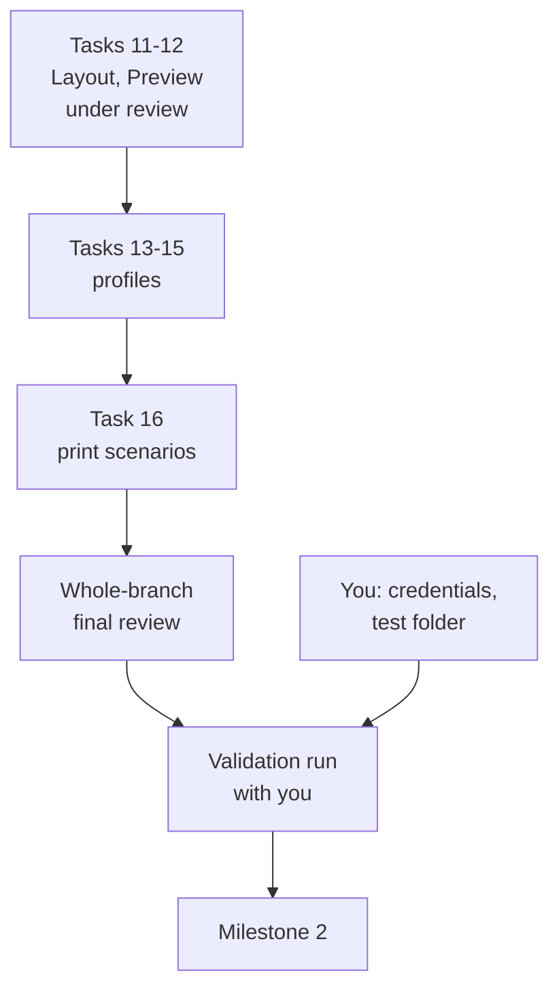
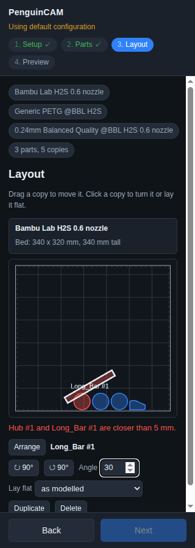
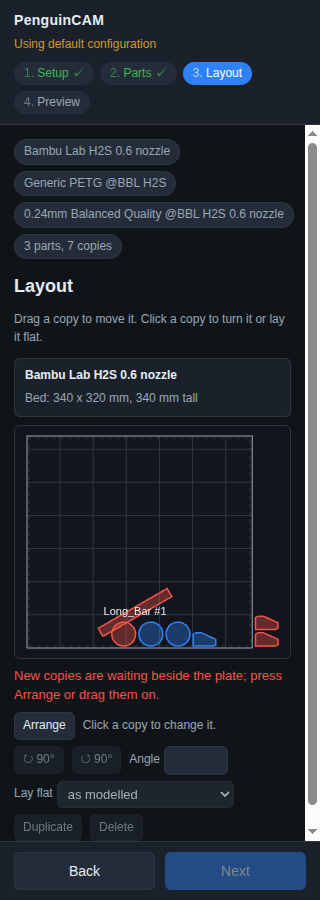
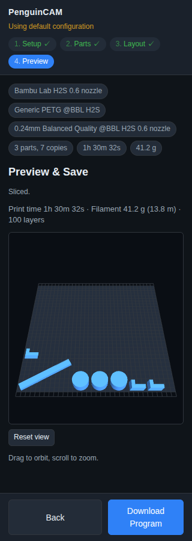
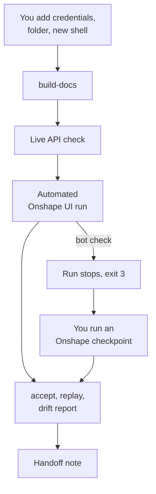

# Onshape test bed and milestone 1 build: where it stands

Written Fri 10-09 around 19:50 PT, at the end of a build session that ran from about 15:00 PT
the same day. All times are Pacific. It covers milestone 1 of the
[3D printing roadmap](../plans/2026-10-09-print-roadmap.md): the Onshape test bed (sub-project
1) and the print path's Onshape features (sub-projects 2 to 6). Read the roadmap first if you
have not; nothing else is needed.

## Short answer

- **The test bed is built** (its Tasks 1 to 13, all reviewed). It works fully in replay mode,
  with no live Onshape call. Its first live recordings (its Task 14) wait on your credentials
  and a test folder in Onshape.
- **Milestone 1's features are built up to the plate preview.** Supportability, the model
  from Onshape, placement on the plate and multiple parts are in (features Tasks 0 to 12).
  Tasks 0 to 10 are reviewed. Tasks 11 (Layout) and 12 (Preview) landed at 19:36 and 19:39 PT
  and are under review now. Profiles and the test bed's print scenarios (Tasks 13 to 16) are
  not started.
- **Nothing has touched real Onshape yet** beyond loading its sign-in page once. Every
  Onshape behaviour the features rely on, and that Onshape does not document, is settled
  only by the validation run with you (Task 17).
- **Three things need you now:** rotate `GH_TOKEN` (section 7.1), add four credentials and
  a test folder (section 7.2), and later answer the decisions in section 7.3.
- Everything is on the local branch `feature/onshape-test-bed` in PenguinCAM. Nothing is
  pushed and there is no pull request.



## Contents

1. [Terms](#1-terms)
2. [Where things stand](#2-where-things-stand)
3. [What was built: the test bed](#3-what-was-built-the-test-bed)
4. [What was built: milestone 1 features](#4-what-was-built-milestone-1-features)
5. [Separation from the CNC path](#5-separation-from-the-cnc-path)
6. [Things learned](#6-things-learned)
7. [Issues for you](#7-issues-for-you)
8. [Rulings made on your behalf](#8-rulings-made-on-your-behalf)
9. [Next steps](#9-next-steps)

## 1. Terms

These are the specs' terms; each means one thing everywhere below.

| Term | Meaning |
|---|---|
| **test bed** | The tools that let the print path's Onshape side be developed without real Onshape: recordings, fakes, scenarios, the call ledger. |
| **development app** | Your private Onshape OAuth app, PenguinCAM-chondl-dev, which redirects to `localhost:6238`. The **production app** is the public App Store app. |
| **counted call** | An Onshape API call that Onshape charges to your annual allowance: a 2xx or 3xx answer to API keys or to a private app such as the development app. |
| **replay mode** | The test bed answers every Onshape request from saved traffic; nothing leaves the machine. |
| **record mode** | Requests go to real Onshape and the traffic is saved. |
| **cassette** | The saved API traffic of one scenario. |
| **message log** | The saved messages between the panel and Onshape for one scenario. |
| **scenario** | A named, scripted run, such as `part-select`. |
| **fake Onshape host** | A page at `https://cad-testbed.onshape.com`, served inside the test browser, that embeds the panel the way Onshape does and plays Onshape's side of the messages from message logs. |
| **live API check** | Running the API-only scenarios in record mode with API keys, unattended. |
| **automated Onshape UI run** | Playwright in real Google Chrome signing in to Onshape as you and running the panel scenarios inside real Onshape, in record mode. |
| **Onshape checkpoint** | You running the same scenarios by hand in Chrome while PenguinCAM records; the fallback for the automated Onshape UI run. |
| **checklist strip** | A bar on the print page, shown only when the test bed is on, that offers the scenarios and their steps. |
| **call ledger** | A local file with one line per live Onshape exchange the test bed made, used to enforce the test bed's budget. |
| **drift report** | The differences between a fresh recording and the stored one. |
| **validation run** | The one recorded session with you that completes milestone 1 (features Task 17, which includes the test bed's Task 14). |
| **page id** | A random id the print page makes on each page load and sends with every print request; it ties log lines together and owns stored parts. |
| **part** | One Onshape part the student picked, exported once to a mesh. |
| **copy** | One placement of a part on the plate. A part with quantity 3 has three copies. |
| **plate** | The printer's build surface (340 x 320 mm on the H2S). |
| **part store** | Server-side storage of exported meshes, each under a random 128-bit **ref**. |
| **upload mode** | The print page opened outside Onshape, which slices the fixed sample part. |
| **print event** | One `[PRINT]` log line the server writes for a step a student takes. |

## 2. Where things stand

| Plan | Tasks | State |
|---|---|---|
| [Test bed plan](../plans/2026-10-09-onshape-test-bed.md) | 1-13 | Done and reviewed, Fri 10-09 15:24 to 17:06 PT |
| | 14, first live recordings | Blocked on your credentials and test folder |
| [Features plan](../plans/2026-10-09-print-onshape-features.md) | 0-10 | Done and reviewed, 17:06 to 19:19 PT |
| | 11 Layout, 12 Preview | Landed (commits `cfeee92`, `77191b0`); `make test` and `make testbed-replay` pass; review under way |
| | 13 profile catalog, 14 team configuration, 15 Setup step, 16 print scenarios | Not started |
| | Whole-branch final review | Planned after Task 16, one review over both plans |
| | 17, the validation run | Needs you and the credentials |

The branch was cut from `feature/printer-relay` with `origin/main` merged in. Since then it
holds 43 commits (counted at 19:50 PT): 147 files changed, about 19,000 lines added, most
of them tests and fixtures. The design is in the [test bed spec](../specs/2026-10-09-onshape-test-bed-design.md)
and the [features spec](../specs/2026-10-09-print-onshape-features-design.md).

**How the work was run.** Each plan task went to an implementer sub-agent, two or three
tasks at a time, and each batch to a separate reviewer sub-agent. Every finding marked
Critical or Important was fixed in a fix round and checked again before the batch counted as
done. Both specs and both plans were reviewed adversarially before any code was written. The
build ledgers and review reports are in `.superpowers/sdd/` in the worktree (not committed).

## 3. What was built: the test bed

### 3.1 Components

All of it is in `testbed/`, inert unless the environment variable `PENGUINCAM_TESTBED` is
set to `replay` or `record`.

| Component | What it does |
|---|---|
| Settings and guards (`settings.py`) | One place for every test bed setting. The app refuses to start with the test bed on if the server looks deployed (`FLASK_ENV=production`, `RAILWAY_ENVIRONMENT` or `VERCEL`), and refuses record mode without the development app's credentials or with the production app's client id. |
| Recorder and replay adapter (`adapters.py`) | Installed in every `OnshapeClient`. In record mode it saves each exchange, each redirect hop separately; in replay mode it answers every request, on any host, from the current scenario's cassette. An unmatched request gets HTTP 599 "not in the cassette". |
| Scrubbing (`scrub.py`, `cassette.py`) | Before anything is written: removes auth headers, cookies, tokens and the whole query of any non-Onshape host; replaces your name, email, user id and company and classroom ids and names with fixed stand-ins; replaces every `/blobelements/` download (the team config, which can hold a pairing code) with a fixture. A test fails the build if a recording holds anything secret-shaped. |
| Call ledger and budget (`ledger.py`) | One line per live exchange in `~/.local/state/penguincam-testbed/ledger.jsonl`. Each command checks its estimate against the budget (250 counted calls a year by default) and a per-command cap (150) before it starts. A 402 latches and stops all live calls in the process. |
| Development sign-in (`flask_hooks.py`) | Replay mode only: signs the panel in with placeholder API keys, so the panel works with no OAuth. Absent in record mode. |
| Checklist strip and message recording (`panel/`) | On the print page only, when the test bed is on: offers the scenarios, sends the selection requests, records every message both ways. |
| Fake Onshape host and browser harness (`host/`, `browser.py`) | A replay server on port 6240 and a Chromium under Xvfb that loads the panel inside the fake Onshape host. |
| Scenarios (`scenarios/`) | `panel-load`, `to-print`, `part-select`, `multi-select`, `assembly-select` (panel scenarios, which have steps in the panel) and `part-export` (API only). In replay mode the panel scenarios run in a browser against the fake Onshape host; one with no recording are skipped with "needs a recording", never passed. |
| Drift report (`drift.py`) | Compares fresh recordings with stored ones by structure and says whether PenguinCAM or Onshape changed. |
| Test documents builder (`documents.py`) | Builds six `tb-` documents through the API in your test folder: a box, two parts, an inch block, a part lying on its side, an oversized slab and an assembly. It writes only to documents that pass three checks (in the folder, `tb-` name, a marker description). |
| Automated Onshape UI run (`ui_run.py`) | Real Chrome, headed under Xvfb, on a kept profile outside the repository; signs in, opens the development app's panel, works the checklist strip. Stops on any bot check (exit 3) or failed step (exit 1), with a screenshot. |
| Chrome installer (`scripts/install-chrome.sh`) | Unpacks Google Chrome for aarch64 Linux into `~/.local/opt/google-chrome/` without root. |

### 3.2 How to use it

The full guide is `docs/ONSHAPE_TEST_BED.md` in PenguinCAM (on the branch). The essentials:

| Command | What it does | Live calls |
|---|---|---|
| `make test-quick`, `make test` | Include the test bed's unit tests; `make test` also slices a fixture box with Orca | none |
| `make testbed-replay` | Every panel scenario in replay mode, in a browser under Xvfb; must pass before any change to the print path's Onshape code is called done | none |
| `make testbed-record` | The live API check | counted |
| `uv run python -m testbed build-docs [--rebuild NAME]` | Builds the missing test documents | counted, estimate 41 |
| `uv run python -m testbed record [SCENARIO...]` | Live API check, then the drift report | counted |
| `uv run python -m testbed record --ui [SCENARIO...]` | Automated Onshape UI run, then the drift report | counted |
| `uv run python -m testbed drift` | Writes `testbed/.fresh/drift-report.md` | none |
| `uv run python -m testbed accept SCENARIO...` | Replaces the stored recording with the fresh one, for a commit | none |
| `uv run python -m testbed ledger` | Counted calls this cycle, the budget, the last ten lines | none |

Exit codes: 2 for a missing environment variable (named), 3 for a bot check, 4 for the budget
or a 402, 1 otherwise. Every live command ends with `counted calls: <n>, remaining budget: <m>`.

Environment variables: `ONSHAPE_ACCESS_KEY` and `ONSHAPE_SECRET_KEY` (live API check,
`build-docs`); `ONSHAPE_CLIENT_ID` and `ONSHAPE_CLIENT_SECRET` (record mode, the development
app); `ONSHAPE_USERNAME` and `ONSHAPE_PASSWORD` (the automated Onshape UI run's browser
only, never the server); `TESTBED_FOLDER_ID`, `TESTBED_BUDGET` (default 250),
`TESTBED_CYCLE_START`, `TESTBED_RUN_CAP` (default 150), `TESTBED_CHROMIUM`.

### 3.3 What is verified, and how

- **Unit tests:** 153 test bed tests run in `make test-quick`, covering scrubbing (including
  a `/blobelements/` download), request matching, redirect hops, translation replay, the
  ledger's arithmetic and the 402 latch, the guards (each in a fresh process), and the
  password redaction.
- **Browser, replay mode:** `make testbed-replay` runs 18 tests, with 6 skipped for want of
  recordings. The harness self-tests prove, in Chromium 151, that the fake Onshape host gets
  a real `onshape.com` origin, passes the panel's frame check and Chrome's local network
  check, carries messages both ways and keeps the session cookie across reloads.
- **Real Chrome:** Google Chrome 155 installed and ran headed under Xvfb, and loaded
  Onshape's sign-in page with no bot check (one online test; the form was never filled).

**Not verified until the validation run:** everything after the username field of Onshape's
sign-in (password page, signed-in marker), opening the panel, the OAuth popup, the parts
list selectors, whether `parentId` puts new documents in the folder, the units switch for
`tb-inch`, and every recorded message shape.

## 4. What was built: milestone 1 features

### 4.1 Supportability on the Onshape web side

- One `[PRINT]` log line per print event (`print/events.py`): `page`, `config`, `select`,
  `export`, `export_failed`, `layout`, `slice_queued`, `slice_done`, `slice_failed`,
  `deliver`, `client_error` and `request`. Each carries the page id and team number. Values
  are bare only if they are plain characters; anything else is JSON-quoted, so no value can
  start a new line. No Onshape user identity, token, full job id or pairing code is ever
  passed in.
- Every error the wizard shows goes through one helper, `showError`, which also reports it
  to the server as a `client_error` event. A node test fails if any other code writes to the
  error line.
- Each print route states its own rate limit. `docs/3D_PRINTING.md` gains a support section:
  how to filter Railway's logs for one page id.
- **Verified:** unit and route tests, including a trailing-newline injection test.

### 4.2 The model from Onshape

- The print page now knows its Onshape context (document, workspace or version, element,
  configuration, server) and does its own messaging in `print/static/print_onshape.js`. It
  asks for one solid body at a time with the same pattern the CNC panel uses for faces, and
  offers **Add from another document…** through Onshape's select dialog.
- The server (`print/onshape_parts.py`) resolves a selection in a Part Studio or an
  Assembly (through subassemblies), refuses standard content, passes configurations through,
  and exports each part as a binary millimetre STL with an explicit print tessellation. It
  follows Onshape's 307 redirect by hand, re-attaching authentication only to `*.onshape.com`.
- Meshes are read with numpy, capped at 150,000 triangles, and kept in the part store,
  owned by the page id, for one hour after last use. **Refresh from Onshape** re-exports
  under new refs.
- **Verified:** resolution, export and the part store against synthetic cassettes written
  from Onshape's OpenAPI (marked `"synthetic": true`); the selection handler and the dialog
  against a synthetic message log in node tests.
- **Not verified until the validation run:** the real shape of Onshape's selection
  answers, whether the dialog's `idTag` is the REST part id, whether the 307 target is an
  Onshape host, and real triangle counts at the chosen tessellation.

### 4.3 Placement on the plate

- Each part gets six footprints (one per axis-aligned orientation) on the server. The
  Layout step draws copies as footprints on the plate at panel width: drag to move, rotate by
  90° or any angle, **Lay flat** in six orientations, duplicate, delete, **Arrange**.
- A copy too close to another (5 mm), off the plate (3 mm margin) or too tall is drawn red
  and Next is disabled with a sentence. The server checks the same rules again before
  slicing. The geometry is written in Python and JavaScript, and both read one shared file of
  test cases.
- The server writes one 3MF object per copy, named `<part name> #<n>`, runs Orca with
  `--arrange 0 --orient 0`, checks that every copy's name is in Orca's `plate_1.json`, and
  maps Orca's error codes to sentences. The delivered file is named like
  `Bracket_plus2-20261009-1432.gcode.3mf`. Send to Printer sends that file unchanged.
- Preview draws every copy in 3D where Layout placed it.
- **Verified:** shared placement cases in both languages, with mutation checks showing they
  catch a flipped rotation; 3MF read-back in all six orientations of an asymmetric part;
  real-Orca tests (a two-part plate slices with every name; end-to-end plate job); Send to
  Printer with the delivered name. Layout and Preview were checked in headed Chromium at
  320 px and full width against a stand-in server with three generated parts:







- **Not verified until the validation run:** Layout and Preview with real Onshape parts.

### 4.4 Multiple parts and limits

The limits were measured on real Orca before they were set (section 6.3): 150,000 triangles
per part, 300,000 per job, 25 copies per plate, 20 distinct parts and 50 MB per page id,
500 MB in the whole part store, and a 240 s plate slice timeout (the sample part keeps
120 s). Each has a plain sentence for the student. **Verified** by route tests and by the
measuring script `print/scripts/measure_plate.py`, rerun after the 3MF writer landed.

### 4.5 Profiles

Not started (Tasks 13 to 15): a committed catalog of every Orca profile for the H2S family,
the team's `printing:` choices of printer, filaments and processes, four student overrides,
and the Setup step. Until then every slice uses the current fixed H2S 0.6 nozzle set. The facts
the catalog rests on were checked during design (section 6.3).

## 5. Separation from the CNC path

New feature code lives under `print/`; the test bed lives under `testbed/`. The print page
never loads the CNC panel's `static/source_onshape.js` (a test checks), and
`templates/` and `static/` are unchanged on the branch. The touches outside `print/` and
`testbed/`:

| File | Change | Inert when the test bed is off? |
|---|---|---|
| `onshape_integration.py` | The client installs the test bed's adapter when it is on; development sign-in in replay mode only; an API-key client writes no tokens to the session; new `request_absolute`, through which `_make_api_request` now goes, so following an export redirect keeps authentication inside the client | All but `request_absolute`, which changes no behaviour for existing calls |
| `frc_cam_gui_app.py` | The import-time guard; test bed routes when on; `/onshape/status` accepts an API-key client; `init_print_routes` receives the Onshape sign-in gate and a client getter | The two print arguments are live; the rest is inert |
| `Makefile` | Test bed unit tests join `make test-quick`; `make testbed-replay`, `make testbed-record` | Yes |
| `CLAUDE.md` | The `testbed-replay` rule and key files | n/a |
| `docs/3D_PRINTING.md`, `docs/ONSHAPE_TEST_BED.md` | Developer guides | n/a |
| `.gitignore`, `.dockerignore` | `testbed/.fresh/` | n/a |
| `tests/test_onshape_request_absolute.py` | Tests for `request_absolute` | n/a |

`team_config.py` gains one helper in features Task 14 (team configuration). Playwright is only in
`testbed/requirements.txt`, never in `requirements.txt` or the Docker image.

## 6. Things learned

### 6.1 Onshape

- **The allowance is small.** Your plan, EDU Student, allows 2,500 counted calls a year
  ([API limits](https://onshape-public.github.io/docs/auth/limits/)). Calls with API keys
  and from private apps count, charged to the app's owner; redirects count, because only the
  status class matters. Calls from App Store apps (the production app), from Onshape's own
  clients, and any 4xx or 5xx do not. Past the limit every counted call gets 402. So teams'
  use of the production app costs nothing, and all development traffic draws on yours.
- **Terms of Use.** Section 4 forbids "any robot, spider, scraper or other automated means
  to access the Service". Your position, from your conversations with Onshape: scripting the
  interface to understand it and to develop the extension is fine; the clause aims at
  automating the creation of parts. The automated Onshape UI run rests on that approval and
  never tries to pass a bot check. The same list forbids making a password available to
  another person, which an `ONSHAPE_PASSWORD` in the container arguably does; worth a word
  with your Onshape contacts.
- **No folder or units API.** The OpenAPI has no way to create a folder or move a document
  into one, and no way to set a document's units. You create the test folder once; the
  automated Onshape UI run switches `tb-inch`'s units in the interface.
- **STL export defaults are a trap.** The part STL export defaults to `units=inch` and
  `mode=text`, whatever the document's units, and answers only with a 307. Onshape's guide
  says the follow-up "must" carry authentication; `requests` drops it on a redirect to
  another host. The print path re-attaches it only to `*.onshape.com` hosts, so credentials
  never go to a storage host.
- **The selection answers are undocumented.** `REQUESTED_SELECTION`, its `PENDING` status
  and the fields of a selection are not in Onshape's documentation; the CNC panel relies on
  them from experience. The select dialog's answer is documented but has `idTag`, not
  `partId`. 3MF export does not appear anywhere in the API documentation or OpenAPI.

### 6.2 Chrome and Playwright

- Since Chrome 142, Local Network Access blocks a public `https` page from framing
  `http://localhost` until the user grants a permission. Your Chrome presumably works because
  that prompt was accepted once for cad.onshape.com; if the production panel ever stops
  loading in a new browser, that permission is the first thing to check. The test browser grants it to the fake Onshape
  host's origin.
- Playwright 1.55 cannot grant it at all; 1.58 is the first version that can. The test bed
  pins 1.63.0 and falls back to granting Chrome's own permission names through the browser
  protocol.
- Real Google Chrome 155 runs in the container (aarch64 Linux), unpacked without root; every
  library it needs is present. Onshape's sign-in page loaded with no bot check. Its first
  field is `input[name="username"]` with a Continue button, not an email field.

### 6.3 Orca 2.4.2 and the limits

From the placement experiments (aarch64 Linux, 6 cores):

- `--arrange 0 --orient 0` keeps every part where it is placed, to 0.01 mm, and drops it to
  the plate. Leaving out `--arrange` arranges. `--rotate` is global and unusable.
- **A part entirely off the plate is silently left out**, with exit 0. That is why the
  server checks placement itself and checks every copy's name in `plate_1.json` afterwards.
- Return codes: -101 overlapping parts, -52 a part crossing the plate edge, -100 no flat
  face down, -50 no part fully on the plate.
- Brims that would collide are trimmed, not refused: two tall pins 2 mm apart slice with
  return code 0. This is why 5 mm spacing suffices.
- Copies that share one 3MF object lose their names in `plate_1.json` and on the printer's
  skip-object list. One object per copy keeps every name.

Measurements at the limits (peak resident memory of Orca, worse of two runs):

| Plate | Triangles | Peak | Time |
|---|---|---|---|
| 30 copies of 9,882 (realistic hub) | 296,460 | 886 MB | 16.2 s |
| 25 copies of 11,968 (realistic hub) | 299,200 | 779 MB | 14.1 s |
| 2 copies of 149,760 (realistic hub) | 299,520 | 214 MB | 3.2 s |
| 2 copies of 150,000 (sliver-faceted cylinder) | 300,000 | 954 to 1,113 MB | 61 to 64 s |
| 30 copies of 33,332 (cylinder, first-draft limits) | 999,960 | 1,087 MB | 5 min 52 s |

The stop rule was 900 MB or 180 s. The sliver cylinder broke it, but a realistic part with
the same triangle count used a fifth of the memory: facet shape matters more than count. With
realistic facets, **the number of copies drives memory**. Thirty copies came within 1.5% of
the line, so the copy cap came down to 25. The export tessellation is 0.05 mm chord and 7.5°,
under half the finest layer step.

- **A bug fixed on the way:** `print/scripts/install-orca.sh` had computed its root as
  `print/` since the move into the print package, so a fresh install landed in
  `print/tools/orca` while the slicer looks in `tools/orca`. Fixed before the build began.
- **The profile catalog:** 96 of the 104 filament base names that exist in both Orca's BBL
  tree and its filament library differ in value, and the BBL copy is the one Orca loads for a
  BBL printer; the catalog follows Orca (ruling R1). The whole H2S catalog flattens to about
  1.3 MB, small enough to commit.

### 6.4 What the adversarial reviews caught

Every review round found at least one real defect. The ones that would have mattered most:

- **Security.** A Playwright fill error would have printed `ONSHAPE_PASSWORD`; reproduced
  with a sentinel, fixed by redacting every message. The team config download goes through
  `/blobelements/`, so a scrub rule keyed on the file name would have published a printer
  pairing code. Development sign-in in record mode would have let anything reaching port
  6238 drive your whole account with the API keys. A trailing newline passed the log
  validator, because a regex `$` matches before a final newline, so a client could forge
  `[PRINT]` lines; reproduced through the test client. An id containing `/` or `..` reached
  REST paths, and a part id of `..` made urllib3 call a different endpoint. A persistent
  Chrome profile inside the repository would have put Onshape cookies into a local Docker
  build.
- **Feasibility.** The design's Local Network Access gap, the Playwright version that cannot
  grant it, the missing folder and units APIs, and the first draft's limits (one million
  triangles per job took 5 min 52 s) were all caught before code.
- **Correctness.** Copies sharing an object lose names; the 12 mm spacing rested on a wrong
  claim; a hard-coded plane id would have failed the live document build halfway; a
  re-clicked part counted against the 20-part limit; nothing pinned the rotation direction
  (flipping it failed no test until an asymmetric case was added).
- **Process.** Reviewers that ran experiments (Orca, Playwright versions, the test client)
  found what reading alone did not. Mutation checks proved whether a test could fail.

## 7. Issues for you

### 7.1 Rotate `GH_TOKEN`

During test bed Task 13 (documentation and clean-up) a failing test printed the whole process environment in its
assertion message. Nothing reached the repository or any log the build writes, but two
sub-agent transcripts that Claude Code keeps in the container, under
`~/.claude/projects/-repos-popcornpenguins/25a2febd-…/subagents/`, hold the live `GH_TOKEN`,
and one also holds the live `CLAUDE_CODE_MESSAGING_TOKEN`. The Onshape values in them are test
values, not live ones. Rotate `GH_TOKEN` (and the messaging token if it can be), then
`make secret-set` in `~/agents/control` and start a new container shell. The test was fixed.

### 7.2 Credentials and the test folder

The container has `ONSHAPE_CLIENT_ID` and `ONSHAPE_CLIENT_SECRET`. It lacks:

```
make secret-set SCOPE=popcornpenguins NAME=ONSHAPE_ACCESS_KEY
make secret-set SCOPE=popcornpenguins NAME=ONSHAPE_SECRET_KEY
make secret-set SCOPE=popcornpenguins NAME=ONSHAPE_USERNAME
make secret-set SCOPE=popcornpenguins NAME=ONSHAPE_PASSWORD
```

Also: create a folder "PenguinCAM test bed" in Onshape and send its URL; say what My Account
→ Developer shows as used and when the cycle resets; whether the development app was created
under My Account or in a classroom; and how many counted calls a year the test bed may spend
(250 until you say).

### 7.3 Decisions

From the [features spec's section 12](../specs/2026-10-09-print-onshape-features-design.md#12-for-the-owner-afterwards) and the build:

1. **A separate right-panel extension for printing** that opens `/print` directly, so a
   student does not start on the CNC page. Only you can register it.
2. **Add `configuration={$configuration}` to the registered panel URL.** Without it, a
   click selection in a configured Part Studio is refused with a sentence pointing to the
   dialog, rather than printing the default configuration.
3. **Copy names (ruling R6, section 8.3).** Copies are numbered per name, so two different parts both
   named `Bracket` print as `Bracket #1`, `#2`, `#3` on the printer's skip-object list,
   without saying which Part Studio each came from.
4. **Students uploading their own STL in upload mode**: out of scope for now; do you want it?
5. **Whether teams choose the nozzle volume type and the plate surface**, both fixed in the flatten script now.
6. **Other printer families in the catalog**: one line each when wanted.
7. **Who started a print in file names**: left to milestone 2.
8. **The rate limiter behind Railway's proxy** may count every limit per proxy rather than
   per user, because `ProxyFix` is set without `x_for`. Unverified; it affects the whole app.
9. **"A part was left off the plate"** has no full stop, unlike every other sentence.

## 8. Rulings made on your behalf

You asked for milestone 1 to be built without you, so every choice a reasonable person might
make differently was ruled and recorded. "Cost if wrong" is what undoing it would take.

### 8.1 From the build ledgers

| Ruling | Why | Cost if wrong |
|---|---|---|
| Test bed settings added later go into `settings.py`, never read ad hoc | One typed surface | A small refactor |
| Never set `PLAYWRIGHT_BROWSERS_PATH`, always pass the browser path, never run `playwright install` | No browser downloads | None |
| Two or three tasks per implementer, one reviewer per batch | You asked to keep the main session small | Coarser review, caught by the final review |
| The recordings check tests your ids and names field by field | The plan's test was weak | False positives, fixed by an allowlist |
| A 402 sets a process-wide latch instead of an uncatchable exception | Keeps the app's error handling sane | One swallowed call path |
| Company and classroom names become "Test Bed Classroom <n>" | Stand-ins in public recordings | None |
| `/testbed/*` routes exempt from the rate limiter | Development-only, bursty | None in production, where they do not exist |
| Moving documents into the folder is not automated; `build-docs` checks and tells you | No API moves a document | One manual step |
| One final review over both plans, after Task 16 | A test bed fix wave would collide with feature work | Test bed issues found later |
| If the plate measurement fails, lower the per-part cap in 25,000 steps, measured with a realistic part | The first part was unrealistic | Students simplify parts (in the event, the per-part cap stayed at 150,000; the copy cap came down instead, two rows below) |
| An upload-mode `page` event logs `configured=no config=default team=-` | Keeps the upload flow apart from Onshape config | Less context in upload-mode logs |
| Copies per plate 30 → 25 | Copies drive memory; 30 was 1.5% under the line | Students print more than 25 copies in two jobs |
| "Could not find the selected part in this Part Studio" sentence accepted, added to the spec | The spec had none | A wording change |
| The part store's start-up cleanup built as specified rather than dropped | The spec asks for it; the review had suggested dropping it | None |
| Orientation convention R2 (section 8.3) stands after review; spec 4.2 updated to match | A reviewer questioned it | Label wording |

### 8.2 From the features spec

| Ruling | Why | Cost if wrong |
|---|---|---|
| No student STL upload in upload mode (it keeps the sample part) | The milestone is about Onshape | A later feature |
| The page id correlates logs and owns parts; the `ref` is the bearer handle | A page id is not secret | None |
| No Onshape user id, name or email in print events | Students' identity out of logs | Harder to say who printed |
| No new log store or dashboard; Railway's log search | Enough until proven otherwise | A tool later |
| Click selection and the dialog feed one list | The dialog is the only way to other documents and configurations | A UI change |
| Configurations passed through, never the default printed silently | Every Onshape path carries one | None known |
| Assembly parts exported in their own Part Studio's frame | Only shape matters; Layout orients | A student expecting the assembly pose re-orients |
| Explicit tessellation 0.05 mm, 7.5° | Onshape's defaults are unpublished | More or fewer triangles than needed |
| `request_absolute` on the shared client | Authentication stays in one place | One shared-client method |
| One export per part, not the Part Studio zip | Zip naming is undocumented | More calls on the development app only |
| A part exported once and reused; Refresh re-exports under new refs | Fewer calls; a queued job never reads a half-written mesh | Stale shape until Refresh |
| Six axis-aligned orientations, not "pick a face" | A face picker needs 3D in a narrow panel | Odd parts need a model change |
| 5 mm spacing | Orca trims colliding brims | Narrower brims between parts |
| Geometry mirrored in Python and JS, with shared cases | The browser checks while dragging | Two copies to maintain |
| Shelf arrangement, not Orca's | Orca's changes rotations | Less dense plates |
| No 3D view or keyboard shortcuts in Layout | The narrow panel | A later addition |
| One 3MF object per copy | Names survive on the printer | A larger input file |
| File names carry part and local time; who started is milestone 2 | Your naming wish, in part | A rename later |
| One plate only | Simpler | Big runs need two jobs |
| Plate slice timeout 240 s | Room on a busy machine | A long wait before a timeout |
| Only the H2S family in the catalog | The team's printer | One line per family |
| Four student overrides: infill, walls, supports, brim | What FRC students change | More in a team's own profile |

### 8.3 From the features plan

| Ruling | Why | Cost if wrong |
|---|---|---|
| R1 A BBL profile shadows the filament library's of the same name | Orca loads the BBL copy for a BBL printer | Wrong values for 96 filaments |
| R2 Orientation names the axis pointing up | The spec contradicted itself | Label wording |
| R3 New `POST /print/deliver` for download, Drive and printer events | Those routes live outside `print/` | One route |
| R4 GET routes accept the page id as a query parameter | `EventSource` cannot send headers | None |
| R5 `arrangeCopies` takes the parts | It needs footprints | None |
| R6 Copies numbered per sanitized name | Avoids two `Bracket #1` | Decision 3 in section 7.3 |
| R7 Measure the limits first, with its own 3MF writer | Slicing a plate came later in the plan | None |
| R8 Without copies, `/print-job` keeps the existing sample job | Upload mode unchanged | None |
| R9 Overrides start at "Profile default" and send nothing | No surprise changes | None |
| R10 A footprint is centred on its bounding box; angle counterclockwise from above | Undefined in the spec | Placement drawn rotated the wrong way |
| R11 Sentences the spec omits are fixed in the owning task | Undefined in the spec | Wording |
| R12 The `layout` event is logged when Preview submits | Entering Preview submits | None |
| R13 Scenario estimates computed per step | The ledger counts each hop | A refused run if low |
| R14 Docstrings left from the first 3D-print build ("Stage 1", September) swept when they stop being true | Avoid wrong comments | None |
| R15 `/print/part` stays ungated | It serves only the sample part | None |
| R16 A cache miss refetches once before refusing | A student models while the panel is open | One extra call |
| R17 Messages go out with `'*'`, come in only from Onshape origins | An enterprise domain may lack `server` | None; outgoing messages hold no secret |

## 9. Next steps

### 9.1 What remains, by risk

Riskiest first. The order of work still follows dependencies: the validation run comes last,
because it needs Task 16 and a configured test document.

| Item | What makes it risky |
|---|---|
| **The validation run** (section 9.2) | Feasibility: every Onshape page selector after the username field, the panel and OAuth steps, and every message shape are unverified; a bot check can stop the automated Onshape UI run; it spends from a budget of 250. |
| **No configured Part Studio among the test documents** | Feasibility: the validation run must record a configured Part Studio, but none of the six `tb-` documents has a configuration, and the API's feature calls for a configuration table are unexplored. Either `build-docs` gains a `tb-configured` document or you add a configuration to one by hand. |
| **Task 16, the print scenarios** | Feasibility: the automated Onshape UI run must drive the print page's own Parts step and the select dialog inside Onshape with selectors nobody has seen; its call estimates are untested. |
| **Tasks 11 and 12 review** | Resources: a review finding in Layout or Preview reopens browser work; Preview's three.js still loads from a CDN. |
| **Task 13, the profile catalog** | Feasibility, moderate: it walks Orca's whole profile tree; the shadowing, the 27 profiles to skip for lacking the High Flow variant, and the size were checked by a prototype, not the real script. |
| **Tasks 14 and 15, team configuration and Setup** | Low: a printer name that does not resolve must fail closed, never fall back. |
| **The whole-branch final review** | Resources: one review over 147 files may start a fix wave. |

### 9.2 The validation run, step by step



**What you provide:** the four credentials and the folder URL (section 7.2), from a new
container shell; your answers on usage, cycle start and the budget share; and your time at
the Mac in case a bot check hands the run to you.

**What the agent runs**, in the PenguinCAM worktree:

1. `uv run python -m testbed ledger`, to confirm the budget. Then
   `TESTBED_FOLDER_ID=<id> uv run python -m testbed build-docs`. Expect six documents in the
   folder, plus a configured Part Studio if one has been added by then (section 9.1). If one lands outside it, the command says so and exits 1: move it in Onshape and
   run again.
2. `uv run python -m testbed record part-export`, then `accept part-export`. The run notes
   where the 307 points and whether the follow-up is counted.
3. `uv run python -m testbed record print-export` (`print-export` and the three `print-*`
   scenarios in step 4 are what Task 16 adds), then `accept print-export`. Note each
   part's triangle count against the 150,000 cap.
4. `uv run python -m testbed record --ui`, for the five test bed panel scenarios, then
   `record --ui print-select-parts print-dialog-parts print-assembly-part`. These record the
   click selection in a Part Studio and an Assembly, the dialog (and whether `idTag` is the
   part id), a configured Part Studio, and once, for reference, a selection request with no required
   count, which Onshape keeps open until told to stop. Accept each.
5. Replace the synthetic message logs and cassettes with the recordings, run `make test`,
   `make testbed-replay` (no "needs a recording" skip may remain) and
   `uv run python -m testbed drift`.
6. Write the findings to a handoff note and commit both repositories.

**Expected counted calls**, from the scenarios' own estimates plus two account lookups per
recording:

| Step | Estimate |
|---|---|
| `build-docs` | 41 |
| `record part-export` | 47 |
| `record print-export` | 14 |
| `record --ui`, five test bed panel scenarios | 28 |
| `record --ui`, three print scenarios | 40 |
| **Total** | **about 170 of 250** |

That leaves about 80 for one rerun after a fix. Each command also stays under the per-command
cap of 150. Your own use of the development app draws on the same 2,500, outside the ledger.

**On a bot check** (a CAPTCHA, a challenge page, an unexpected verification): the run
stops at once, saves a screenshot, exits 3, and the agent asks you in chat. It never tries to
solve or avoid the check. You then run an
[Onshape checkpoint](../guides/ONSHAPE_CHECKPOINT.md) from the Mac's Chrome while the
PenguinCAM records; the recordings are the same. A block is also something to raise
with your Onshape contacts.

### 9.3 After milestone 1

The [roadmap](../plans/2026-10-09-print-roadmap.md) sets the sequence; within each milestone,
riskiest first. Rows name the roadmap's items by number.

**Milestone 2, the daemon (local only)**

| Item | What makes it risky |
|---|---|
| Item 10, daemon architecture and rebuild | Feasibility and resources: a rewrite of working code in a new language, with MQTT and FTPS to a real printer |
| Item 8, test bed for the 3D printer | Feasibility: needs captured H2S status documents and a faithful enough MQTT and FTPS fake |
| Item 11, relay fixes and polish (see the [first relay test](2026-10-09-printer-relay-first-hardware-test.md)) | Resources: each fix needs the printer to confirm |
| Items 7 and 9, supportability on the server and daemon sides | Low: the print events built here are the pattern |

**Milestone 3, shipping**

| Item | What makes it risky |
|---|---|
| Item 12, Railway deployment with Orca | Resources: one gunicorn worker runs Orca, which peaked at 779 MB on a realistic 25-copy plate and over 1 GB on a worst-case faceted part inside the limits; the Railway plan's memory is unchecked |
| Production app changes: the print extension and `{$configuration}` (section 7.3) | Only you can make them; untested until registered |
| Rate limiting behind the proxy | Unverified; a fix touches the whole app |
| Item 12, push and a pull request to `6238/PenguinCAM` | Low: a large diff (147 files) for the team to review |
