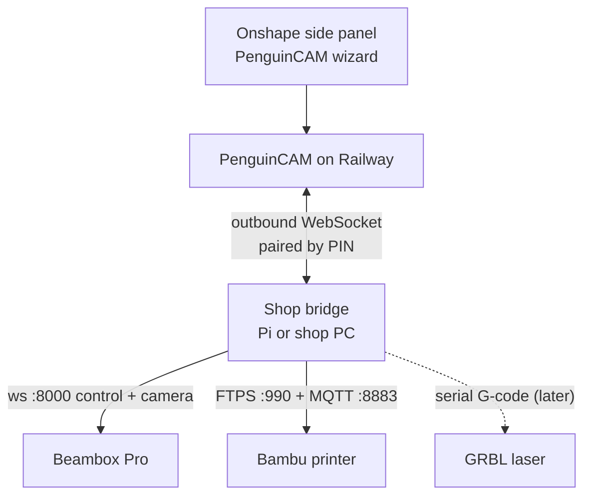
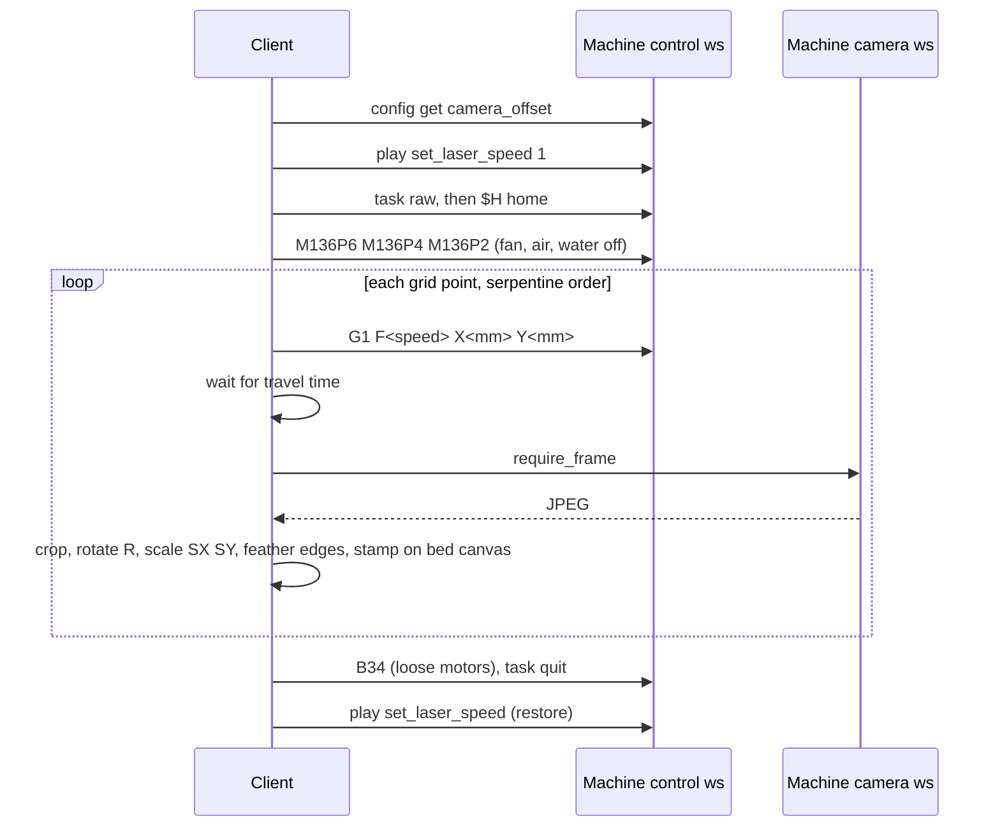

# Laser cutting from Onshape and the shop bridge: research notes

**Status:** Research, no design decisions taken yet
**Date:** 2026-09-13
**Machines studied:** FLUX Beambox Pro (CO2 laser), Bambu Lab X1C / P1S / A1 (3D printers)

These notes answer one question: how can open-source code on the shop LAN send
jobs to, and read state from, these two classes of machine, so that one small
"shop bridge" service can serve both the laser path and the 3D printing path
described in
[3D Print Slicing, Stage 1](../specs/2026-09-13-3d-print-slicing-design.md).

Every claim is marked **[V]** (verified in cited source or docs) or **[I]**
(inferred). Nothing here has been tested against a real machine yet; section 6
lists what to verify first.

## 1. Why a bridge

PenguinCAM runs on Railway and is embedded in the Onshape side panel. Both
machines only listen on the shop LAN. A browser page served over HTTPS cannot
open a plain WebSocket or TCP connection to a LAN device, and neither machine
speaks HTTPS with a certificate a browser trusts (FLUX works around this with a
`*.sslip.flux3dp.com` certificate and a Chrome extension; Bambu uses MQTT over
TLS with a self-signed certificate, which browsers cannot reach at all).

So the last hop is a small service installed once per shop. It holds machine
credentials, speaks each machine's native protocol, and dials out to the cloud
app. The student's browser never touches the machine.



## 2. FLUX Beambox Pro

### 2.1 What is open source

| Repo | Language, licence | Layer | State (2026-09) |
|------|-------------------|-------|-----------------|
| [beam-studio](https://github.com/flux3dp/beam-studio) | TypeScript, AGPL-3.0 | UI (Electron app and web PWA) | Active [V] |
| [fluxghost](https://github.com/flux3dp/fluxghost) | Python, AGPL-3.0 | Backend: discovery, control, SVG to job file. Good in-repo API docs under `docs/api/` | Active [V] |
| [fluxsvg](https://github.com/flux3dp/fluxsvg) | Python, LGPL-3.0 | SVG rasterising (CairoSVG fork) | Active [V] |
| [fluxclient](https://github.com/flux3dp/fluxclient) | Python + C++, AGPL-3.0 | Machine protocol and FCode encoder | Frozen 2018 snapshot [V] |
| `fluxclient-dev`, `beamify` | private | Current protocol library and SVG to toolpath engine | Not public [V] |
| [swiftray](https://github.com/flux3dp/swiftray) | C++/Qt, GPL-3.0 | FLUX's UI for GRBL lasers | Active, not for Beambox [V] |

No Beambox firmware repository exists. The machine is a Raspberry Pi running a
Linux system; firmware `.fxfw` is installed from a USB stick. [V]

### 2.2 The key fact: the machine runs the backend itself

Beam Studio never talks to the laser directly. It talks to fluxghost over a
WebSocket API, and fluxghost speaks the machine protocol. Since firmware 3.5.2
the machine itself runs a fluxghost-compatible server on port 8000, which is how
[Beam Studio Web](https://studio.flux3dp.com/) works with no local helper
([websocket.ts](https://github.com/flux3dp/beam-studio/blob/master/packages/core/src/web/helpers/websocket.ts),
[firmware 3.5.2 notes](https://support.flux3dp.com/hc/en-us/articles/4409674435215-Beambox-beamo-Firmware-3-5-2)). [V]

That means the bridge needs no private library. It uses the documented
WebSocket API on the machine:

```
ws://<machine-ip>:8000/ws/discover
ws://<machine-ip>:8000/ws/control/<uuid>
ws://<machine-ip>:8000/ws/camera/<uuid>
ws://<machine-ip>:8000/ws/svgeditor-laser-parser
```

Under the WebSocket layer the machine protocol is: UDP multicast discovery on
`239.255.255.250:1901`, control on TCP 23811, camera on TCP 23812, a FLUX hello
plus RSA challenge, then AES or TLS
([backends.py](https://github.com/flux3dp/fluxclient/blob/master/fluxclient/robot/backends.py)). [V]
The bridge does not need to implement this; the on-machine server does.

### 2.3 Trust and job control

- **Trust ("touch")**, once per client: send an RSA public key plus the machine
  password (factory default `default`); the machine stores the key
  ([touch.md](https://github.com/flux3dp/fluxghost/blob/master/docs/api/touch.md)). [V]
- **Every later session**: open `/ws/control/<uuid>`, send the RSA private key
  PEM as the first text message, wait for `{"status":"connected"}`. [V]
- **Job commands** ([control.md](https://github.com/flux3dp/fluxghost/blob/master/docs/api/control.md)) [V]:

```
file upload application/fcode <size>    then binary chunks
upload text/gcode <size> <path>/<name>.fc   G-code, converted on the machine
play select <path>
play start | pause | resume | abort | quit
play report                              st_id 0 idle, 16 running, 64 done
task raw                                 GRBL-style pass-through ($H, G1, M136 ...)
config get <key> / config set <key> <value>
```

- **Executed format**: FCode v1 (`.fc`) on Beambox and Beambox Pro (`fbb1b`,
  `fbb1p`). Documented in the
  [FCode v1.2 wiki](https://github.com/flux3dp/fluxmonitor/wiki/Flux-Device-Control-Description-File-V1.2)
  with a public C++ encoder
  ([fcode_v1_writer.cpp](https://github.com/flux3dp/fluxclient/blob/master/src/toolpath/fcode_v1_writer.cpp)). [V]
  The laser-specific opcodes used today go beyond the wiki; the encoder is the
  ground truth. [I]
- **G-code is accepted**: Beam Studio uploads `.gcode` with
  `upload text/gcode` and the machine converts it
  ([control.ts](https://github.com/flux3dp/beam-studio/blob/master/packages/core/src/web/helpers/api/control.ts)). [V]
  Since firmware 4.2.1 the machine also streams GRBL-style G-code over USB for
  LightBurn ([FLUX article](https://support.flux3dp.com/hc/en-us/articles/8723361480719-LightBurn-Bridge-Cable-Beambox-Pro)). [V]
  Whether a third-party G-code upload plays correctly, and which laser G-code
  dialect (power, speed, air) the converter expects, is untested. [I]
- **Machine facts**: 600 x 375 mm bed, 50 W CO2, `pxWidth 6000, pxHeight 3750`
  at 10 px/mm in Beam Studio. No lock-down trend found; 3.5.2 and 4.2.1 opened
  access rather than closing it. [V]

### 2.4 Camera preview

The user-facing feature "look at a picture to see where the material is" is
built entirely in the Beam Studio frontend. The machine only provides single
frames; nothing on the machine returns a bed image.

**Hardware.** The camera rides on the laser head and is a 640 x 480 webcam
(firmware 1.4.4 and later; 1280 x 720 before). Beam Studio crops each frame to
640 x 280 and flips it 180 degrees if the stored offset carries `F:1`
([camera.ts](https://github.com/flux3dp/beam-studio/blob/master/packages/core/src/web/helpers/api/camera.ts)). [V]

**Frame API** ([camera.md](https://github.com/flux3dp/fluxghost/blob/master/docs/api/camera.md)) [V]:
open `/ws/camera/<uuid>`, send the RSA PEM, wait for `connected`, then send the
text `require_frame`; the reply is one binary WebSocket message holding a JPEG.
Beam Studio retries up to 20 times at 500 ms when a frame does not decode.

**Preview loop** in
[BeamPreviewManager.ts](https://github.com/flux3dp/beam-studio/blob/master/packages/core/src/web/app/actions/camera/preview-helper/BeamPreviewManager.ts)
(used for Beambox Pro) [V]:



Head position for a shot is `X = target_x - offset.x`, `Y = target_y - offset.y`
in mm. Tile size is about `28 * SY / (cos R + sin R)` mm, roughly 45 mm square
at defaults, stepped at 95 percent overlap, so a full 600 x 375 bed is on the
order of 14 x 9 shots. The client waits `max(dx/18000, dy/6000, dist/F)` minutes
plus 20 percent plus 100 ms between move and shot. [V]

**Calibration** lives on the machine as a plain string under the config key
`camera_offset` (and `camera_offset_borderless`):
`Y:<mm> X:<mm> R:<rad> S:<avg> SX:<sx> SY:<sy>` with an optional `F:<0|1>` flip
flag. Any client the machine trusts can read it with `config get camera_offset`
([camera-calibration-helper.ts](https://github.com/flux3dp/beam-studio/blob/master/packages/core/src/web/helpers/camera-calibration-helper.ts)). [V]
Ideal values are X 20, Y 30, R 0, S 1.625 (about 0.1625 mm per camera pixel).
The calibration flow engraves a 25 mm square at bed position 90, 90, photographs
it, and posts the image to `/ws/camera-calibration` on the machine, which
returns the square's centre, angle and size. [V]

**Consequence for the bridge.** Calibration can stay in Beam Studio, done once
by an adult; the bridge only reads the result. The grid drive and stitching
must be reimplemented in the bridge (Python, Pillow or OpenCV). A full-bed
preview takes on the order of a minute of head travel. A single-shot "where is
the material" at one region is cheap.

**Newer FLUX machines** (Ador, Beambox II, HEXA II, Beamo II) use a fixed
wide-angle fisheye camera with a server-side undistortion pipeline
(`set_fisheye_*` commands). None of that applies to the Beambox Pro. [V]

## 3. Bambu Lab printers on the LAN

### 3.1 Protocols

| Purpose | Protocol | Notes |
|---------|----------|-------|
| Commands and status | MQTT over TLS, port 8883, user `bblp`, password is the LAN access code, self-signed certificate. Topics `device/<serial>/request` and `device/<serial>/report` | [OpenBambuAPI mqtt.md](https://github.com/Doridian/OpenBambuAPI/blob/main/mqtt.md) [V] |
| File upload | Implicit FTPS, port 990, same credentials. Upload `.gcode.3mf` to `/` | [OpenBambuAPI ftp.md](https://github.com/Doridian/OpenBambuAPI/blob/main/ftp.md) [V] |
| Discovery | SSDP `NOTIFY` every 5 s to UDP 1990 and 2021, carries serial, model and IP | [bambudiscovery.sh](https://github.com/gashton/bambustudio_tools/blob/master/bambudiscovery.sh) [V] |
| Camera | X1: `rtsps://bblp:<code>@<ip>:322/streaming/live/1`. P1 and A1: TLS TCP port 6000, one JPEG per second after an 80-byte auth packet | [OpenBambuAPI video.md](https://github.com/Doridian/OpenBambuAPI/blob/main/video.md) [V] |

**Start a print** after the FTPS upload, on the request topic
([ha-bambulab commands.py](https://github.com/greghesp/ha-bambulab/blob/main/custom_components/bambu_lab/pybambu/commands.py)) [V]:

```json
{"print": {"sequence_id": "0", "command": "project_file",
  "url": "ftp:///<job>.gcode.3mf", "param": "Metadata/plate_1.gcode",
  "subtask_name": "<job>", "use_ams": false, "ams_mapping": "",
  "bed_leveling": true, "flow_cali": false, "vibration_cali": false,
  "layer_inspect": false, "timelapse": false, "bed_type": "auto"}}
```

**Status** comes on the report topic. X1 pushes full state; P1 and A1 push
deltas, so the bridge merges and sends `pushall` once on connect. Useful
fields: `gcode_state` (IDLE, PREPARE, RUNNING, PAUSE, FINISH, FAILED),
`mc_percent`, `mc_remaining_time`, `layer_num`, `total_layer_num`, nozzle and
bed temperatures, `print_error`. P1 allows about five MQTT clients, so the
bridge keeps one long-lived connection per printer. [V]

### 3.2 Developer Mode is required

In January 2025 Bambu added "Authorization Control": print start, motion and
camera need signed requests from Bambu's own apps. After community pushback
they added **Developer Mode**, which keeps MQTT, FTP and the camera open,
LAN-only and unsupported
([Bambu blog](https://blog.bambulab.com/updates-and-third-party-integration-with-bambu-connect/),
[wiki](https://wiki.bambulab.com/en/knowledge-sharing/enable-developer-mode)). [V]

- Requires LAN-Only Mode first, then Developer Mode, on X1 01.08.03+, P1
  01.08.02+, A1 01.05.00+. [V]
- Bambu Cloud and the Bambu Handy phone app stop working for that printer.
  Bambu Studio still works over the LAN. [V]
- Still shipped in current firmware and on new models as of 2026. [I]

Without Developer Mode a third party can only read status. The bridge design
should state this requirement up front in its setup guide.

### 3.3 Libraries

| Library | Licence | State | Fit |
|---------|---------|-------|-----|
| [ha-bambulab / pybambu](https://github.com/greghesp/ha-bambulab) | MIT | Released 2026-09-12 | Best-maintained reference for X1, P1, A1. Vendored inside a Home Assistant integration, not a pip package. |
| [bambulabs_api](https://github.com/BambuTools/bambulabs_api) | MIT | Pushed 2026-08 | Pip package with MQTT, FTPS and P1/A1 camera. Reasonable dependency. |
| [bambu-connect](https://github.com/mattcar15/bambu-connect) | MIT | Stale since 2025 | Avoid. |
| [BambuStudio](https://github.com/bambulab/BambuStudio) | AGPL-3.0 | Active | Network code is in a closed plugin; only useful for message shapes. |

## 4. What both machines have in common

| Concern | Beambox Pro | Bambu | Bridge abstraction |
|---------|-------------|-------|--------------------|
| Find on LAN | UDP multicast 1901, or fixed IP | SSDP on 1990 and 2021, or fixed IP | `discover()`, plus manual IP in config |
| Credential | RSA key pair trusted once with the machine password | LAN access code and serial | Stored only on the bridge |
| Send job | `upload text/gcode` or `file upload application/fcode` | FTPS `STOR` | `send_job(file)` |
| Start | `play select`, `play start` | MQTT `project_file` | `start(job_id)` |
| Progress | `play report` polled | MQTT report pushed | `status()` normalised to one shape |
| Image | Head-mounted camera, grid capture and stitch | Fixed chamber camera, single stream | `capture()` returning a bed image with mm mapping, or a single frame |
| Long-lived connection | WebSocket per session | One MQTT client per printer | Driver owns its connection |

The differences are all inside the driver. The interface above is small enough
that a GRBL serial driver for other teams' lasers fits it too: `send_job`
buffers G-code, `start` streams it, `status` parses `?` reports, `capture` is
unsupported.

## 5. Where the laser job file comes from

Two options, both open:

1. **Cloud-side G-code.** PenguinCAM turns the Onshape face into laser G-code
   (cut and engrave layers, power and speed per material from team config).
   The Beambox driver uploads it as `text/gcode` and the machine converts to
   FCode. The same G-code, with a different post, drives a GRBL laser. This is
   the portable route and matches how PenguinCAM already works for CNC.
2. **On-machine SVG parser.** The bridge posts an SVG to the machine's
   `svgeditor-laser-parser` endpoint and gets FCode back, exactly as Beam
   Studio does. Zero toolpath code to write, but Beambox-only and dependent on
   FLUX's private `beamify` behaviour. [V] that the endpoint exists; [I] that
   it accepts arbitrary SVG without Beam Studio's layer metadata.

Option 1 is the one that serves "other lasers in future". Option 2 is a useful
fallback and a quick way to get a first cut on the real machine.

## 6. Verify against the machine first

None of this has touched hardware. In order:

1. Firmware version on the shop's Beambox Pro, and that `ws://<ip>:8000/ws/discover` answers.
2. Touch with a fresh RSA key and the machine password, then `config get camera_offset`.
3. Upload a trivial G-code file with `upload text/gcode` and play it at 1 percent power. Record which dialect works (speed units, power command).
4. One `require_frame` at a known head position; confirm frame size and the crop.
5. Bambu: firmware version, Developer Mode available, `pushall` answered, FTPS login.

## 7. Sources

- [fluxghost API docs](https://github.com/flux3dp/fluxghost/tree/master/docs/api)
- [beam-studio source](https://github.com/flux3dp/beam-studio)
- [fluxclient (2018)](https://github.com/flux3dp/fluxclient)
- [FCode v1.2 format](https://github.com/flux3dp/fluxmonitor/wiki/Flux-Device-Control-Description-File-V1.2)
- [flux-fcode-tools decoder](https://frank26080115.github.io/flux-fcode-tools/fcode2gcode.htm)
- [OpenBambuAPI](https://github.com/Doridian/OpenBambuAPI)
- [ha-bambulab](https://github.com/greghesp/ha-bambulab)
- [Bambu Developer Mode](https://wiki.bambulab.com/en/knowledge-sharing/enable-developer-mode)
