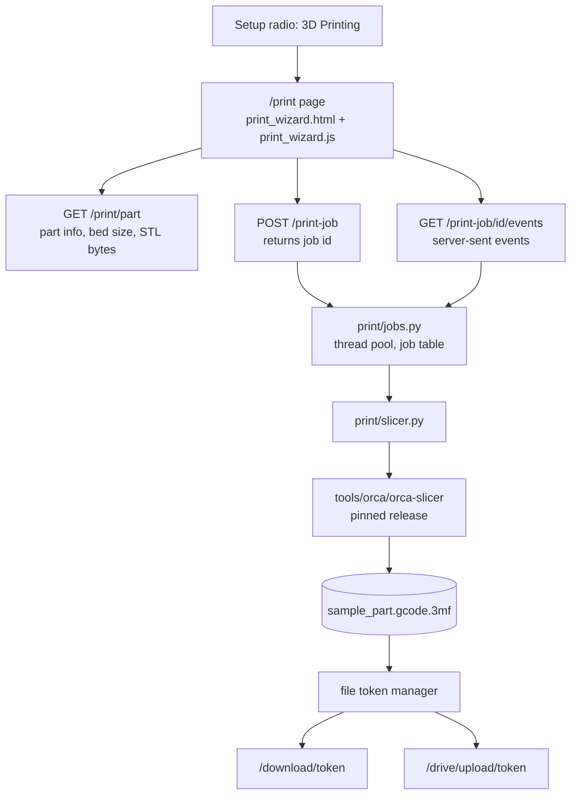

# 3D Print Slicing, Stage 1: Fixed Part Through Orca Slicer

> **Paths updated 2026-09-13:** the print path moved into the top-level `print/`
> package after this document was written. File paths and imports below were
> rewritten to match; the design and the task order are unchanged. See
> [3D_PRINTING.md](https://github.com/6238/PenguinCAM/blob/main/docs/3D_PRINTING.md) for the current layout.

**Status:** Draft for review
**Date:** 2026-09-13
**Scope:** Prove the slicing pipeline end to end with one fixed STL, one fixed
Bambu Lab profile set, and Orca Slicer's command line, inside PenguinCAM.

## 1. Goal

Give a student the same one-click feeling for 3D printing that PenguinCAM gives
for CNC: pick "3D Printing" on the Setup screen, walk through Parts, Layout and
Preview, and save a file the printer accepts. This stage proves that the
pipeline works in the hosted container and in the development environment. It
does not yet connect to Onshape or to team configuration.

## 2. Scope

### In scope

- A "3D Printing" mode radio on the existing Setup screen, beside 2D, 2.5D and
  Tubing.
- A separate print wizard page with the same look: Setup, Parts, Layout,
  Preview, and the existing Download / Send to Google Drive split button.
- One fixed sample part, `print/sample_part.stl`, checked into the repository.
- One fixed set of three Orca profiles (printer, filament, process) for the
  team's Bambu Lab printer, checked into the repository.
- Orca Slicer installed at a fixed path by the project's install step, in the
  development environment and in the Docker image, at one pinned version.
- A Python wrapper that runs Orca's command line and returns the output file and
  a slice summary.
- A small in-process job pool so slices run in the background, in parallel for
  different students, and never hold an HTTP request open. The browser follows
  a job through a server-sent event stream.
- A Preview that shows the part on the printer bed and the slice summary:
  estimated print time, filament used, layer count, and slicer warnings.
- Delivery of the `.gcode.3mf` through the existing token download and Google
  Drive routes.
- Tests: fast mocked tests, plus a full run that slices with the real binary.

### Out of scope, planned for later stages

- Exporting the part from Onshape instead of the fixed STL.
- Printer, filament and process profiles chosen from team configuration.
- More than one printer or printer brand.
- Layer-by-layer toolpath preview from the sliced G-code.
- Moving, rotating or duplicating parts on the bed.
- Sending the job to the printer over the network.

### Deployment targets

Railway, built from the Dockerfile, is the production target. Vercel is
unsupported from this stage on: the serverless build has no Orca binary and a
60-second function limit. `app.py`, `vercel.json` and the Vercel notes in the
README stay untouched but no longer describe a working deployment.

## 3. User flow

The student sees one PenguinCAM. Only the Setup screen's mode radio reveals
that printing is a separate path.

### Two layouts, as today

The CNC wizard has two layouts, and the print wizard copies both. In the
Onshape panel (`source=onshape`) the steps show one at a time with a Next
button and a running summary of chips. In full-page mode (`source=upload`) all
four steps show at once in a 2x2 grid, the current step highlighted, and the
summary chips are hidden. "Entering a step" below means the step becoming
current in either layout.

### Setup

The mode radios read 2D, 2.5D, Tubing, 3D Printing in the panel, and 2D,
Tubing, 3D Printing in full-page mode, where 2.5D is hidden as it is today.
Choosing 3D Printing navigates to the print wizard's Setup step, which shows
the same header, step bar and mode radios, and replaces the CNC fields with
read-only print fields:

| Field | Value in this stage |
|-------|---------------------|
| Printer | `name` from the printer profile, for example `Bambu Lab X1 Carbon 0.4 nozzle` |
| Filament | `name` from the filament profile, for example `Bambu PLA Basic @BBL X1C` |
| Process | `name` from the process profile, for example `0.20mm Standard @BBL X1C` |

The machine dropdown does not appear in print mode. Choosing 2D, 2.5D or
Tubing on the print wizard's Setup navigates back to the page the student came
from. That page reloads with its default mode, 2D, selected, and the student
picks again. Any values typed on the CNC Setup before switching are lost, as
they are today on any reload.

### Parts

No drop zone and no Onshape face selection. The list shows the one sample part
with its name and bounding box in millimetres, fetched from the server. This
list is the stand-in for the later Onshape export.

### Layout

A top-down drawing of the printer bed with the part's footprint centred on it,
drawn from the bounding box. An info line shows printer name and bed size. The
part cannot be moved. If the part is larger than the bed in any axis, the step
shows an error and Next stays disabled.

### Preview

Entering the step submits the slice job and shows a status line that follows
it: "Queued", then "Slicing", updated live from the server. On success the
step shows:

- The sample part as a mesh on the printer bed in a 3D view with orbit
  controls.
- A summary line: estimated print time, filament in grams and metres, layer
  count.
- Slicer warnings, if any, in the notes box.

The split button offers Download Program and Send to Google Drive, as on the
CNC Preview, and delivers `sample_part.gcode.3mf`. On failure the error box
shows a short message and the save button stays disabled.

### Summary chips (panel layout only)

Printer, filament and process from Parts onward; "1 part" from Layout onward;
print time and filament grams on Preview.

## 4. Architecture



### Separation from the CNC code

The print path is its own code. It shares the stylesheet, the Three.js library,
the header and step-bar markup pattern, the session gate, and the file token
manager. It shares nothing with the G-code engine, the CNC wizard's step logic,
or the CNC 3D viewer.

### Changes to existing files

| File | Change |
|------|--------|
| `templates/wizard.html` | Add the "3D Printing" radio to the mode fieldset. |
| `static/wizard.js` | When the 3D Printing radio is chosen, navigate to `/print` with `source`, `theme` and `return` query parameters. |
| `frc_cam_gui_app.py` | One call to `init_print_routes(...)` after the limiter and temp folders exist. Pick the download MIME type by file extension so `.3mf` downloads as binary. |
| `Makefile` | `install` runs the Orca install script. Add `test-quick`. `test` includes the Orca run. |
| `Dockerfile` | Pin the base image, install `curl` and Orca's runtime libraries, run the Orca install script, and switch gunicorn to threaded workers. |
| `Procfile` | Same gunicorn command line as the Dockerfile, kept in step. |
| `.gitignore`, new `.dockerignore` | Ignore `tools/`. |
| `.github/workflows/integration.yaml` | Run the Orca install script, then `make test`, so CI covers the slicer. |
| `CLAUDE.md`, `README.md`, `docs/DEPLOYMENT_GUIDE.md` | Document the new commands, the print stage, and the deployment changes. |

No change to `frc_cam_postprocessor.py`, the `/process*` routes,
`gcode_viewer.js`, or the CNC step logic in `wizard.js`.

### New files

| File | Purpose |
|------|---------|
| `print/routes.py` | Flask blueprint: `/print`, `/print/part`, `/print-job`, `/print-job/<id>`, `/print-job/<id>/events`. |
| `print/jobs.py` | Job table and thread pool: submit, look up, subscribe to state changes, expire. No Flask imports. |
| `print/slicer.py` | Runs Orca's command line, reads the summary, no Flask imports. |
| `print/templates/print_wizard.html` | The print wizard page. |
| `print/static/print_wizard.js` | Step logic for the print wizard. |
| `print/static/print_viewer.js` | Mesh-on-bed 3D view built on Three.js. |
| `print/sample_part.stl` | Fixed sample part: a binary STL in millimetres, no larger than 60 mm on any axis. |
| `print/profiles/printer.json`, `filament.json`, `process.json` | Fixed Orca profiles, flattened. |
| `print/README.md` | Which Orca profiles these came from and the command that regenerates them. |
| `print/scripts/install-orca.sh` | Downloads and unpacks the pinned Orca release. |
| `print/scripts/flatten_orca_profiles.py` | Resolves an Orca profile inheritance chain into one self-contained JSON. |
| `print/tests/test_slicer.py`, `print/tests/test_routes.py`, `print/tests/orca_integration_test.py` | See section 9. |
| `docs/3D_PRINTING.md` | Developer guide for the print path. |

### Wiring the blueprint without a circular import

Everything the print path shares is a module global of `frc_cam_gui_app.py`:
the session gate, the token manager, the limiter, the upload and output
folders, metrics, logging and the template context that carries
`drive_enabled`. `print/routes.py` therefore never imports
`frc_cam_gui_app`. It exposes:

```python
def init_print_routes(app, *, limiter, require_session, token_manager,
                      upload_folder, output_folder, template_context, metrics, log)
```

`frc_cam_gui_app.py` calls it once, after the limiter and temp folders are
created and before the module-level cleanup registration at the end of the
file. That call is the one addition to the Flask module besides the MIME map.

## 5. Orca Slicer as a core dependency

Orca Slicer is part of the product, like the Python interpreter. It is never
optional and never configurable.

### Fixed location

The command line entry point is always `tools/orca/orca-slicer`, relative to
the repository root. `print/slicer.py` computes that path from its own file
location. There is no environment variable and no lookup on `PATH`.

### Target architectures

The same code runs on three platforms, and Orca publishes an official build
for each, so the install script never compiles Orca and never emulates a
foreign CPU.

| Where | OS and CPU | Orca release asset (v2.4.2 names) |
|-------|-----------|-----------------------------------|
| Railway production | Linux x86-64 | `OrcaSlicer_Linux_AppImage_Ubuntu2404_V2.4.2.AppImage` |
| Agent containers (no root), local Docker on the Mac | Linux aarch64 | `OrcaSlicer_Linux_AppImage_Ubuntu2404_aarch64_V2.4.2.AppImage` |
| Mac development | macOS arm64 (universal binary) | `OrcaSlicer_Mac_universal_V2.4.2.dmg` |

The script chooses the asset from `uname -s` and `uname -m` and refuses any
other combination with a message naming the two values. Each of the three
assets has its own checksum in the script. Downloads come from the canonical
repository, `github.com/OrcaSlicer/OrcaSlicer`; the older `SoftFever` path
only redirects there.

On Linux the script extracts the AppImage with `--appimage-extract`, so the
container needs no FUSE, and writes `tools/orca/orca-slicer` as a shell
wrapper. The wrapper does not go through the AppImage's `AppRun`, whose
launcher insists on finding host libraries through `ldconfig`. It sets what
`AppRun` would set, `APPDIR` and `LC_ALL=C`, puts
`squashfs-root/lib/orca-runtime`, `squashfs-root/bin` and, when present,
`tools/orca/hostlibs/usr/lib/<triplet>` and its `gstreamer-1.0` subdirectory
on `LD_LIBRARY_PATH`, and runs `squashfs-root/bin/orca-slicer` directly. On
macOS the script mounts the disk image, copies `OrcaSlicer.app` into
`tools/orca/`, and writes the same wrapper pointing at
`Contents/MacOS/OrcaSlicer`. The wrapper passes all arguments through. `tools/orca/VERSION` records the version and the architecture, so a
`tools/` directory copied from a Mac into a Linux build is detected and
replaced rather than trusted.

The Linux AppImages are built on Ubuntu 24.04 and need glibc 2.38 or newer.
The Dockerfile pins its base to `python:3.11-slim-trixie` (Debian 13, glibc
2.41). Today the unpinned `python:3.11-slim` tag already resolves to trixie,
but the pin stops a future tag move from changing the C library under Orca.

### Pinned version

`print/scripts/install-orca.sh` holds `ORCA_VERSION`, set to `2.4.2`, the current
stable release, and the SHA-256 checksum of each platform's download. It is
the only place the version appears. The script is idempotent: if
`tools/orca/VERSION` matches the version and architecture, it exits without
downloading. If the checksum fails, it deletes the download and exits
non-zero.

`make install` runs the script. The Dockerfile installs `curl` and Orca's
runtime libraries, then runs the same script in a build step, so the image and
the development machine run the identical release.

The AppImage bundles only a handful of private libraries and takes the rest
from the host. On Ubuntu 24.04 the packages that resolve every dependency
are:

```
libopengl0 libegl1 libglu1-mesa libgtk-3-0t64 libgdk-pixbuf-2.0-0
libpangocairo-1.0-0 libpangoft2-1.0-0 libcairo-gobject2
libgstreamer1.0-0 libgstreamer-plugins-base1.0-0
libwebkit2gtk-4.1-0 libjavascriptcoregtk-4.1-0 libsoup-3.0-0 libsecret-1-0
libwayland-client0 libwayland-egl1 libwayland-server0
```

Debian 13 package names may differ in small ways; the Dockerfile build ends
with `ldd tools/orca/squashfs-root/bin/orca-slicer | grep 'not found'` and
fails the build if anything prints. The AppImage needs glibc 2.38 or newer.

The agent containers run Ubuntu 24.04 aarch64 without root, sudo or a Docker
daemon, so those packages cannot be installed there with apt. The install
script therefore has an unprivileged Linux path. After extracting the
AppImage it runs the same `ldd` check. If libraries are missing and the
script is not root, it downloads the Ubuntu 24.04 `.deb` files for the
missing libraries and their dependencies for the current architecture from
the Ubuntu archive, verifies each against the archive's published checksum,
unpacks them with `dpkg-deb -x` into `tools/orca/hostlibs/`, and repeats the
`ldd` check until nothing is missing. The wrapper described above picks
`hostlibs` up automatically. In the Docker image the distro packages are
present, `ldd` is clean on the first pass, and `hostlibs` is never created.
Either way the entry point stays `tools/orca/orca-slicer`, and nothing is
configurable.

Slicing needs no display. With any action flag the command line never consults
`DISPLAY`, and a real slice on the aarch64 build with no display server exited
0 in about one second. No `xvfb` is installed.

### Profiles

Orca's profiles form inheritance chains: a Bambu printer profile inherits from
a family profile, which inherits from a base, and each file holds only the
keys it overrides. The command line does not resolve those chains. It loads
exactly the keys in the files it is given and fills every other key with
Orca's built-in defaults, without error. Slicing with an unflattened Bambu X1
Carbon profile "succeeds" with a 200 mm bed, a filament density of zero and no
weight in the output. The desktop app's export does not help: it writes the
user preset's differences plus the parent's name, not a resolved file.

The three checked-in profiles are therefore produced by
`print/scripts/flatten_orca_profiles.py`. It reads the profile tree that ships inside
the Orca build at `tools/orca/squashfs-root/resources/profiles/BBL/` on Linux,
or the equivalent under `Contents/Resources` on macOS, follows `inherits` to
the root, merges the keys child over parent, sets `from` to `system` and
`inherits` to an empty string, and writes one self-contained JSON. A printer
profile marked `from: User` with no `inherits` fails Orca's printer-to-process
compatibility check with return code -17, which is why `from` stays `system`.

`print/README.md` records the three source profile names and the one command
that regenerates the files. Two tests guard them. A unit test asserts that
each file has an empty `inherits` and carries the keys the pipeline depends
on: `name`, `printable_area`, `printable_height`, `filament_density`,
`layer_height`, and `compatible_printers` on the process and filament. The
integration test re-runs the flattening script against the installed Orca and
fails if the result differs from the checked-in files, so an Orca upgrade
forces a regeneration. Orca's `version` key is a vendor profile version, not
the application version, and is not used.

## 6. Backend

### `print/slicer.py`

One public function:

```python
def slice_stl(stl_path, output_dir, timeout_s=120) -> SliceResult
```

It uses the fixed profiles under `print/profiles/`. The output file name is the
STL's stem plus `.gcode.3mf`. It creates `output_dir` first, because the
command line does not create a missing `--outputdir` and exits with code 156
if it is absent. It runs:

```
tools/orca/orca-slicer \
    --load-settings "print/profiles/printer.json;print/profiles/process.json" \
    --load-filaments "print/profiles/filament.json" \
    --arrange 1 --slice 0 \
    --export-3mf <stem>.gcode.3mf --outputdir <output_dir> \
    <stl_path>
```

`--arrange 1` centres the part on the plate, which matches the Layout drawing.
`--slice 0` slices every plate; the sample has one. Orca also writes a loose
`plate_1.gcode` and, on Linux, a `result.json` beside the archive, so the
output directory is scratch space and only the archive is kept.

The subprocess environment sets `XDG_CONFIG_HOME` and `XDG_RUNTIME_DIR` to
directories under `output_dir`, so Orca's per-user configuration writes land
in scratch space and two concurrent slices never share one. Without
`XDG_RUNTIME_DIR` Orca prints an `error:` line on stderr and carries on, so
stderr text is never used to judge success. Success is the exit code plus the
presence of the archive.

`SliceResult` holds `output_path`, `print_time_s`, `filament_m`, `filament_g`,
`layer_count`, and `warnings`. The function raises `SliceError` when the
process exits non-zero, exceeds the timeout, or leaves no output file.
`SliceError` carries two strings: `message`, one sentence fit for the student,
and `details`, the last twenty lines of Orca's output, which the route logs
and never returns to the browser.

The summary comes from two entries inside the `.gcode.3mf`, which is a zip
archive:

| Field | Source |
|-------|--------|
| `print_time_s` | `Metadata/slice_info.config`, `<metadata key="prediction" value="…"/>`, seconds |
| `filament_g` | same file, `<metadata key="weight" value="…"/>`, grams |
| `filament_m` | same file, the `used_m` attribute of the `<filament>` element |
| `layer_count` | `Metadata/plate_1.gcode`, header line `; total layer number: N` |

The G-code header also carries the printing time as a string like
`13m 10s`, and the filament totals appear only at the end of the file and are
omitted when the weight is zero, so the archive metadata is the primary source
and the header supplies only the layer count. The first implementation task
captures a real `slice_info.config` and header from the pinned release into
test fixtures.

`warnings` comes from `result.json`, which the Linux build writes into the
output directory with `return_code`, `error_string` and a `warning_message`
per sliced plate. The macOS build does not write that file, so on a Mac the
list is empty and the developer guide says so. Orca's own log lines carry no
reliable prefix and are not parsed; they go to the server log.

A second public function, `part_info()`, returns the sample part's name and
bounding box in millimetres computed from the STL, the printer name, bed size
and height from the printer profile, and the filament and process names from
the other two profiles. Every value in an Orca profile is a string:
`printable_area` is a list of `"XxY"` corner strings such as `"256x256"`, and
`printable_height` is a string like `"250"`. `part_info()` parses them to
numbers once.

### Routes, in `print/routes.py`

| Route | Method | Behaviour |
|-------|--------|-----------|
| `/print` | GET | Requires the app session gate. Renders `print_wizard.html` with `source`, `theme` and `return` from the query string. When `source=onshape`, sets the same `Content-Security-Policy: frame-ancestors https://*.onshape.com` header the panel route sets, so the page can live in the Onshape iframe. |
| `/print/part` | GET | Returns JSON from `part_info()`. With `?stl=1` streams the STL bytes with `model/stl`. |
| `/print-job` | POST | Requires the app session gate. Rate limited to three requests per minute. Submits a job to the pool and returns `{job_id}` at once with status 202. Returns 503 with `{error}` when the queue is full. |
| `/print-job/<id>` | GET | Requires the gate. Returns the job's current record as JSON: `{state, token, summary, part, error}`. 404 for an unknown or expired id. |
| `/print-job/<id>/events` | GET | Requires the gate. A `text/event-stream` response that sends a `state` event now, then every five seconds or on change, then a final `done` or `failed` event carrying the same JSON as the record, and closes. 404 for an unknown id. |

The `return` parameter is user-controlled, so `/print` accepts only a
same-origin path: it must start with a single `/`. Anything else is replaced
by `/app`. When the gate fails, `/print` redirects to the validated `return`
with `?verify=1` appended; the CNC page already runs its verification on load,
so the student lands back on a page that can verify them. For the Onshape
panel, `wizard.js` passes the panel's current path and query string as
`return`, so the document, workspace, element, server and theme parameters
survive the round trip and the panel can re-handshake with Onshape.

The rate limit keys on the remote address, as every existing limit does.
Behind the Railway proxy all browsers share one address, so three per minute
is a deployment-wide cap this stage. The fourth student in a minute sees a 429
message on the Preview step. Trusting the proxy's forwarded-for header is a
separate change and is not made here.

### Job files and cleanup

The route creates a scratch directory under the upload folder for Orca's
output and configuration writes, moves the `.gcode.3mf` into the output folder
under a unique name, registers that path with the file token manager as
`sample_part.gcode.3mf`, and removes the scratch directory in a `finally`
block. This mirrors what the multi-part CNC route does. The token manager's
cleanup thread unlinks registered files after their retention period; it does
not remove directories, which is why the route removes its own scratch space.

### Delivery

`/download/<token>` chooses its MIME type by extension: `.3mf` is
`application/octet-stream`; everything else keeps `text/plain`.
`/drive/upload/<token>` uploads by path and lets the Drive client pick the
type from the file name, so it needs no change.

### Job pool

`print/jobs.py` owns a job table and a `ThreadPoolExecutor`. The pool size
is the number of Orca processes allowed to run at once, and it is sized to
the compute the Railway service actually has, not to demand: the smaller of
the service's vCPU count and its memory divided by one slice's peak resident
memory, rounded down, never below one. Orca is multi-threaded and will use
every core it is given, so two slices on one vCPU only slow each other. The
first implementation task measures both numbers on the production plan and
the constant is set from them; until then it is one.

The queue is deliberately small: at most two jobs wait beyond the running
ones. Beyond that a submit raises and the route answers 503 "server busy",
because queued work that nobody will wait for is worse than an honest
refusal. Both numbers are constants at the top of the module, and the
deployment guide says how to revisit them when the plan changes.

Each job record holds `id`, `state`, `created`, `updated`, and on completion
`token`, `summary`, `part`, or `error`. States are `queued`,
`running`, `done`, `failed`. Ids are random URL-safe tokens of at least 32
characters, so knowing one is the only credential needed to read its result,
the same model the file token manager uses for downloads.

The worker function creates the scratch directory, calls `slice_stl`, moves
and registers the archive as described under "Job files and cleanup", writes
the result into the record, and removes the scratch directory in `finally`.
It logs the `print_job` metrics event with the outcome. Records expire one
hour after their last update, on the same sweep cadence as the token manager,
and a job whose result was never read still expires.

Subscribers wait on a per-job condition variable with a five-second wait. A
state change notifies every subscriber at once; otherwise each wakes every
five seconds to report the unchanged state. The table is process memory,
like the token map, so it works with one gunicorn worker and any number of
threads.

### Status stream

The events route is a long-running GET: a generator response with
`Content-Type: text/event-stream` and `Cache-Control: no-cache` that returns
a sequence of status updates. It sends the current state immediately, then
a `state` event every five seconds or sooner when the state changes, then
the terminal `done` or `failed` event with the full record, and closes. Each
`state` event carries `state` and `elapsed_s`, so the status line can show
"Slicing, 12 s". It also closes when the job's record expires or the client
disconnects. A stream is never longer than one slice plus the queue wait, and
this stage assumes slices are short, so there is no handling of proxy idle
limits beyond the five-second cadence itself.

The plain JSON route exists for two reasons: the browser reads it as a
fallback if its event source errors before the terminal event, and a developer
can inspect a job with `curl`.

### Threads and gunicorn

gunicorn today runs one synchronous worker with one thread, so any request
blocks every other one. With the pool, no request is long except an open
event stream, but each open stream still occupies a request thread. The
command line in the Dockerfile and Procfile becomes:

```
gunicorn frc_cam_gui_app:app --bind 0.0.0.0:$PORT --worker-class gthread --threads 16
```

Sixteen threads leave room for several open streams beside ordinary
requests. The threaded worker keeps its liveness heartbeat on its own main
loop, so a long stream does not trip gunicorn's request timeout and the
default stays. Workers stay at one: the job table, the file token map, the
limiter's memory storage and, without a configured secret key, the session
secret are all per process. The token manager already holds a lock, and the
job table holds its own.

Slices run in the pool's threads, not in request threads. A subprocess wait
releases Python's global lock, so running slices and sixteen request threads
do not contend.

### Slicer timeout and memory

The slicer timeout is 120 seconds, a safety net rather than a budget: this
stage assumes a slice finishes well inside it. Past the timeout the job fails
with a message saying the part took too long.

Orca initialises its GUI toolkit even when slicing headless, so its memory
footprint times the pool size must fit the Railway plan beside the Flask
process. The first implementation task measures peak resident memory and CPU
use of one slice on x86-64, and the deployment guide records those numbers,
the plan's vCPU and memory allotment, and the pool size derived from them.

## 7. Frontend

### `print_wizard.html`

Same header, step bar and navigation footer as the CNC wizard, copied rather
than shared, so the two pages can diverge. Four step sections with print
content as in section 3. Applies the same `grid` class in full-page mode.
Loads `wizard.css`, Three.js and OrbitControls from the same sources as the
CNC wizard, then `print_viewer.js` and `print_wizard.js`. Receives
`drive_enabled` from the template context so the split button's Drive option
appears under the same rule as the CNC page.

### `print_wizard.js`

Owns step navigation, the summary chips, and the three data calls. On load it
fetches `/print/part` and fills Setup, Parts and Layout. Layout draws the bed
and footprint on a canvas. Entering Preview posts `/print-job`, opens an
`EventSource` on the job's events route, and updates the status line from each
`state` event. On `done` it fills the summary, enables the save button,
fetches the STL and hands it to the viewer. On `failed` it shows the error.
If the event source reports an error before a terminal event, it closes it
and polls the JSON route every two seconds instead, so a proxy that cannot
stream still finishes the job. Leaving the Preview step closes the stream;
the job keeps running and its result is still there if the student comes
back within the hour. The save split button and the Drive
handling follow the CNC wizard's pattern, including the remembered last
choice, but the code lives in this file. Hides the 2.5D radio when
`source=upload`, as the CNC page does.

The other mode radios navigate to the `return` URL.

### `print_viewer.js`

Parses binary and ASCII STL, builds a Three.js mesh, draws a bed plane sized
from the part info, centres the mesh on it, and provides orbit controls and a
reset-view button. No scrubber and no animation.

## 8. Error handling

| Condition | Behaviour |
|-----------|-----------|
| Orca binary missing at the fixed path | `print/slicer.py` raises when `init_print_routes` imports it, with a message naming `make install`. The server does not start, and every test module that imports the app fails. |
| A checked-in profile no longer matches what the flattening script produces from the installed Orca, or a profile lacks a required key | A test fails. At runtime the slice runs anyway, possibly with wrong defaults, which is why the test exists. |
| Slice exits non-zero or times out | The job ends `failed` with `message`; `details` goes to the server log; Preview shows the message; save button disabled. |
| Queue full (pool busy and two waiting) | 503 on submit; Preview shows "The slicer is busy, try again in a minute". |
| Unknown or expired job id | 404; Preview shows "This slice has expired, go back and slice again". |
| Server restarts while a job runs | The job table is gone; the stream closes and the fallback poll gets 404, handled as above. |
| Output archive lacks a G-code entry | `SliceError` whose `details` names the archive contents. |
| A summary field is missing from the archive metadata or header | That field is `null`; the summary line omits it; the file is still delivered. |
| Part larger than bed | Layout shows the error; Next disabled. |
| Session gate fails on `/print-job` | 401 with the same JSON the CNC routes return; the page shows the message. |
| Rate limit hit on `/print-job` | 429; the page shows "Too many slices in a minute, try again shortly". |

## 9. Testing

`make test` is the full run and includes the real slicer. Orca missing is a
failure, not a skip. `make test-quick` runs everything except the slow slice
and remains the tool for iteration; `make test` stays the gate the project
CLAUDE.md requires before a change is done.

The exclusion needs no environment variable. The integration test lives in
`print/tests/orca_integration_test.py`, a name the `test_*.py` discovery pattern
does not match, and `make test` runs it explicitly after discovery:

```
test: test-quick
	uv run python -m unittest print.tests.orca_integration_test

test-quick:
	uv run python -m unittest discover -s tests --buffer && uv run python -m unittest discover -s print/tests -t . --buffer
	uv run python gcode_test.py --quiet
```

| Test file | Runs Orca | Covers |
|-----------|-----------|--------|
| `print/tests/test_slicer.py` | No | Command construction, including creating the output directory and the XDG environment; timeout; non-zero exit; missing output; summary parsing from fixture `slice_info.config`, header and `result.json` files; `part_info()` bounding box from a small STL and names and bed size from the profiles; profiles have an empty `inherits` and the required keys. |
| `print/tests/test_jobs.py` | No | Submit returns an id and runs the worker; state transitions in order; queue cap raises; subscribers are notified on change and wake on the five-second cadence; expiry removes old records; a failing worker ends `failed` with `message` and no `details`. Uses a synchronous stand-in for the executor. |
| `print/tests/test_routes.py` | No | `/print` redirects without a session and rejects a foreign `return`; `/print/part` JSON and STL bytes; `/print-job` returns 202 with an id and 503 when the pool reports a full queue; `/print-job/<id>` JSON and 404; the events route emits `state` then `done` and closes, read through the Flask test client; download MIME type for `.gcode.3mf`. |
| `print/tests/orca_integration_test.py` | Yes | Slices `print/sample_part.stl` with the pinned binary; asserts a valid zip with `Metadata/plate_1.gcode` and `Metadata/slice_info.config` entries and positive time, filament and layer count. Re-runs the flattening script against the installed Orca and asserts the output equals the checked-in profiles. Logs the wall-clock duration and does not assert on it; the 120-second subprocess timeout is the only bound. |

The existing G-code system tests are unchanged. CI installs Orca with the
same script on its x86-64 runner and runs `make test`.

## 10. Facts already verified, and tasks for the first implementation step

The following were confirmed by running the pinned v2.4.2 aarch64 build in a
Linux container with no display server: the command line flags above, that
`--export-3mf` embeds the G-code as `Metadata/plate_1.gcode`, that `--arrange 1`
centres a single part, that a missing `--outputdir` fails, the archive entry
names, the header and `slice_info.config` contents, the runtime library list,
and that unflattened profiles slice with wrong defaults.

Tasks that remain, confirmed before the rest is built and pinned in tests:

1. The Debian 13 package names for the runtime libraries, on both x86-64 and
   aarch64, with the `ldd` check green in the Docker build.
2. Peak resident memory and CPU use of one slice on x86-64, the production
   Railway service's vCPU and memory allotment, and the pool size that
   follows from the rule in section 6.
3. On macOS: that `OrcaSlicer.app` copied into `tools/orca/` runs from the
   command line without a Gatekeeper prompt, or which quarantine attribute the
   install script must clear, and where the macOS build writes its
   configuration when `XDG_CONFIG_HOME` is set.
4. The command line produces no thumbnail images inside the archive, because
   thumbnails need an OpenGL context the headless run does not have. Whether
   the team's Bambu printer and the Bambu apps accept a `.gcode.3mf` without
   thumbnails is unverified. The acceptance step for this stage is loading the
   produced file on the team's printer and printing the sample part.

## 11. Build notes for the implementing session

This section holds what the session that builds the feature needs beyond the
design. It is not part of the product.

### Preserved artefacts from the review

The adversarial review left working material at
`/tmp/claude-1000/orca-review-artifacts/` in the agent container:

| Path | What it is |
|------|------------|
| `appimg/orca.AppImage` and `appimg/squashfs-root/` | The v2.4.2 aarch64 AppImage, downloaded and extracted. |
| `hostlibs/` | Ubuntu 24.04 arm64 runtime libraries unpacked from `.deb` files, the set that makes `ldd` clean. |
| `debs/` | The downloaded `.deb` files themselves. |
| `bootstrap_libs.sh` | The script that resolved missing libraries to packages through the Ubuntu `Contents-arm64` index and Launchpad. A starting point for the install script's unprivileged path, not a finished one. |
| `test/profiles/` | Flattened X1 Carbon printer, filament and process JSONs that sliced correctly. A starting point for `print/profiles/` and for checking the flattening script's output. |
| `test/box.stl`, `test/outA/` | A 20x30x10 mm binary STL and a successful headless slice of it: the archive, the loose `plate_1.gcode`, and `result.json`. Sources for the test fixtures in section 9. |

The install script must still download and verify from the network on a
clean machine; these artefacts save time and provide fixtures, nothing more.

### Running the development server

Follow the workspace `CLAUDE.md` in `/repos/popcornpenguins/`: start the
server from the checkout with `EMBED_COOKIES=1`, port 6238, as a background
process with output teed to a log file, and run its three verification
checks. Turnstile is unconfigured in development, so the full-page wizard
verifies itself on load and `/print` is reachable after visiting `/app` once.

### Playwright end-to-end acceptance

After the automated tests pass, drive the real server with `playwright-cli`
from the agent container and confirm each step below. A failure is a defect
to fix, then rerun.

1. Open `/app`. The Setup step shows the 3D Printing radio beside 2D and
   Tubing, and 2.5D is hidden.
2. Choose 3D Printing. The browser lands on `/print?source=upload&…` with
   the same header and step bar, the print fields filled from the profiles,
   and no machine dropdown.
3. Parts lists the sample part with a bounding box in millimetres.
4. Layout draws the bed with the footprint centred and shows the printer
   name and bed size.
5. Preview: the status line shows Queued or Slicing, updates within five
   seconds, and reaches the summary with positive time, grams, metres and
   layer count. The 3D view shows a mesh on a bed. The save button is
   enabled.
6. Download Program fetches a file named `sample_part.gcode.3mf` that is a
   valid zip containing `Metadata/plate_1.gcode`.
7. Choosing 2D on the print Setup returns to `/app`.
8. Submit enough jobs in quick succession to exceed the pool and queue, and
   see the busy message rather than a hang.
9. Repeat steps 1 to 6 with `?source=onshape&theme=dark` in the URL to
   confirm the single-step layout and dark theme render, without an Onshape
   login.

Take a screenshot at steps 2, 4 and 5 and keep them in the scratchpad for the
final report.

## 12. Documentation

- [CLAUDE.md](https://github.com/6238/PenguinCAM/blob/main/CLAUDE.md): add `make install` installs Orca,
  `make test` versus `make test-quick`, and a row for
  [3D_PRINTING.md](https://github.com/6238/PenguinCAM/blob/main/docs/3D_PRINTING.md) in the documentation table.
- [README.md](https://github.com/6238/PenguinCAM/blob/main/README.md): add the 3D Printing stage to the 2.0
  section.
- [3D_PRINTING.md](https://github.com/6238/PenguinCAM/blob/main/docs/3D_PRINTING.md): the fixed Orca location, the
  install script, the profile flattening script and why exported profiles do
  not work, the routes, the macOS differences, and the later stages listed in
  section 2.
- [DEPLOYMENT_GUIDE.md](https://github.com/6238/PenguinCAM/blob/main/docs/DEPLOYMENT_GUIDE.md): the Docker build now
  downloads Orca, Railway builds from the Dockerfile so its `CMD` is what
  production runs, the gunicorn thread settings, the memory numbers from
  section 10, and the note that Vercel is unsupported.
