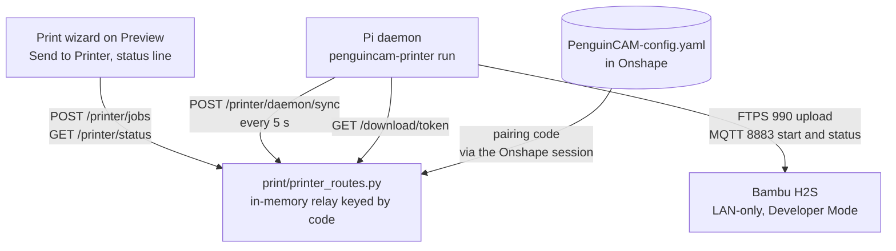

# Bambu Printer Relay: Sending Prints From PenguinCAM to a LAN Printer

> **Paths updated 2026-09-13:** the print path moved into the top-level `print/`
> package after this document was written, and the printer relay moved with it.
> File paths and imports below were rewritten to match; the design and the task
> order are unchanged. See [PRINTER_SETUP.md](https://github.com/6238/PenguinCAM/blob/main/docs/PRINTER_SETUP.md) for the
> current layout.

**Status:** Approved by the owner on 2026-09-13; ready for an implementation plan
**Date:** 2026-09-13
**Scope:** A small daemon on a Raspberry Pi in the shop, a stateless relay in
the PenguinCAM backend, and a "Send to Printer" option in the print wizard,
so a student can start a print on the team's Bambu Lab printer and watch its
progress from Onshape.
**Builds on:** the 3D Print Slicing, Stage 1 design, which produces the
`.gcode.3mf` this feature delivers. See section 0 for where that document is.

## 0. Context for the session that implements this

This document is self-contained. The session that designed it is gone; do
not expect any other context. Everything below was true on 2026-09-13.

### Where you are

- The repository is PenguinCAM, `https://github.com/6238/PenguinCAM`, a
  Flask web app for FRC Team 6238. Its own `CLAUDE.md` at the repository
  root is authoritative for commands, dependency rules, G-code rules and the
  no-git rule; the workspace `CLAUDE.md` one level up, at
  `/repos/popcornpenguins/CLAUDE.md`, is authoritative for branch rules and
  for how to start the development server. Read both first.
- Work in this linked worktree only:
  `/repos/popcornpenguins/PenguinCAM/.worktrees/printer-relay`, on branch
  `feature/printer-relay`, cut from `origin/main` at commit `392cc1b`. It has
  its own `.venv`. Never `cd` to the main checkout at
  `/repos/popcornpenguins/PenguinCAM`, never write files there, and never
  check out a different branch here.
- Git: the owner handles commits and pushes. Never commit or push to `main`.
  Changes reach `main` only by pull request from this branch, and only when
  the owner asks for one. Do not create tags or releases.

### The parallel session you must not collide with

Another Claude session is implementing the slicing stage at the same time,
in the main checkout, on branch `feature/3d-print-stage1`. Its work is not
on `main` yet, so this worktree does not contain it. That session owns these
files, and this branch must not create or edit them:

- `scripts/install-orca.sh`, `scripts/flatten_orca_profiles.py`,
  `scripts/make_sample_part.py`, `Dockerfile`, `Procfile`, `.dockerignore`,
  `.github/workflows/integration.yaml`, `print/`, `print/slicer.py`,
  `print/jobs.py`, `print/routes.py`, `print/templates/print_wizard.html`,
  `print/static/print_wizard.js`, `print/static/print_viewer.js`, `templates/wizard.html`,
  `static/wizard.js`, `static/wizard.css`, `tests/js/`,
  `tests/fixtures/print/`, `docs/3D_PRINTING.md`.

Files both branches touch, where this branch's change must be small,
additive and placed so a merge is a clean hunk: `frc_cam_gui_app.py` (one
`init_printer_routes` call and one `note_code` line), `Makefile` (the
`test-daemon` target), `.gitignore`, `README.md`, `CLAUDE.md`,
`docs/DEPLOYMENT_GUIDE.md`. Files only this branch touches:
`config_validation.py`, `team_config.py`,
`static/docs/PenguinCAM-config-template.yaml`, everything new in section 5.

Because the print wizard belongs to the other branch, build in this order:
the relay, the daemon, the config changes, the installer and all their tests
first, with no dependency on the wizard. Do the wizard changes of section 10
last, after `feature/3d-print-stage1` has merged to `main` and this branch
has been rebased onto it. Until then, the section 10 work is a stub: a
short note in the plan, no code.

The slicing design document lives in the other session's checkout as an
untracked file,
`/repos/popcornpenguins/PenguinCAM/docs/superpowers/specs/2026-09-13-3d-print-slicing-design.md`,
and will arrive on `main` with that branch. Read it there if needed, but do
not copy it into this branch. The facts from it that this design relies on
are restated here: the print wizard's Preview step posts `/print-job`, which
registers a `.gcode.3mf` named `sample_part.gcode.3mf` with the file token
manager and returns a download token; the existing `/download/<token>` route
serves it without a session; the wizard has a split button with Download and
Send to Google Drive; print routes are wired by an `init_print_routes(app,
*, limiter, require_session, token_manager, ...)` call that receives the
Flask module's globals instead of importing them; and production gunicorn
becomes one worker with four threads.

### The development server and port 6238

The Onshape dev OAuth app pins the development server to port 6238, and
another session's server is bound to it and verified end to end by the
owner. Do not start a server on 6238 and do not kill the one running. Unit
tests and the daemon's mocked tests need no server. When the section 13
end-to-end arrangements need the panel, ask the owner for a turn on 6238
first; a session on this machine can also be asked by name through the
cross-session messaging tool, which `ListAgents` shows.

### What to do next

Invoke the `superpowers:writing-plans` skill with this document as the
spec. Save the plan under `docs/superpowers/plans/` in this worktree. Then
execute it with the project's normal workflow, test-driven, running
`make test` before calling any task done, and stop for the owner at the
points the plan marks. Section 14 lists facts to confirm; items 1 to 4 need
the printer, which was not yet connected on 2026-09-13, so do not block on
them.

## 1. Goal

Close the loop that the slicing stage leaves open. Today the student downloads
the sliced file and carries it to the printer. After this feature the Preview
step offers "Send to Printer", the printer starts within seconds, and the
Preview shows what the printer is doing until the print finishes.

The feature must stay as simple as the rest of PenguinCAM. A mentor sets up
the Pi once with one command, pastes one code into the team's YAML, and from
then on everything is driven from the wizard in Onshape.

## 2. Scope

### In scope

- A Python daemon, `penguincam-printer`, that runs on a Raspberry Pi on the
  school LAN, talks to one Bambu Lab printer, and talks outbound to the
  PenguinCAM backend.
- A one-command installer for Raspberry Pi OS.
- Pairing by an eight-character code shown on the Pi and pasted into the
  team's `PenguinCAM-config.yaml` in Onshape.
- A relay in the backend, `print/printer_routes.py`, that keeps state in memory
  only and stores nothing per team on disk.
- "Send to Printer" on the print wizard's Preview split button.
- A printer status line on Preview: idle, printing with percent and time
  remaining, finished, error, or offline.
- Tests for the relay, the daemon with the printer and backend mocked, and a
  smoke test against a real printer that a developer runs by hand.

### Out of scope

- More than one printer per team, or more than one Pi per team.
- Cancelling or pausing a print from the wizard.
- Camera, timelapse, filament or AMS management.
- Any printer brand other than Bambu Lab, and any Bambu printer in cloud mode.
- Windows or macOS builds of the daemon. The daemon is plain Python and will
  probably run there, but only the Pi installer is supported.
- Automatic updates of the daemon.
- A queue. One job at a time per printer; a second send while one is in
  flight is refused.
- Full-page mode. Direct printing is an Onshape-panel feature, because only
  the panel has a team YAML that Onshape authenticated.

### Prerequisites the team must meet

- The printer runs in LAN-only mode with Developer Mode on. Bambu's firmware
  since 2025 rejects print starts from third-party software in any other mode,
  and Developer Mode disconnects the printer from Bambu Cloud, so the Bambu
  Handy app and cloud sending from Bambu Studio stop working for that printer.
  The team accepted this trade-off during design.
- A Raspberry Pi running Raspberry Pi OS Bookworm or newer, on the same LAN
  as the printer, with outbound HTTPS to the backend. No inbound ports are
  opened anywhere.
- The team's printer is a Bambu Lab H2S. Developer Mode exists on it. The
  library this design uses has not been tested on the H2 series, but the H2
  speaks the same MQTT and FTPS protocol as the printers it has been tested
  on, so the plan is to build on the library as it is and patch it if the
  first real run finds a gap. Section 9 says how.

## 3. Why build our own

Research on 2026-09-13 found the protocol well documented and several
libraries that speak it, but no open-source project that relays jobs from a
third-party backend to a LAN printer in a way PenguinCAM could adopt.

- The printer speaks MQTT over TLS on port 8883 with user `bblp` and the LAN
  access code as password, and accepts files over FTPS on port 990. Starting a
  print is the `print.project_file` MQTT command; status arrives on the
  printer's report topic. Reference:
  [OpenBambuAPI](https://github.com/Doridian/OpenBambuAPI).
- [`bambulabs_api`](https://github.com/BambuTools/bambulabs_api) is MIT
  licensed, actively maintained, and wraps upload, print start and status in
  a few calls. The daemon builds on it.
- OctoEverywhere and SimplyPrint bridge Bambu printers to closed SaaS
  backends. Obico has no Bambu support. Bambuddy and print-farm-manager are
  open-source farm managers with their own web servers and user accounts, and
  each would need the backend to reach into the school LAN. All were rejected.
- No cloud-only path exists. Bambu's cloud API blocks third-party print starts
  under the same authorization rules, and its login sits behind Cloudflare
  bot protection. Bambu's sanctioned alternative, Fleet Hub, is a hardware
  appliance for approved developers.
- A browser-to-Pi design with no relay was rejected because the wizard runs
  as HTTPS inside the Onshape iframe, and browsers block requests from that
  context to a plain-HTTP device on the LAN.

## 4. User flow

### Mentor: pair the Pi, once

1. On the Pi, run the install command from the setup guide. It installs the
   daemon as a system service and then runs `penguincam-printer pair`.
2. `pair` listens for Bambu printers announcing themselves on the LAN and
   lists them with model, name and serial, or accepts an IP address typed by
   hand, which is the normal path on school networks that block broadcasts.
   It asks for the LAN access code shown on the printer's screen, connects,
   prints the model and name the printer reports, and then prints a pairing
   code such as `7K3M-Q9XW` and the YAML lines to paste:

   ```yaml
   printing:
     pairing_code: "7K3M-Q9XW"
   ```

3. The mentor adds those lines to the team's `PenguinCAM-config.yaml` in
   Onshape, then opens PenguinCAM from Onshape and clicks the config refresh
   link in the header so the new YAML loads now rather than at the next
   ten-minute refresh. Loading the YAML is what tells the relay the code
   exists; no wizard step is needed. The daemon is already running and asking
   for its token every thirty seconds; within a minute of the refresh it
   starts reporting status.
4. Re-running `pair` on the same Pi, after a printer swap or a reinstall,
   keeps the existing code, so the YAML needs no edit. `pair --new-code`
   mints a new one, for when a former student still knows the old code;
   replace the line in the YAML. To retire a Pi, delete the line. No fresh
   session will send jobs to the old code again.

### Student: send a print

1. The student walks the print wizard to Preview as in the slicing spec. The
   split button now offers Download, Send to Google Drive, and Send to
   Printer. Send to Printer is enabled when the team's YAML has a pairing
   code, the printer has reported in the last two minutes, it is not printing,
   and no job is in flight.
2. The student picks Send to Printer. The status line shows "Sending to
   printer", then "Printer starting sample_part", then "Printing sample_part,
   3 percent, 41 min left".
3. The student can leave the page. Coming back to Preview later shows the
   printer's current state, whoever started the print.

### Everyone: the status line

The status line sits under the slice summary on Preview. The wizard chooses
the first row whose condition holds:

| Text | Condition |
|------|-----------|
| No printer paired | The YAML has no `printing.pairing_code`. |
| Pi with code 7K3M-Q9XW has not reported since the service started | The relay has not heard from a daemon with this code since it started. Links to the setup guide. |
| No printer reporting | A daemon has been heard, but no status snapshot is held. |
| Printer offline, last seen 7 min ago | The latest snapshot is older than two minutes. |
| Sending to printer | A job is pending and not yet handed to the daemon. |
| Printer starting sample_part | A job has been handed to the daemon and not yet acknowledged. |
| Printing sample_part, 42 percent, 31 min left | Snapshot state `running`. |
| Paused, sample_part | Snapshot state `paused`. |
| Upload to printer failed: connection refused | The last job failed within the last ten minutes. The daemon's one-line reason. |
| Printer unreachable from the Pi | Snapshot state `unreachable`. |
| Printer error: HMS_0300_0100_0001_0004 | Snapshot state `error`, with the printer's code. |
| Finished sample_part | Snapshot state `finished`. |
| Printer idle | Snapshot state `idle`. |

The file name shown is the printer's reported file name with the job suffix
from section 7 removed. Every age shown, such as "last seen 7 min ago", is
measured on the relay from when the snapshot arrived; the Pi's and the
printer's clocks are never used.

## 5. Architecture



### Three parties

- **The daemon** on the Pi. It owns the printer connection. It makes one
  outbound HTTPS request every five seconds that carries the printer's status
  and returns a pending job if there is one. It has no web server and no open
  ports.
- **The relay** in the backend. One Flask blueprint with a module-level
  dictionary of printer records behind a lock, keyed by pairing code. It
  never writes per-team data to the Railway volume or database.
- **The wizard**, from the slicing spec, with one new split-button option and
  one status line, both in `print_wizard.js` and `print_wizard.html`.

### Why the pairing code, not the team number, is the key

The team number in a session comes from `team.number` in whatever YAML the
user's own Onshape documents hold. Onshape authenticates the user and the
document, not the number inside the file, so any Onshape user could write
another team's number into their YAML. The pairing code is forty random bits
that only the team's documents and the team's Pi hold, so it identifies the
printer on its own. The team number is used for metrics only.

### Repository layout

| Path | Purpose |
|------|---------|
| `print/printer_routes.py` | Flask blueprint: session routes, daemon routes, and the installer route. No printer protocol code. |
| `print/printer_relay.py` | The in-memory printer records, code normalisation, token issue and check. No Flask imports, so it unit-tests without an app. |
| `print/printer_daemon/` | The daemon package, with its own `requirements.txt`. The backend never imports it and it never imports the backend. It is not a pip package and has no `pyproject.toml`; the installer copies the directory and runs it with `python -m printer_daemon`. |
| `print/printer_daemon/__main__.py` | `pair`, `run` and `status` commands. |
| `print/printer_daemon/config.py` | Reads and writes the Pi's config file. |
| `print/printer_daemon/relay_client.py` | Talks to the backend: exchange, sync, download, acknowledge. |
| `print/printer_daemon/printer.py` | Wraps `bambulabs_api`: discover, connect, upload, start, latest status. |
| `print/printer_daemon/install.sh` | The Pi installer. |
| `static/docs/PenguinCAM-config-template.yaml` | Gains a commented `printing` block. |
| `config_validation.py` | Validates and normalises `printing.pairing_code` after the existing walk. |
| `team_config.py` | A `pairing_code` property that finds the block in v1 and v2 files. |
| `print/templates/print_wizard.html`, `print/static/print_wizard.js` | The button and the status line. |
| `frc_cam_gui_app.py` | One call to `init_printer_routes(...)`, and one call to `printer_relay.note_code(...)` inside `_load_team_config_into_session`. |
| `print/tests/test_printer_relay.py`, `print/tests/test_printer_routes.py`, `print/printer_daemon/tests/` | See section 13. |
| `docs/PRINTER_SETUP.md` | The mentor's guide: firmware mode, Pi install, YAML line, troubleshooting. |

The daemon lives in the PenguinCAM repository so that one pull request can
change both ends of the protocol. Its `requirements.txt` lists
`bambulabs_api`, `requests` and `tomli-w`. Nothing from the backend's list is
installed on the Pi, and `bambulabs_api` is never installed in the Docker
image; the development venv installs it only for `make test-daemon`.

### Wiring

`init_printer_routes` follows the slicing spec's pattern of receiving the
Flask module's globals instead of importing them:

```python
def init_printer_routes(app, *, limiter, has_onshape_session, refresh_team_config,
                        token_manager, metrics, log)
```

`has_onshape_session` is `_has_onshape_session`; `refresh_team_config` is
`_maybe_refresh_team_config`, the existing ten-minute refresh helper, so the
status route can pull a changed YAML; `token_manager` resolves the download
token a send carries. The call sits beside `init_print_routes`.

The second change to the Flask module is one line in
`_load_team_config_into_session`: after the YAML is validated, it calls
`printer_relay.note_code(team_config.pairing_code)`. That function runs on
login, on the ten-minute refresh and on the header's refresh link, so every
way a YAML reaches a session also tells the relay its code, and pairing
needs no wizard step. `print/printer_relay.py` has no Flask imports, so the Flask
module can import it without a cycle; the blueprint uses the same module
singleton.

The slicing spec keeps gunicorn at one worker because its token map is per
process; the relay is another reason, and the slicing spec's list of
per-process state gains this line.

## 6. Pairing and trust

### The pairing code

`pair` generates eight symbols from Crockford's base32 alphabet,
`0123456789ABCDEFGHJKMNPQRSTVWXYZ`, which omits I, L, O and U so that no two
symbols look alike. Forty bits of randomness from `secrets.choice`. A code
made only of digits is discarded and drawn again, so the YAML value is a
string whether or not the mentor quotes it. The code is displayed as two
groups of four with a dash, `7K3M-Q9XW`, and stored everywhere else in its
normalised form, `7K3MQ9XW`.

Everywhere a code is read, it is normalised before use: uppercase, spaces and
dashes removed, O mapped to 0, and I and L mapped to 1. `config_validation.py`
does this as a step after its existing walk: a `printing.pairing_code` that
is not a string of eight alphabet symbols after normalisation is dropped
with a warning in lenient mode, which is the Onshape path, and rejected in
strict mode with "printing.pairing_code must be the 8-character code shown by
the Pi". The existing string sanitiser leaves the code untouched because it
only strips parentheses and non-ASCII characters.

`TeamConfig` gains a `pairing_code` property. A version 2 file keeps
`printing` at the top level; a version 1 file has it moved under the default
machine by the normaliser. The property looks in both places, like the
existing `team` lookup, and returns the normalised code or `None`.

### The token

The daemon's credential is a token the relay signs with the app's
`FLASK_SECRET_KEY` using `itsdangerous`, which Flask already depends on, with
the salt `penguincam-printer`. The payload is the normalised code and the
issue time. The relay verifies a token by signature alone and reads the code
out of it, so it needs no storage to recognise a daemon. A valid token is the
only thing a daemon route trusts; the relay does not compare the token's code
with any YAML, because it may not have seen one since it started.

Tokens carry no expiry. Retiring a Pi means removing or changing the code in
the YAML: sessions then stop naming the old code, so no fresh session can
send a job to it. The old Pi can keep posting status into an orphan record
until the relay drops it, which is harmless.

Production must set `FLASK_SECRET_KEY`, which it already does. Without it the
app makes a random key on every start and every token dies on every deploy.
The daemon recovers by re-exchanging its saved code, but the exchange then
needs a session to have loaded the YAML first, so a printer would sit at
"has not reported" after each deploy until someone opens PenguinCAM. The
deployment guide states the requirement.

### The exchange

The daemon posts its code to `/printer/daemon/pair`. The relay looks the code
up among the codes sessions have presented since the process started. If a
record exists and no daemon with that code has been heard in the last two
minutes, the relay answers with a token. In every other case it answers 404
with the same body, so a caller cannot tell an unknown code from a code no
session has presented yet.

The exchange route is limited to sixty requests a minute across the whole
service, keyed on a constant. Forty bits at sixty guesses a minute is out of
reach. A second, per-address limit is added only if verification task 8
shows that the address the app sees in production is the client's rather
than a proxy's; `ProxyFix` already takes one forwarded hop, and nobody has
checked what arrives. The daemon asks every thirty seconds until it has a
token, and never asks again unless a sync answers 401.

### Development mode

The backend is in development mode when Flask's debug flag is on and the
`RAILWAY_ENVIRONMENT` variable is absent. The development server started as
the project's CLAUDE.md describes meets both; gunicorn on Railway meets
neither. Two things depend on it:

- The daemon routes and the installer route refuse with 403 any request
  that did not arrive over HTTPS, judged after `ProxyFix`, unless the server
  is in development mode. On Railway, therefore, nothing in this feature is
  ever served over plain HTTP, whatever a proxy forwards.
- The environment variable `PRINTER_DEV_PAIRING_CODE`, which seeds a record
  for that code at start-up so a daemon can exchange without an Onshape
  session, is read only in development mode and ignored otherwise.

### Where secrets live

| Secret | Lives on | Never on |
|--------|----------|----------|
| Printer LAN access code, IP, serial | The Pi's config file, mode 600 | Railway, Onshape |
| Pairing code | The Pi's config file and the team's YAML in Onshape; the relay's memory while the process runs | The Railway volume or database |
| Daemon token | The Pi's config file | Anywhere else; the relay verifies it by signature |
| `FLASK_SECRET_KEY` | Railway environment, as today | Files |

The pairing code sits in the team's YAML, and the YAML is cached in the
session cookie as today, so anyone with Onshape access to the team's
documents can read it. That is the intended trust boundary: the printer
belongs to the team.

## 7. The relay

### Printer record

One record per normalised code, created when a session presents the code or
a valid token names it, and discarded when the process exits or when nothing
has touched it for twenty-four hours:

| Field | Set by | Meaning |
|-------|--------|---------|
| `session_seen_at` | A session route | Last time a session presented this code. |
| `daemon_seen_at` | A daemon route | Last request with a valid token for this code, or `None`. |
| `status`, `status_received_at` | The sync route | Latest snapshot from the daemon and when it arrived. |
| `job` | The jobs route | The one job in flight, or none, with its state and the sending session's team number. |
| `last_result`, `last_result_at` | The ack route or expiry | The last finished job's outcome, for the status line. |

Everything sits behind one lock, and every check-and-store, such as the
send's "refuse if a job is in flight, else store", happens inside one
acquisition. Network calls such as the config refresh run outside it. Expiry
is evaluated lazily on every read, so the relay needs no thread: a read first
applies the job deadlines below, drops a status older than twenty-four
hours, and deletes records untouched for twenty-four hours.

### How the relay learns a code

Only from an Onshape session, through the `note_code` call in
`_load_team_config_into_session` described in section 5. Both session routes
also require `has_onshape_session`, not the shared gate that also admits the
anonymous upload flow, and read the code through `TeamConfig.pairing_code`
from the session's Onshape copy of the YAML, never from an uploaded config.
The status route first calls `refresh_team_config`, so a YAML edit reaches
the relay within ten minutes of the next status poll even without a page
render, and at once after the header's refresh link. Each session route
records `session_seen_at` on the record for its code.

### Session routes

| Route | Method | Behaviour |
|-------|--------|-----------|
| `/printer/status` | GET | Refreshes the session's config if due. Returns `paired`, `waiting` (record exists and `daemon_seen_at` is `None`), `online` (status younger than two minutes), `age_seconds`, `status`, `job` (state `pending`, `handed_out` or none, with file name), and `last_result` (`ok` or `failed`, reason, age). Limited to one hundred and twenty a minute keyed on the code, which allows ten open Previews per team. |
| `/printer/jobs` | POST | Body `{token}`, a download token from `/print-job`. Resolves it through the token manager and answers 404 if unknown, or 409 "slice again" if the file was registered more than forty minutes ago, since the file itself is deleted at sixty. Refuses with 409 and a reason when the YAML has no code, the daemon is offline, the status is `running`, `paused`, `error` or `unreachable`, or a job is in flight. Otherwise stores a pending job with the session's team number and answers 202 with its id. Limited to ten a minute keyed on the code. Logs a `printer_send` metrics event with the team number. |

Both limits use a `key_func` that reads the code from the session, with
`override_defaults` left on so the app-wide two-hundred-per-hour limit does
not apply; that limit is keyed on whatever address the proxy chain leaves in
the request, which verification task 8 pins down. Every `key_func` in this
blueprint wraps its parsing in a try block and falls back to the address
key, because flask-limiter runs it before the view and an exception there
would be a 500. A session without a code gets the address key and, for
`/printer/jobs`, is refused anyway.

### Daemon routes

All carry `Authorization: Bearer <token>` except the exchange and the
installer. All, the installer included, require HTTPS outside development
mode, as section 6 says. A bad signature answers 401 with `{"error": "repair"}`. A valid
token updates `daemon_seen_at`, creating the record if needed. These routes
never call the session gate. Their limits key on the code from the token,
parsed inside the `key_func`, at sixty a minute.

| Route | Method | Behaviour |
|-------|--------|-----------|
| `/printer/daemon/pair` | POST | Body `{code}`. The exchange from section 6. Answers `{token}` or 404. |
| `/printer/daemon/sync` | POST | Body is the status snapshot below. Stores it with the arrival time. If the snapshot's `file` carries the id of the job in `last_result`, clears `last_result`, since the printer has the job whatever the acknowledgement said. If a `pending` job exists, moves it to `handed_out` and returns it; if a `handed_out` job exists, returns it again; otherwise `{job: null}`. |
| `/printer/daemon/jobs/<id>/ack` | POST | Body `{ok, error}`. If the record's job has that id, records the outcome in `last_result` and clears the job. Otherwise 404, which the daemon treats as final. Logs a `printer_ack` metrics event with the job's team number. |
| `/printer/daemon/ping` | GET | Answers `{ok: true}` and the record's `waiting` and `online` flags. Stores nothing and hands out nothing; used by the `status` command. |
| `/install-printer.sh` | GET | Serves `print/printer_daemon/install.sh` with `send_from_directory`, so the install URL is stable. |

The daemon sends `User-Agent: penguincam-printer/<version>`. Cloudflare
fronts production and may challenge non-browser clients, so the deployment
guide adds a rule that skips challenges for `/printer/daemon/`, `/download/`
and `/install-printer.sh`. Verification task 7 finds out which Cloudflare
bot product the zone runs, because the free-plan Bot Fight Mode cannot be
skipped per path; if it cannot, the installer is fetched from
`raw.githubusercontent.com` instead and the setup guide gives that URL. The
daemon recognises a challenge page, an HTML body on a JSON route, and reports
it as its own failure state in `status`.

### Job

```json
{
  "id": "j8f3a2c1",
  "download_path": "/download/<token>",
  "filename": "sample_part.gcode.3mf",
  "created_at": 1789300000
}
```

The job has three states with two deadlines:

- `pending`, from the send until the next sync hands it out. Expires three
  minutes after creation with "printer did not pick up the job".
- `handed_out`, until the acknowledgement. Expires fifteen minutes after
  hand-out with "printer did not confirm the job", long enough for a large
  upload over Pi Wi-Fi and the printer's start wait. The same job is returned
  by every sync in this state, so a daemon that restarted mid-job sees it
  again.
- Finished, recorded in `last_result` with `ok` or the reason, shown for ten
  minutes. An expiry is recorded the same way and logs a `printer_ack`
  metrics event with `ok: false`, so the metrics show every job's end.

The download path is the existing token route, which needs no session and
rate-limits by address. The job carries a path, not a URL: the daemon joins
it with the backend URL in its own config file, so the relay never needs to
know the name it is reached by, and a development server reached as
`localhost` by the browser and by the Mac's LAN address by the daemon works
without configuration. The token expires with the file an hour after the
slice, which the forty-minute check at send keeps clear of both deadlines.
The daemon's fetch has no session, so the existing download metrics event
records no team number for it; the `printer_send` and `printer_ack` events
carry the team number instead.

### The uploaded file name

The daemon uploads the file to the printer as
`<stem>-<job id>.gcode.3mf`, for example `sample_part-j8f3a2c1.gcode.3mf`.
The printer reports the name of the file it is printing, so the job id in
the name lets the daemon confirm that this job started rather than the
previous one, and lets a restarted daemon recognise its job already running.
The wizard strips the suffix for display.

### Status snapshot

Posted by the daemon in every sync:

```json
{
  "state": "running",
  "file": "sample_part-j8f3a2c1.gcode.3mf",
  "percent": 42,
  "remaining_min": 31,
  "layer": 87,
  "layers": 210,
  "error": null,
  "printer": {"model": "H2S", "name": "Shop H2S", "serial": "01P00A..."}
}
```

`state` is one of `idle`, `running`, `paused`, `finished`, `error`,
`unreachable`. The daemon maps the printer's own state names onto these, with
the printer's preparing and heating states mapped to `running`, and the
mapping is pinned by a test fixture captured from the real printer. There is
no sequence number: the daemon posts from one thread, one request at a time,
so arrival order is send order. The snapshot carries no timestamp. The relay
stamps `received_at` from its own clock on arrival and serves `age_seconds`
from that, so nothing depends on the Pi's clock being right. A sync arrives
within a second of being sent, which is all the precision the status line
needs. The printer's clock is never read either: `remaining_min` is a
duration the printer reports, not a time of day, and the daemon's own
retry timers use the monotonic clock, so a Pi with no network time source,
or one whose clock jumps when it gets one, behaves the same as any other.
The only clock the design relies on is the backend's, which also signs the
tokens; a token carries its issue time for logging only and is never
compared with any clock.

## 8. How status gets back to Onshape

The Onshape panel is an iframe showing the print wizard. Nothing is pushed
into Onshape, and no Onshape API is involved. The path has three hops:

1. **Printer to daemon.** The daemon holds an MQTT subscription to the
   printer's report topic. Every report updates the daemon's in-memory
   snapshot: state, file name, percent, remaining minutes, layer, error code.
2. **Daemon to relay.** Every five seconds, and immediately on any state
   change, the daemon posts the snapshot in its sync request with its own
   timestamp. The relay keeps the latest per code, stamped with its own
   arrival time.
3. **Relay to the wizard in Onshape.** While Preview is open, `print_wizard.js`
   polls `/printer/status` every five seconds with the student's ordinary
   session, and the route answers from the record for the code in the
   session's YAML. The status line renders the table in section 4.

Two consequences matter. Status flows whether or not a job exists, so a
student opening Preview sees the printer's state right away, including a
print someone else started. And staleness is decided from the relay's clock:
if the daemon stops posting, `online` turns false two minutes later even
though the last snapshot still says "running", and the line shows "Printer
offline, last seen N min ago".

## 9. The daemon

### Install

One command on Raspberry Pi OS Bookworm or newer:

```
curl -sSL https://penguincam.popcornpenguins.com/install-printer.sh | sudo bash
```

The script:

1. Installs `python3-venv`, `curl` and `tar` if missing.
2. Creates a `penguincam` system user and `/opt/penguincam-printer`.
3. Downloads the source archive of a pinned PenguinCAM commit from GitHub,
   `https://github.com/6238/PenguinCAM/archive/<sha>.tar.gz`, whose top
   directory is `PenguinCAM-<sha>`, extracts only `*/printer_daemon/*` with
   one path component stripped into `/opt/penguincam-printer/app`, creates a
   venv beside it, and installs the daemon's `requirements.txt` into it. A
   commit is pinned rather than a tag because the repository has no tags and
   agents may not create them; the SHA in `install.sh` is the one place the
   daemon version is written, and the pull request that changes the daemon
   updates it.
4. Writes `/usr/local/bin/penguincam-printer`, a two-line wrapper that runs
   `python -m printer_daemon` from the venv.
5. Writes a systemd unit that runs `penguincam-printer run` as `penguincam`
   with `Restart=always`, and enables it without starting it.
6. Runs `penguincam-printer pair` with standard input redirected from
   `/dev/tty`, because the script itself arrived on standard input. `pair`
   starts the unit when it finishes.

Re-running the command upgrades the daemon in place and runs `pair` again,
which keeps the existing code unless `--new-code` is given.

### Configuration

`/etc/penguincam-printer/config.toml`, in a directory owned by `penguincam`,
file mode 600:

```toml
backend_url = "https://penguincam.popcornpenguins.com"
printer_ip = "10.0.0.42"
printer_serial = "01P00A..."
access_code = "12345678"
pairing_code = "7K3MQ9XW"
token = ""
```

`pair` always runs under `sudo`: it writes the file as root, changes the
owner of the directory and file to `penguincam`, and restarts the unit. `run`
runs as `penguincam` and rewrites the whole file with `tomli-w`, changing only
`token`; the file carries no comments, so nothing is lost. If the file does
not exist yet, `run` waits for it, checking every five seconds and logging
once a minute, rather than exiting into a restart loop. `--backend` on `pair`
overrides the URL for development against a local server, and `pair` prints
the URL it saved so a typo is visible. A plain-HTTP backend URL is refused
by `pair` and by `run` unless `pair` was given `--dev`, which writes
`dev = true` into the config file. The installer never passes `--dev`, so a
shop install cannot talk HTTP. With the flag, `run` logs a warning at every
start naming the URL, so a development shortcut never goes unnoticed. The
flag exists because the development server is reached from the Pi by the
Mac's LAN address, not by `localhost`, so a hostname rule would not do.

### The `pair` command

1. Listens on UDP port 2021 for five seconds. Bambu printers announce
   themselves there with SSDP notify datagrams that carry the serial, model
   and name, so a printer that is heard needs no typing beyond the access
   code. Prints the list, or "no printers heard; enter the IP address", and
   asks for the serial when the IP was typed.
2. Asks for the access code.
3. Connects over MQTT, waits up to twenty seconds for a status push, and
   prints the model and name the printer reports. Refuses to continue if the
   printer does not answer, with a message pointing at LAN-only and
   Developer Mode.
4. Keeps the pairing code from an existing config file, or generates one
   when there is none or `--new-code` was given. Writes the config file with
   a blank token and prints the YAML lines from section 4.
5. Restarts the service.

### The `run` loop

One thread holds the MQTT client from `bambulabs_api` and keeps the latest
snapshot. A second thread runs at most one job at a time. The main loop:

1. If there is no token, posts the code to the exchange route every thirty
   seconds. On 404 it logs, once a minute, "waiting for the pairing code to
   appear in the team config". On 429 it honours `Retry-After`.
2. Every five seconds, and at once when the snapshot's state changes, posts
   the snapshot to the sync route. On 401 with `repair` it blanks the token
   and returns to step 1. Syncs continue while a job runs, so the printer
   never looks offline during an upload.
3. If the sync returns a job whose id is not running and not among the ids
   this process has already acknowledged, hands it to the job thread:
   download the file to a temporary directory, upload it to the printer over
   FTPS under the suffixed name, send the print start command, wait up to
   sixty seconds for the printer to report `running` with that name, then
   acknowledge. Any failure acknowledges with `ok: false` and one line of
   reason. The set of acknowledged ids guards against a sync that was in
   flight when the acknowledgement landed and so returned the job once more.
   If the printer's snapshot already names the job's suffixed file in any
   state, the daemon acknowledges without uploading: `ok` for `running`,
   `paused` or `finished`, and `ok: false` with the printer's error code for
   `error`. That covers a daemon that died after the start command, whether
   the print is still going or already finished. A 404 on an acknowledgement
   is logged and treated as final.

Every network error is caught, logged, and followed by backoff doubling from
five seconds to a cap of sixty. All of the daemon's intervals, waits and
backoffs are measured with the monotonic clock, never wall time. The process never exits on a single failure;
systemd restarts it if it dies for any other reason.

### The `status` command

Prints the config file's non-secret fields, whether the printer answers on
MQTT, whether a token is set, and the result of one request to the
read-only ping route, naming a Cloudflare challenge if it gets one. It never
posts a snapshot, so it cannot disturb the running service. This is what a
mentor runs when the wizard says offline.

### Printer protocol

Through `bambulabs_api`: connect with IP, serial and access code; `upload_file`
over FTPS; `start_print` with the file name and plate 1; and the client's
status object for the snapshot. The wrapper in `printer.py` is the only file
that imports the library.

The daemon is built and tested against the library with the printer mocked,
before the printer is connected. The first run against the real H2S is the
smoke test in section 13. If it finds a gap, the fix is a patch to the
library, not a second protocol implementation: the daemon's
`requirements.txt` pins the library to a fork and commit under the team's
GitHub organisation carrying the patch, and the patch is offered upstream.
The library is MIT licensed and small, so this is a small cost, and a
merged upstream fix lets the pin return to a release.

## 10. Wizard changes

`print_wizard.html` adds Send to Printer to the split button and a status
line under the slice summary. `print_wizard.js`:

- On entering Preview, starts polling `/printer/status` every five seconds
  and stops when leaving the step or the page. Renders the status line from
  the table in section 4.
- Enables Send to Printer only when `paired` and `online` are true, the
  state is neither `running` nor `paused`, and `job` is empty. Otherwise the
  option shows a tooltip with the status line's text.
- On Send to Printer, posts the slice's download token to `/printer/jobs`
  and lets the status polling take over. A 409 shows its reason in the error
  box.
- Remembers Send to Printer as the last split-button choice, as the CNC
  wizard remembers Drive.

In full-page mode, `source=upload`, the wizard never shows the option or the
status line and never calls the printer routes, whatever cookies the browser
holds. A browser that used the Onshape panel earlier may still carry an
Onshape session, and the full-page mode must not act on that team's printer.

## 11. Error handling

| Condition | Detected by | Result |
|-----------|-------------|--------|
| YAML has no `printing` block | Wizard | "No printer paired". Send hidden. |
| Malformed code in the YAML | Config validation | Dropped with a warning on the Onshape path, so the wizard shows "No printer paired"; the warning names the key. |
| Code in YAML, no daemon heard since the relay started | Relay | "Pi with code 7K3M-Q9XW has not reported since the service started" with a link to the setup guide. |
| Daemon silent for two minutes | Relay, from `received_at` | "Printer offline, last seen N min ago". Send refused with the same text. |
| Printer running or paused | Relay, from last snapshot | Send refused: "Printer busy, printing sample_part at 42 percent". |
| Printer in error or unreachable | Relay, from last snapshot | Send refused with the status line's text. |
| Slice older than forty minutes at send | Relay | 409 "slice again"; the wizard re-enters Preview. |
| Job in flight, second send | Relay | Send refused: "A job is already on its way to the printer". |
| Unknown download token in a send | Relay | 404. The wizard tells the student to slice again. |
| Job not handed out in three minutes | Relay, lazily | `last_result` failed, "printer did not pick up the job". |
| Job not acknowledged in fifteen minutes | Relay, lazily | `last_result` failed, "printer did not confirm the job". |
| Download, upload or start fails on the Pi | Daemon | Acknowledged with `ok: false` and one line; shown for ten minutes. Full tracebacks go to the Pi's journal only. |
| Printer never reports `running` with the job's name within sixty seconds | Daemon | Acknowledged with "printer did not start the file". |
| Token rejected | Daemon | Blank token, re-exchange every thirty seconds. |
| Exchange rate limited | Daemon | Waits for `Retry-After`. |
| Cloudflare challenge on a daemon route | Daemon | Logged and named in `status`; syncs retry with backoff. |
| Printer unreachable on MQTT | Daemon | Snapshot state `unreachable`; "Printer unreachable from the Pi"; reconnect with backoff. |
| Backend redeployed | Daemon | Next sync fails, backoff, retry. The first valid sync recreates the record, so status is back before any session opens. |
| Two Pis with the same code, from a copied config file | Relay | Second exchange refused while the first is heard, with the same 404 as any other refusal, so the second Pi reports "waiting for the pairing code". The setup guide names this as the cause when a second Pi never pairs. |
| No Onshape session on a session route | Relay | 401 with the JSON the other print routes return. |

## 12. Security considerations

- **No inbound path to the school.** The Pi only opens outbound HTTPS to the
  backend and LAN connections to the printer.
- **Printer credentials never leave the Pi.** The relay and the YAML hold only
  the pairing code and, on the Pi, the token.
- **The relay stores nothing per team on disk.** Restart empties it. This
  follows the project rule that per-team secrets live in Onshape, not on
  Railway.
- **Identity is the code, never a claimed team number.** A user who writes
  another team's number into their YAML gains nothing; they would need the
  other team's code, which lives only in that team's documents and on its Pi.
- **The code is team-wide, not per-student.** Anyone who can read the team's
  Onshape documents can read it; anyone who can open PenguinCAM from the
  team's documents can send a print. That matches how the printer is used.
- **Guessing.** Forty bits, sixty exchange attempts a minute service-wide,
  and a refusal while the real daemon is heard. A guessed
  code would let a stranger receive the team's next sliced file and post
  fake status; it would not reach the printer, whose credentials are on the
  Pi only.
- **Session routes admit only Onshape sessions**, not the Turnstile-verified
  anonymous flow, and read the code only from the Onshape copy of the YAML,
  never from an uploaded config.
- **Download tokens** handed to the daemon are the existing single-file,
  one-hour tokens. The daemon fetches each once.
- **The daemon trusts the backend URL** in its config file. `pair` defaults
  it to the hosted service and prints it back. The daemon verifies the
  backend's TLS certificate normally.
- **The printer's TLS certificate is self-signed**, and `bambulabs_api`
  disables verification for it as every Bambu client does. The daemon pins
  nothing; the IP, serial and access code are the printer's identity on the
  LAN.

## 13. Testing

`make test-quick` and `make test` from the slicing spec cover the backend
tests below with the daemon and printer mocked. The daemon's own tests run
with `make test-daemon`, which installs the daemon's requirements into the
development venv and runs its `unittest` suite; `make test` includes it. The
real-printer smoke test is run by hand.

| Test file | Covers |
|-----------|--------|
| `print/tests/test_printer_relay.py` | Code generation alphabet, length and the no-all-digits rule; normalisation of O, I, L, case, dashes and spaces; token issue and verification, and rejection under a different key; exchange refused while a daemon is heard and allowed after two minutes of silence; a daemon restarting and re-syncing after the relay restarted; job states, both deadlines, expiry metrics and `last_result` from an injected clock; `last_result` cleared by a snapshot naming the job; a send refused in every busy state; status dropped after twenty-four hours and records dropped when untouched; `online`, `waiting` and `age_seconds` computed from the relay's clock with no timestamp in the snapshot; `note_code` creating a record; the dev seed variable. |
| `print/tests/test_printer_routes.py` | Session routes refuse an `app_verified` session with an uploaded config; `_load_team_config_into_session` calls `note_code`; `/printer/status` shapes for unpaired, waiting, no snapshot, offline, idle, running, pending and handed out; `/printer/jobs` refusals, unknown token, stale token and success; daemon routes with a bad and a good token; the ping route stores nothing; daemon and installer routes answer 403 over HTTP outside development mode and 200 in it; the dev seed variable ignored outside development mode; the route limits use the code key and not the address; a `key_func` given a corrupt session falls back rather than raising; the download URL in a job resolving through the real download route; the installer route; metrics events with the team number on send, ack and expiry. |
| `tests/test_config_validation.py` | `printing.pairing_code` accepted quoted and unquoted, normalised, and dropped or rejected when malformed, in lenient and strict modes; `TeamConfig.pairing_code` on a version 1 and a version 2 file. |
| `print/printer_daemon/tests/test_config.py` | Round trip of the config file; every field but `token` unchanged after `run` writes; `pair` keeps the code by default and replaces it with `--new-code`; `run` waits when the file is missing; an HTTP backend URL refused by `pair` and `run` without `--dev` and accepted with a warning with it. |
| `print/printer_daemon/tests/test_run_loop.py` | With `relay_client` and `printer` replaced by fakes: exchange every thirty seconds until a token; 429 honoured; re-exchange on 401; syncs continuing while a job runs; a job downloaded, uploaded under the suffixed name, started and acknowledged; each failure acknowledged with a reason; a job returned again after its acknowledgement ignored; a job the printer already names acknowledged without upload in each state; 404 on ack treated as final; backoff on network errors; immediate sync on state change; the state mapping from a captured H2S status fixture, including preparing states as `running`. |
| `print/printer_daemon/tests/smoke_test.py` | Not discovered by `test_*.py`. Takes IP, serial and access code from the environment, uploads a small fixture file, starts it, waits for `running`, and prints the mapped snapshot and the raw status object, so the raw output becomes the fixture for the state-mapping test. A developer runs it once the shop printer is connected; until then the mocked tests are the gate. |

### End-to-end testing before production

The whole feature is tested against the development server, started as the
project's CLAUDE.md describes and opened in Onshape's panel through the dev
OAuth app, before any pull request. Both arrangements use `pair --dev`,
since the development server speaks plain HTTP. Two arrangements, in order:

1. **Daemon in the development container, no Pi.** The daemon is plain
   Python, and the agent container reaches the LAN outbound, so `run` with
   `--backend http://localhost:6238` and the printer's LAN IP exercises the
   code in the YAML, the exchange, sync, a send from the panel, the upload,
   the print start and the status line. Discovery cannot be tested this way,
   because broadcasts do not cross the container boundary; the IP is typed.
2. **Pi on the LAN, backend URL `http://<mac-lan-ip>:6238`.** Needs the
   container's port published on the Mac's LAN interfaces and the macOS
   firewall to admit it. One `curl -sI` from the Pi decides; a hang means
   the port publish or the firewall, and the developer guide records what
   had to change.

Arrangement 1 proves the protocol and the printer library; 2 proves the
installer and the service on real hardware.

## 14. Verification tasks

Items 1 to 4 need the printer, which is not yet connected. The daemon is
built first against the library's documented status object, with the state
mapping and the file-name match written from the library's own field names
and the OpenBambuAPI reference; the fixture is then replaced by a capture
from the real printer when it is available, and the smoke test settles the
rest. Items 5 to 8 need no printer and are confirmed early.

1. `bambulabs_api` on the H2S in LAN-only Developer Mode: connect, upload a
   `.gcode.3mf` over FTPS, start it, and read status. Record the exact state
   strings, the file-name field, and the percent, remaining-time and layer
   fields into the fixture the state-mapping test uses. If any step fails,
   patch the library as section 9 describes.
2. The form in which the H2S reports the file name of a running print, so the
   suffixed name can be matched.
3. The SSDP notify datagram the H2S sends on UDP 2021 and the fields it
   carries, for the `pair` listing.
4. How long the printer takes from start command to reporting `running` for
   a small file, including its preparing states, to confirm the sixty-second
   wait.
5. That `itsdangerous` signing with the app secret survives a gunicorn
   restart when `FLASK_SECRET_KEY` is set, and that a token from one key is
   rejected under another.
6. That `bambulabs_api` and its dependencies install from wheels on
   Raspberry Pi OS Bookworm on aarch64, and how large the dependency tree is,
   to state a minimum Pi model in the setup guide.
7. Which Cloudflare bot product the zone runs, whether it challenges the
   daemon's requests and the installer fetch, and whether a rule can exempt
   the three paths. If not, the installer URL moves to GitHub.
8. What address the app sees in production for a request from a browser and
   from a Pi, given `ProxyFix` behind Cloudflare and Railway, so the limits
   keyed by address are understood; and that flask-limiter's per-route
   `key_func` can read the bearer token before the view runs, with
   `override_defaults` removing the app-wide limit for these routes.

## 15. Documentation

- [PRINTER_SETUP.md](https://github.com/6238/PenguinCAM/blob/main/docs/PRINTER_SETUP.md), new: the mentor's guide.
  Putting the printer in LAN-only mode with Developer Mode and what that
  gives up; the Pi install command and the minimum Pi model; typing the IP
  when the printer is not heard; pasting the code into the YAML and clicking
  the config refresh link; the status line meanings; and troubleshooting
  with `penguincam-printer status`.
- [3D_PRINTING.md](https://github.com/6238/PenguinCAM/blob/main/docs/3D_PRINTING.md): a section on the relay, the daemon
  package, the routes, and how to run a daemon against a local server with
  `--backend`.
- [CLAUDE.md](https://github.com/6238/PenguinCAM/blob/main/CLAUDE.md): `make test-daemon`, a row for the setup
  guide in the documentation table, and a note that the no-`pyproject.toml`
  rule is why the daemon is run as a module rather than installed as a
  package.
- [README.md](https://github.com/6238/PenguinCAM/blob/main/README.md): Send to Printer in the 3D printing
  section, and the `printing` block in the "For Other FRC Teams" YAML notes.
- `static/docs/PenguinCAM-config-template.yaml`: the commented `printing`
  block.
- [DEPLOYMENT_GUIDE.md](https://github.com/6238/PenguinCAM/blob/main/docs/DEPLOYMENT_GUIDE.md): the installer route, the
  Cloudflare rule, `FLASK_SECRET_KEY` as a requirement for daemon tokens to
  survive a deploy, the definition of development mode and that HTTPS is
  enforced outside it, and updating the SHA in `install.sh` when the daemon
  changes.
