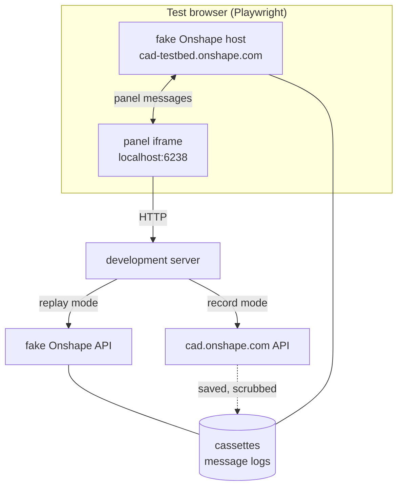

# Onshape test bed: design

Sub-project 1 of milestone 1 in the [3D printing roadmap](../plans/2026-10-09-print-roadmap.md).
Brainstormed with the owner on Fri 10-09, then reviewed adversarially twice: once against
Onshape's documentation, its published OpenAPI and experiments in the container, and once
against the code on `feature/printer-relay`.

## 0. Read this first: three findings that shape the design

**1. Every live Onshape call costs part of a small annual allowance.** Onshape caps API
calls per year by plan ([API limits](https://onshape-public.github.io/docs/auth/limits/)):

| Plan | Annual calls |
|---|---|
| Free, Standard, EDU Student | 2,500 per user |
| EDU Educator, Pro Discovery | 2,500 per company |
| Professional | 5,000 per user in the company |
| Enterprise, Enterprise GOV | 10,000 per full user in the company |
| EDU Enterprise | 10,000 per enterprise |

- Counted: calls made with API keys, API Explorer calls made with keys or OAuth, and calls
  from **private** OAuth apps. Only responses with a 2xx or 3xx status count, so a redirect
  counts.
- A private app's calls are charged to its owner, not to the user who runs it: to the
  owner's own allowance if the app was created under My Account, to the company's if it was
  created in Company or Classroom settings.
- Not counted: calls from public App Store apps, from Onshape's own browser and mobile
  clients, webhooks, and any 4xx or 5xx response.
- When the allowance runs out, every counted call fails with **402 Payment Required** until
  the cycle resets or more calls are bought. Short-window throttling is separate and per
  endpoint: 429 with a `Retry-After` header, and `X-Rate-Limit-Remaining` on every response
  ([response codes](https://onshape-public.github.io/docs/api-adv/errors/)).
- Usage is shown under **My Account → Developer** (Company Settings → Developer for a
  company). Warning emails at 25, 50, 75 and 100 percent go to admins, so a personal
  account may get none.

Both of the test bed's live paths draw on the owner's allowance: the API keys, and the
private PenguinCAM-chondl-dev OAuth app the development server uses. The owner's plan and
current usage are not known yet (section 12, decision 1). This is why the test bed works
from recordings and spends live calls deliberately, through a counted budget (section 7).

**2. Driving Onshape's own web interface with a robot very likely breaks Onshape's Terms
of Use.** Section 4 of the [Terms of Use](https://www.onshape.com/en/legal/terms-of-use)
(effective July 15, 2020) says a user shall not "use any robot, spider, scraper or other
automated means to access the Service, or use any data mining, data gathering or extraction
method". Access other than through an unmodified Onshape client makes the user "also"
subject to Onshape's API Agreement: the agreement adds terms, it does not carve out an
exception. Unattended API calls against the owner's own documents fit what the API is for
("to develop applications or tools that enhance productivity"). A Playwright script logging
in to cad.onshape.com as the owner and clicking through the interface (approach B from the
brainstorm) is "automated means to access the Service" on a plain reading, and the account
at risk is the owner's own. The same list also forbids making a password available to
anyone else, which giving `ONSHAPE_PASSWORD` to an agent arguably does.

**Where this stands (owner, Fri 10-09).** The owner reports that PenguinCAM extends
Onshape in a way Onshape's team supports, and that they are in contact with Onshape. The API
side therefore goes ahead as designed: test documents built through the API, live API
checks, unattended.

Approach B is a different question from the API, because the clause above is about the
interface. The design keeps it **switched off** until the owner's contact at Onshape
confirms that scripted use of the web interface on the owner's account is fine (section 12,
decision 2). With that confirmation, approach B runs in a real Chrome rather than the
bundled test browser, which the owner has approved. If Onshape's bot checks still stop
the script, the design does not try to get past them: a block from Onshape's own defences is
a question for the contact at Onshape (an allowlist, a test account, or their guidance),
not something to engineer around on the owner's account.

Until approach B is on, the panel's behaviour inside real Onshape is checked by the owner in
an **Onshape checkpoint**: a short scripted session in Chrome during which PenguinCAM itself
records everything, so the owner's few minutes refresh the recordings (section 6). An
Onshape checkpoint stays useful afterwards too, as the one place OAuth runs for real.

**3. The fake must look like Onshape to both the panel and Chrome.** Three checks stand
between a test page and the panel, and an experiment in the container (Chromium 151 under
Playwright) confirmed how to pass each without loosening any of them:

- The panel's message listener drops messages whose origin is not `*.onshape.com` on the
  default port (`static/source_onshape.js`; the test is on host and port together).
- The panel's `Content-Security-Policy` allows framing only by `https://*.onshape.com`.
- Chrome's Local Network Access check (since Chrome 142) blocks a public `https` page from
  framing `http://localhost` until the user grants a permission. The owner's Chrome works
  because the owner once accepted that prompt for cad.onshape.com.

The fake Onshape host is therefore served to the test browser at
`https://cad-testbed.onshape.com`, with the browser's requests for that host answered
locally, and the test browser grants that origin the Local Network Access permission
(section 5.4). The production checks stay exactly as they are, so a test that passes in
the test bed has passed the real checks.

## 1. Goal

Let development of the Onshape-facing parts of PenguinCAM run without the owner and without
spending the Onshape allowance, while still noticing when real Onshape behaves differently
from what PenguinCAM was built against.

Success looks like this:

- An agent can load the panel in a browser in the container, sign it in, select faces in a
  test document, and run the existing CNC export end to end against the test bed, with no
  live call and no person.
- The same scenarios' API side can run against real Onshape, unattended, at a known cost in
  calls, and the differences from the recordings are reported.
- The owner can refresh the recordings of the panel inside real Onshape by following a
  short checklist in Chrome.
- What the next sub-project, model from Onshape, needs is recorded: what Onshape sends
  when a part (not a face) is selected, and what the part export endpoints return.

## 2. Scope

### In scope

- Test documents built by script in a folder of the owner's account.
- Recording and replaying Onshape API traffic and panel messages.
- A fake Onshape API and a fake Onshape host.
- A development-only sign-in for the panel that uses the API keys.
- Scenarios covering today's CNC panel flow and the probes model from Onshape needs.
- A drift report and a call ledger with a budget.
- The automated Onshape UI run (approach B), designed now, built once decision 2 is a yes.

### Out of scope

- The OAuth login flow itself. Development sign-in replaces it in the test bed, and an
  Onshape checkpoint exercises it in real Onshape.
- The print path's own behaviour (slicing, placement, profiles). Those sub-projects use the
  test bed; they are not part of it.
- The printer and the daemon. Milestone 2 has its own test bed.
- Recording real teams' traffic from production. Recordings come only from the owner's test
  documents.
- Fixing bugs the test bed finds in existing code. They are reported (section 11) and fixed
  in the sub-project that touches that code.

## 3. Terms

Each term below means one thing everywhere in this spec.

| Term | Meaning |
|---|---|
| **test bed** | Everything in this spec: test documents, recordings, fakes, scenarios and tools. |
| **development server** | PenguinCAM's Flask server started locally on port 6238, as in the workspace instructions. |
| **test folder** | The folder "PenguinCAM test bed" in the owner's Onshape account. |
| **test documents** | The Onshape documents the test bed builds in the test folder. |
| **scenario** | A named, scripted run, for example `cnc-face-2d`. |
| **record mode** | Scenarios run against real Onshape and their traffic is saved. |
| **replay mode** | Scenarios run against the fakes, served from saved traffic. |
| **cassette** | The saved API traffic of one scenario: one file of request and response pairs. |
| **message log** | The saved panel messages of one scenario, in both directions. |
| **recorder** | The transport adapter that saves API traffic in record mode. |
| **replay adapter** | The transport adapter that answers API calls from cassettes, inside the process. |
| **fake Onshape API** | The local HTTP server that answers the development server's API calls from cassettes. |
| **fake Onshape host** | The page at `https://cad-testbed.onshape.com` that embeds the panel the way Onshape does and plays Onshape's side of the panel messages from message logs. |
| **development sign-in** | Signing the panel in with the API keys instead of OAuth, development only. |
| **live API check** | Running the API side of every scenario in record mode with the API keys, unattended. |
| **Onshape checkpoint** | The owner running a short checklist in real Onshape in Chrome while PenguinCAM records. |
| **checklist strip** | The bar at the top of the panel, shown only during an Onshape checkpoint, that gives the steps. |
| **automated Onshape UI run** | Playwright driving real Onshape's interface as the owner in a real Chrome (approach B). Off until decision 2. |
| **drift report** | The differences between a fresh recording and the stored one. |
| **call ledger** | The local record of every live call the test bed made, used to enforce the budget. |

## 4. How the pieces fit



In replay mode the development server sends its Onshape calls to the fake Onshape API, and
the fake Onshape host answers the panel's messages. In record mode the development server
calls real Onshape and the recorder saves each exchange. Both modes run the same scenarios.

## 5. Components

### 5.1 Test documents

The owner creates the test folder once in Onshape and gives its id; the public API has no
endpoint to create a folder. `testbed build-docs` then builds simple geometry through the
API, one `POST …/features` per sketch or extrude:

| Document | Contents | Why |
|---|---|---|
| `tb-box` | One 40 × 30 × 10 mm box | The plain case. |
| `tb-two-parts` | A box and a cylinder in one Part Studio | Choosing among several parts. |
| `tb-plate` | A 6 mm plate with holes and a pocket | CNC face export, 2D and 2.5D. |
| `tb-inch` | A 2 × 1 × 0.5 in block, dimensioned in inches, document units inches | Unit conversion. |
| `tb-sideways` | A tall thin part modelled lying on its side | Orientation on the plate. |
| `tb-oversized` | A 400 × 50 × 10 mm slab | Larger than the H2S's 340 × 320 mm plate. |
| `tb-assembly` | An assembly placing two instances of `tb-box` | Parts reached through an assembly, the way students often work. |

- **Placing documents in the folder.** `POST /documents` takes a `parentId`, which the
  documentation describes only as the document's parent. The first build task checks that
  passing the test folder's id puts the document in the folder. If it does not, the owner
  moves the documents into the folder by hand once.
- **Units.** No API endpoint sets a document's units. The features use inch expressions
  (`"2 in"`), and the owner switches `tb-inch`'s document units to inches during the first
  Onshape checkpoint. Both matter: the geometry tests conversion, the document setting tests
  whatever reads it.
- **Rules for writing.** Before every write the tool checks that the target document is a
  test document: it is listed in the test folder, its name starts with `tb-`, and its
  description reads `created by PenguinCAM test bed`. It never deletes a document without
  all three.
- **Re-running is safe.** It lists the folder, keeps documents that already exist, and
  builds only what is missing. `--rebuild NAME` deletes and rebuilds one document.
- **Cost.** A full build is about 30 to 35 counted calls (estimate: two or three per simple
  part, five to seven for the plate and the assembly, one folder listing), more if each step
  is read back to confirm it.
- The ids go into `testbed/documents.json`, which the scenarios read.
- If the features endpoint makes a shape needlessly hard, a simpler shape with the same
  purpose is acceptable. The table's last column is the requirement.

### 5.2 Recorder

`OnshapeClient` builds a new `requests.Session` for every client, and the server builds a
new client for every request (`session_manager.get_client`, `from_api_keys`). So the test
bed installs its adapters in `OnshapeClient.__init__`, behind the test bed setting (section
5.6), rather than mounting anything once. Both the recorder and the replay adapter subclass
`HTTPAdapter` and carry the same `Retry` configuration the client mounts today, so retry
behaviour is unchanged.

In record mode the recorder writes each exchange to the scenario's cassette: method, path,
query, request body, status, selected response headers (`X-Rate-Limit-Remaining`,
`Location`, `Content-Type`), and response body. Each hop of a redirect is its own exchange.
Binary bodies (DXF, STL) are stored as files next to the cassette. Every exchange is also
counted in the call ledger (section 7).

Scrubbing happens before anything reaches disk, because the repository is public:

- **Removed:** `Authorization` headers in both their bearer and Basic forms, cookies, OAuth
  tokens, API keys, and the query string of any redirect target outside the Onshape API
  host (a signed storage URL, if Onshape uses one).
- **Replaced with fixed stand-ins, in requests and responses alike:** the owner's name,
  email address and user id, the ids of the owner's companies and classrooms, and any
  `href` that embeds one of them. The same stand-in is used in both directions, so a
  request that carries a company id still matches its recording in replay mode.
- **Replaced with a fixture:** the body of any `PenguinCAM-config.yaml` fetched from the
  owner's classroom, because it can hold a printer pairing code. The fixture is
  `testbed/fixtures/PenguinCAM-config.yaml`.
- **Kept:** document, workspace, element, part and face ids of the test documents. They are
  not secret, and nothing can reach those documents without the owner's credentials.
- **Checked:** a scrub test fails the build if a cassette or message log contains the API
  key's value, its Basic-auth encoding, anything shaped like a token or an email address,
  or the owner's user id.

The OAuth token exchange (`exchange_code_for_token`, `refresh_access_token`) calls
`requests.post` directly, so the recorder does not see it. That is acceptable: development
sign-in skips OAuth, and those responses are secrets that must not be recorded anyway.

### 5.3 Fake Onshape API

Two forms, both answering from cassettes:

- **The replay adapter**, for unit and route tests: no server, no network.
- **The fake Onshape API**, for browser runs: a local HTTP server on port 6239 serving the
  `/api/v13` prefix. The development server sends API calls to it when
  `ONSHAPE_API_BASE` is set, which is read only when the test bed is on. It replaces only
  `API_BASE`. `BASE_URL` is left alone: it serves the OAuth token calls and a link in the
  UI, which replay mode never uses, and the environment variable `BASE_URL` already means
  PenguinCAM's own address.

Matching: a request matches on method, path, and query and body with volatile fields
removed (timestamps, and microversion ids where the scenario says they vary). An unmatched
request gets a 599 whose body names the request, and the scenario fails with "not in the
cassette: …". It never falls through to real Onshape. 599 is not in the client's retry
list, so it fails at once.

DXF export today is synchronous (`exportinternal`), and the asynchronous translation path
is only a fallback. Replay of a translation returns the recorded status sequence in order,
and replay mode skips the client's 2-second wait between polls. This matters for the
future part export, which may need translations.

### 5.4 Fake Onshape host

A page served to the test browser at
`https://cad-testbed.onshape.com/documents/<did>/…`, always on the default port. It:

- embeds `/onshape-panel` from the development server in an iframe with the query
  parameters Onshape sends (`documentId`, `workspaceId`, `elementId`, `theme`, `versionId`
  or `microversionId` for a panel opened on a version), and
  `server=https://cad-testbed.onshape.com`, so a stricter origin check that compares
  against `server`, as Onshape's documentation recommends, would also pass;
- receives the panel's messages (`applicationInit`, `requestSelection`) and logs them;
- answers them from the scenario's message log, including the statuses and deselections
  Onshape sends;
- gives Playwright a small control surface: `select face <name>`, `select part <name>`,
  `deselect`, `reload panel`.

**How the browser reaches it.** The test browser intercepts requests for
`cad-testbed.onshape.com` (Playwright request routing) and answers them from the test
bed's server, and grants that origin Chrome's Local Network Access permission so it may
frame `http://localhost:6238`. The experiment confirmed that this gives the page a real
`https://cad-testbed.onshape.com` origin, passes the panel's `frame-ancestors` check,
carries messages both ways, and keeps the panel's `SameSite=None; Secure` session cookie
across reloads. The development server runs with `EMBED_COOKIES=1` as usual. Chrome has
renamed the Local Network Access permission between versions, so the Playwright version is
pinned and the first build task re-runs these checks.

**What it is built from.** Onshape's [right-panel message
documentation](https://onshape-public.github.io/docs/app-dev/messages/element-right-panel/)
covers `requestSelection` with `entityTypeSpecifier` (including `BODY`, so parts can be
requested) and `requiredSelectionCount`. It does not document `REQUESTED_SELECTION`, its
`PENDING` status, or the `filterType` and `bodyTypeSpecifier` fields the panel sends, all
of which the panel relies on. So the fake Onshape host's answers come only from message
logs recorded in real Onshape, never from the documentation. Until the first Onshape
checkpoint has run, it has nothing to answer with, and the browser scenarios cannot run.

The fake Onshape host fakes only what the panel uses. It does not draw a model or try to
look like Onshape.

### 5.5 Development sign-in

`/testbed/sign-in` marks the panel's session as signed in with the API keys, and sets the
session's user to a stand-in (`testbed@example.invalid`) so logs and metrics read as they
do for a real user. The keys never enter the cookie; the session holds only a flag.

Three existing functions change, each only while the test bed is on:

- `session_manager.get_client` checks the flag **first** and returns
  `OnshapeClient.from_api_keys()` for such a session.
- `session_manager.update_session_tokens`, which runs after every Onshape call, does
  nothing for a client in API-key mode. Otherwise it would write a token record with empty
  tokens into the cookie.
- `/onshape/status` reports an API-key client as connected (today it tests for an access
  token).

On any other server the route is not registered and the flag is ignored, so a crafted
cookie cannot use it.

### 5.6 Switching the test bed on

One environment variable, `PENGUINCAM_TESTBED`, with values `replay` or `record`, read once
when `frc_cam_gui_app` is imported. Production runs under gunicorn and never reaches the
module's `__main__` block, so the guard sits at import: the module refuses to load if
`PENGUINCAM_TESTBED` is set and the server looks deployed (`FLASK_ENV=production`,
`RAILWAY_ENVIRONMENT` or `VERCEL` set, the same signals the app already uses to decide its
cookie mode). When unset, none of the test bed's routes, adapters or settings are loaded,
and the production server behaves exactly as it does today.

### 5.7 Scenarios

Each scenario is a short script with steps for the browser, when it has a panel part, and
expectations about the result. The first set:

| Scenario | What it does | Exercises |
|---|---|---|
| `panel-load` | Open the panel, development sign-in, load team config | `applicationInit`, `sessioninfo`, config search |
| `cnc-face-2d` | Select the top face of `tb-plate`, export | Face selection, flat DXF export |
| `cnc-face-25d` | The same in 2.5D | Multilayer DXF export, face listing |
| `cnc-version` | Panel opened on a version of `tb-plate` | `versionId` addressing |
| `part-select` | Ask for one part in `tb-two-parts`, two ways | What Onshape sends for a part selection |
| `multi-select` | Ask for two parts, the same two ways | Multiple selection messages |
| `part-export` | Export parts of `tb-box`, `tb-inch`, `tb-sideways` and `tb-assembly` through the API | Export endpoints, units, call counts |

The two ways in `part-select` and `multi-select` are `requestSelection` with
`entityTypeSpecifier: ['BODY']`, and Onshape's documented `openSelectItemDialog` with
`selectParts` (and `selectMultiple`), answered by `itemSelectedInSelectItemDialog`. The
panel sends neither today. During an Onshape checkpoint the checklist strip sends them; in
the test bed the fake Onshape host replays the answers. These two scenarios are stored
evidence for model from Onshape and multiple parts, not tests of today's panel.

`part-export` calls the endpoints through the client's existing `_make_api_request`, from
the scenario's own code, so the client gains no export methods in this sub-project. It
records:

- the part STL export both with Onshape's defaults (`units=inch`, `mode=text`) and with
  `units=millimeter&mode=binary`, because the default is inches whatever the document's
  units, and that, not the document setting, is the real unit hazard;
- where each 307 redirect points, and whether the follow-up download is a counted API call;
- `GET /translations/translationformats` once, to learn whether 3MF can be exported through
  the API at all. 3MF is not mentioned anywhere in Onshape's API documentation, so "not
  available" is a likely and acceptable answer.

### 5.8 Drift report

`testbed drift` compares a fresh recording with the stored one, scenario by scenario:

- For API traffic: the same requests in the same order, the same status codes, and
  response bodies with the same structure (keys and value types). Volatile values (ids that
  change on rebuild, timestamps, microversions) are compared by type only.
- For message logs: the same message names, fields and value types.

The output is a Markdown file listing each difference and saying whether the request
differs (PenguinCAM changed) or only the response does (Onshape changed). A clean report
means the stored recordings still describe real Onshape. A fresh recording replaces the
stored one only when someone accepts it (`testbed accept <scenario>`), and the commit says
why.

### 5.9 Automated Onshape UI run (off until decision 2)

Designed so it can be added without reshaping anything: a Playwright script logs in at
cad.onshape.com with `ONSHAPE_USERNAME` and `ONSHAPE_PASSWORD`, opens a test document,
opens the PenguinCAM-chondl-dev panel, and makes selections through Onshape's parts list
and feature tree rather than by clicking in the 3D view. It runs in a real Chrome under
Xvfb, not the bundled test browser. PenguinCAM records exactly as in an Onshape checkpoint.
It is built once decision 2 in section 12 is a yes. If a login or a page is stopped by
Onshape's bot checks, the run stops and reports it; it does not try to evade them.

## 6. Onshape checkpoint

What the owner does, from the Mac's Chrome, with the development server running in record
mode:

1. Open `tb-plate` in Onshape and open the PenguinCAM-chondl-dev panel. Sign in through
   OAuth when asked; this is the one place OAuth is exercised.
2. Follow the checklist strip at the top of the panel, for example: "select the top face",
   "switch to 2.5D and select it again", "open `tb-two-parts` and press *Ask for a part*,
   then select the cylinder", "press *Ask for two parts*, then select both". The first
   checkpoint also asks the owner to set `tb-inch`'s document units to inches.
3. Press **Done** in the checklist strip.

In record mode the development server passes a `testbed` flag into the panel's template.
With it, the panel copies every message it sends (by wrapping its `post` function) and
every message it receives (in a listener that runs before the origin and message-name
filters in `source_onshape.js`) to the development server, which saves them as message
logs. The recorder saves the API traffic as cassettes. When the owner presses Done, the
agent runs `testbed drift` and reports.

The checklist strip and the message copying exist only in record mode. The agent writes
the checklist from the scenario list, so an Onshape checkpoint covers exactly the
scenarios that have a panel part. The panel opens at whichever URL the PenguinCAM-chondl-dev
app is configured with (`/onshape-panel` or the older `/onshape/element-panel`); the first
checkpoint records which.

**When:** an Onshape checkpoint is asked for at the start of this sub-project, to make the
first recordings; whenever a change alters which messages the panel sends; and before each
sub-project of milestone 1 is called done. The agent asks for one in chat with the
checklist and what it is for.

## 7. Budget and the call ledger

- The call ledger is a local file outside the repository
  (`~/.local/state/penguincam-testbed/ledger.jsonl`), with one line per live exchange
  (each redirect hop separately): time, scenario, method, path, status, and whether Onshape
  counts it (2xx and 3xx).
- Every record-mode command checks the ledger before it starts. It refuses to run if the
  calls counted in the current cycle plus the command's estimate would pass the test bed's
  annual budget, or if one run would pass the per-run cap (default 150 counted calls).
  Estimates come from the last recording of the same scenarios, or from section 5.1 for
  `build-docs`.
- The annual budget and the cycle start date are settings the owner gives (section 12,
  decision 3). Until then the budget is 250 counted calls.
- A 402 from Onshape stops every record-mode command at once and is reported in chat; no
  retry.
- 429s are retried by the client's existing retry adapter, which honours `Retry-After`.
  Three behaviours of that adapter matter here and stay as they are in this sub-project:
  it does not cap the wait; after four retries it hands back the last 429 without raising;
  and it retries a `POST` that got a 5xx, which for a translation request could start and
  be charged for a second translation. The ledger makes all three visible.
- Each status poll of an asynchronous translation is a counted call. The ledger shows the
  polls per export, so model from Onshape can choose an export method with the real cost in
  hand.
- Each live API check and Onshape checkpoint report ends with the number of counted calls
  it made and the remaining budget.

The ledger counts only the test bed's calls. The owner's own use of PenguinCAM through the
development app draws on the same allowance, which is why the budget is a share, not the
whole allowance.

## 8. Where the code lives

In PenguinCAM, on a new branch `feature/onshape-test-bed` cut from `feature/printer-relay`
(the latest work, not yet merged):

```
testbed/
  __main__.py           CLI: build-docs, record, replay, drift, accept, ledger
  documents.py          test documents (5.1)
  recorder.py           recorder and scrubbing (5.2)
  replay.py             replay adapter and fake Onshape API (5.3)
  host/                 fake Onshape host page and its script (5.4)
  scenarios/            one file per scenario (5.7)
  drift.py              drift report (5.8)
  ledger.py             call ledger and budget (7)
  cassettes/            cassettes and binary bodies, committed
  messages/             message logs, committed
  fixtures/             PenguinCAM-config.yaml stand-in
  requirements.txt      Playwright, pinned; development only
  tests/
```

Changes outside `testbed/`, all inert unless `PENGUINCAM_TESTBED` is set:

- `onshape_integration.py`: `OnshapeClient.__init__` installs the recorder or replay
  adapter; `API_BASE` comes from `ONSHAPE_API_BASE`; `get_client` and
  `update_session_tokens` change as in 5.5.
- `frc_cam_gui_app.py`: the import-time guard (5.6), the test bed's routes, the
  `/onshape/status` change (5.5), and the `testbed` flag passed to the panel template.
- `templates/wizard.html` and `static/source_onshape.js`: the checklist strip and message
  copying (6).
- `Makefile`: `testbed/tests` joins the discovery in `make test-quick`, so the replay-adapter
  and unit tests run with every change. The browser scenarios run in a separate
  `make testbed-replay`, which installs `testbed/requirements.txt` into the development
  environment the way `make test-daemon` installs the daemon's, and never touches the
  Docker image. `make testbed-replay` is required before any change to Onshape-facing code
  is called done. `make testbed-record` runs the live API check.

`onshape_harness.py` keeps working as it is. Its API-key client is the same one the live
API check uses.

A guide to using the test bed goes in PenguinCAM's `docs/` (`docs/ONSHAPE_TEST_BED.md`),
because any developer of PenguinCAM can use it. It describes the tool neutrally. How the
owner runs Onshape checkpoints goes in the notes repository's `guides/`.

## 9. Error handling

| What fails | What happens |
|---|---|
| A request in replay mode has no match | 599 naming the request; the scenario fails with "not in the cassette". |
| `ONSHAPE_ACCESS_KEY` or `ONSHAPE_SECRET_KEY` missing | The live API check and `build-docs` stop and name the missing variable. Replay mode needs neither. |
| `ONSHAPE_CLIENT_ID` or `ONSHAPE_CLIENT_SECRET` missing | Record mode refuses to start the development server for an Onshape checkpoint and names the variable, rather than falling back to the production app's id. |
| The test folder's id is not set | `build-docs` stops and asks for it. |
| 402 from Onshape | All record-mode commands stop; reported in chat. |
| Budget would be exceeded | The command refuses to start and shows the ledger total and the estimate. |
| A write would touch something other than a test document | Refused before the call; this is a bug and fails loudly. |
| Scrub test finds a secret-like string | The build fails and names the file and line. |
| The test browser cannot frame the panel (origin, CSP or Local Network Access) | The first build task stops and reports which check failed, since the panel cannot be tested without it. |
| No message log yet for a browser scenario | The scenario is skipped with "needs an Onshape checkpoint", not passed. |

## 10. Testing the test bed

- Unit tests for scrubbing, request matching, translation replay, drift comparison, and the
  ledger's budget arithmetic.
- Tests that the module refuses to load with `PENGUINCAM_TESTBED` set under each deployed
  signal, and that the development sign-in route, flag and adapters are absent without it.
- A test that `update_session_tokens` leaves the cookie alone for an API-key client.
- `make testbed-replay` runs every browser scenario in replay mode with Playwright, under
  Xvfb as in the container's notes. The CNC scenarios assert that the DXF the panel
  receives matches the recorded one.
- The test bed is accepted when: one Onshape checkpoint has produced message logs for every
  scenario with a panel part; the CNC scenarios then pass in replay mode in the container
  with no live call; one live API check has run with its counted calls reported; and the
  drift report between the two recordings is clean.

## 11. Findings outside this sub-project

Reported for the owner, not acted on here:

- **The production app's allowance.** If the production PenguinCAM OAuth app is private
  rather than listed in the Onshape App Store, every call made by every team counts against
  its owner's allowance (section 0, finding 1). Model export from Onshape adds calls to each
  print. This belongs to the shipping sub-project, but it should be checked before model
  from Onshape is designed, because it could change how the export works.
- **A latent bug in the translation fallback.** `export_dxf_async` in
  `onshape_integration.py` treats the translation state `ACTIVE` as a failure, but Onshape
  reports `ACTIVE` while a translation is still running. The fallback therefore gives up on
  the first poll of any translation that is not already done. It is unused while the
  synchronous export works; model from Onshape must not reuse it as it stands.

## 12. Decisions for the owner

1. **Your plan and usage.** Which Onshape plan is the account on? What do My Account →
   Developer show as used and as the limit, and when does the cycle reset? Was the
   PenguinCAM-chondl-dev app created under My Account or in a company or classroom? The
   agent cannot see that page without driving Onshape's interface (finding 2).
2. **Approach B.** You are already in contact with Onshape about PenguinCAM. Please confirm
   with them that a script may log in as you and drive the web interface to test the
   extension, and ideally ask whether they offer an allowlist or a test account for it. With
   that yes, approach B is built in a real Chrome. Until then it stays off, no password goes
   into the container, and Onshape checkpoints cover the panel.
3. **The test bed's share of the allowance.** How many counted calls per year the test bed
   may spend. The default until then is 250.
4. **The test folder.** Create the folder "PenguinCAM test bed" in Onshape and send its URL.
5. **Credentials.** `ONSHAPE_ACCESS_KEY` and `ONSHAPE_SECRET_KEY`, from
   `~/agents/control` on the Mac:
   `make secret-set SCOPE=popcornpenguins NAME=ONSHAPE_ACCESS_KEY`, and the same for
   `ONSHAPE_SECRET_KEY`. `ONSHAPE_USERNAME` and `ONSHAPE_PASSWORD` are needed only once
   decision 2 is a yes.
