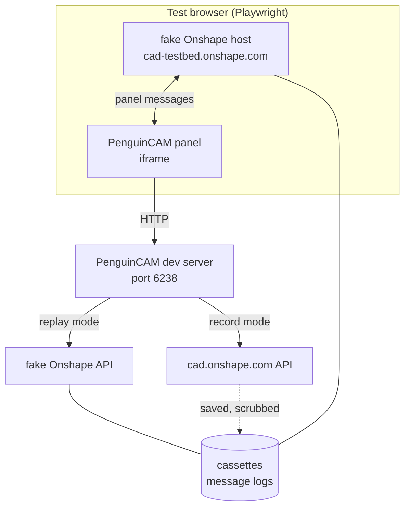

# Onshape test bed: design

Sub-project 1 of milestone 1 in the [3D printing roadmap](../plans/2026-10-09-print-roadmap.md).
Brainstormed with the owner on Fri 10-09.

## 0. Read this first: three findings that shape the design

**1. Every live Onshape call costs part of a small annual allowance.** Onshape caps API
calls per year by plan ([API limits](https://onshape-public.github.io/docs/auth/limits/)):

| Plan | Annual calls |
|---|---|
| Free, Standard, EDU Student | 2,500 per user |
| EDU Educator, Pro Discovery | 2,500 per company |
| Professional | 5,000 per user in the company |
| Enterprise, Enterprise GOV | 10,000 per full user in the company |
| EDU Enterprise | 10,000 per enterprise |

- Counted: calls made with API keys, calls from **private** OAuth apps (charged to the
  app's owner, not to the user), and only responses with a 2xx or 3xx status.
- Not counted: calls from public App Store apps, Onshape's own browser and mobile clients,
  webhooks, and any 4xx or 5xx response.
- When the allowance runs out, every counted call fails with **402 Payment Required**
  until the cycle resets or more calls are bought. Short-window throttling is separate:
  429 with a `Retry-After` header, and `X-Rate-Limit-Remaining` on every response
  ([response codes](https://onshape-public.github.io/docs/api-adv/errors/)).
- Usage is shown under **My Account → Developer** (and Company Settings → Developer for a
  company); admins get emails at 25, 50, 75 and 100 percent.

Both of the test bed's live paths draw on the owner's allowance: the API keys, and the
private PenguinCAM-chondl-dev OAuth app the development server uses. The owner's plan and
current usage are not known yet (section 11, decision 1). This is why the test bed works
from recordings and spends live calls deliberately, through a counted budget (section 7).

**Beyond this sub-project, unverified:** if the production PenguinCAM OAuth app is private
rather than listed in the Onshape App Store, every call made by every team counts against
its owner's allowance. Model export from Onshape adds calls to each print. This belongs to
the shipping sub-project, but it should be checked early, because it could change how the
model export is designed.

**2. Driving Onshape's own web interface with a robot may break Onshape's Terms of Use.**
Section 4 of the [Terms of Use](https://www.onshape.com/en/legal/terms-of-use) (effective
July 15, 2020) forbids users to "use any robot, spider, scraper or other automated means
to access the Service". Calls through the API fall under Onshape's separate API Agreement
and are what the API is for. A Playwright script logging in to cad.onshape.com as the owner
and clicking through the interface (approach B from the brainstorm) is plausibly the
"automated means" the clause names, and the account at risk is the owner's own.

So the design ships approach B **switched off**, built only if Onshape agrees in writing
(section 11, decision 2). Until then, the panel's behaviour inside real Onshape is checked
by the owner in an **Onshape checkpoint**: a short scripted session in Chrome during which
PenguinCAM itself records everything, so the owner's few minutes refresh the recordings
(section 6). Everything on the API side runs unattended.

**3. The panel trusts only Onshape's origin, so the fake must be served from one.** The
panel's message listener drops any message whose origin is not `*.onshape.com`
(`static/source_onshape.js`), and the panel's `Content-Security-Policy` allows framing only
by `https://*.onshape.com`. The fake Onshape host is therefore served to the test browser
at `https://cad-testbed.onshape.com`, with the browser's requests for that host answered
locally. The production checks stay exactly as they are, so a test passing in the test bed
says the real checks passed too (section 5).

## 1. Goal

Let development of the Onshape-facing parts of PenguinCAM run without the owner and without
spending the Onshape allowance, while still noticing when real Onshape behaves differently
from what PenguinCAM was built against.

Success looks like this:

- An agent can load the Onshape panel in a browser in the container, sign it in, select
  faces or parts in a test document, and run the existing CNC export end to end, against
  the test bed, with no live call and no person.
- The same scenarios can be run against real Onshape through the API, unattended, at a
  known cost in calls, and the differences from the recordings are reported.
- The owner can refresh the recordings of the panel inside real Onshape by following a
  short checklist in Chrome.
- The material the next sub-project, model from Onshape, needs is recorded: what Onshape
  sends when a part (not a face) is selected, and what the part export endpoints return.

## 2. Scope

### In scope

- Test documents built by script in the owner's account.
- Recording and replaying Onshape API traffic and panel messages.
- A fake Onshape API and a fake Onshape host.
- A development-only sign-in for the panel that uses the API keys.
- Scenarios covering today's CNC panel flow and the probes model from Onshape needs.
- A drift report and a call ledger with a budget.
- An automated Onshape UI run (approach B), designed but switched off, see finding 2.

### Out of scope

- The OAuth login flow itself. Development sign-in replaces it in the test bed, and an
  Onshape checkpoint exercises it in real Onshape.
- The print path's own behaviour (slicing, placement, profiles). Those sub-projects use the
  test bed; they are not part of it.
- The printer and the daemon. Milestone 2 has its own test bed.
- Recording real teams' traffic from production. Recordings come only from the owner's test
  documents.

## 3. Terms

Each term below means one thing everywhere in this spec.

| Term | Meaning |
|---|---|
| **test bed** | Everything in this spec: test documents, recordings, fakes, scenarios and tools. |
| **test documents** | The Onshape documents the test bed builds in the owner's folder "PenguinCAM test bed". |
| **scenario** | A named, scripted run, for example `cnc-face-2d`. |
| **record mode** | A scenario runs against real Onshape and its traffic is saved. |
| **replay mode** | A scenario runs against the fakes, served from saved traffic. |
| **cassette** | The saved API traffic of one scenario: one file of request and response pairs. |
| **message log** | The saved panel messages of one scenario, in both directions. |
| **fake Onshape API** | The local server that answers API calls from cassettes. |
| **fake Onshape host** | The local page that embeds the panel the way Onshape does and plays Onshape's side of the panel messages from message logs. |
| **development sign-in** | Signing the panel in with the API keys instead of OAuth, development only. |
| **live API check** | Running the API side of every scenario in record mode with the API keys, unattended. |
| **Onshape checkpoint** | The owner running a short checklist in real Onshape in Chrome while PenguinCAM records. |
| **automated Onshape UI run** | Playwright driving real Onshape's interface as the owner (approach B). Switched off. |
| **drift report** | The differences between a fresh recording and the stored one. |
| **call ledger** | The local record of every live call the test bed made, used to enforce the budget. |

## 4. How the pieces fit



In replay mode the development server sends its Onshape calls to the fake Onshape API, and
the fake Onshape host answers the panel's messages. In record mode the server calls real
Onshape and a recorder saves each exchange. Both modes run the same scenarios.

## 5. Components

### 5.1 Test documents

`testbed build-docs` creates the folder **PenguinCAM test bed** in the owner's account if it
is missing, and builds simple geometry in it through the API (sketches and extrudes, made
with the Part Studio features endpoint):

| Document | Contents | Why |
|---|---|---|
| `tb-box` | One 40 × 30 × 10 mm box | The plain case. |
| `tb-two-parts` | A box and a cylinder in one Part Studio | Choosing among several parts. |
| `tb-plate` | A 6 mm plate with holes and a pocket | CNC face export, 2D and 2.5D. |
| `tb-inch` | A 2 × 1 × 0.5 in block, document units inches | Unit conversion. |
| `tb-sideways` | A tall thin part modelled lying on its side | Orientation on the plate. |
| `tb-oversized` | A 400 × 50 × 10 mm slab | Larger than the H2S's 340 × 320 mm plate. |
| `tb-assembly` | An assembly placing two instances of `tb-box` | Parts reached through an assembly. |

- Rules for writing: the tool writes only inside that folder. Before every write it checks
  that the target document is in the folder, and it never deletes a document it did not
  create (each one carries a description `created by PenguinCAM test bed`).
- Re-running is safe. It lists the folder, keeps documents that already exist, and builds
  only what is missing. `--rebuild NAME` deletes and rebuilds one document.
- The document ids go into `testbed/documents.json`, which the scenarios read.
- If the features endpoint makes a shape needlessly hard to build, a simpler shape with
  the same purpose is acceptable. The table's last column is the requirement.

### 5.2 Recorder

In record mode, a `requests` transport adapter mounted on `OnshapeClient.session` writes
each exchange to the scenario's cassette: method, path, query, request body, status,
selected response headers, and response body. Binary bodies (DXF, STL) are stored as files
next to the cassette. It also counts each call in the call ledger (section 7).

Scrubbing happens before anything reaches disk, because the repository is public:

- Removed: `Authorization` headers, cookies, OAuth tokens, API keys, and any signed
  download URL's query string.
- Replaced with fixed stand-ins: the owner's name, email address, user id, and the ids of
  the owner's companies and classrooms.
- Replaced with a fixture: the body of any `PenguinCAM-config.yaml` fetched from the owner's
  classroom. That file can hold a printer pairing code. The fixture is
  `testbed/fixtures/PenguinCAM-config.yaml`.
- Kept: document, workspace, element, part and face ids of the test documents. They are not
  secret and nothing can reach those documents without the owner's credentials.
- A scrub test fails the build if a cassette or message log contains anything that looks
  like a token, an email address or the owner's user id.

The OAuth token exchange in `exchange_code_for_token` and `refresh_access_token` calls
`requests.post` directly, not through the client's session, so the recorder does not see
it. That is acceptable: development sign-in skips OAuth, and the token responses are
secrets that must not be recorded anyway.

### 5.3 Fake Onshape API

Two forms, both answering from cassettes:

- **In-process**, for unit and route tests: a replay adapter mounted on
  `OnshapeClient.session`. No server, no network.
- **As a server**, for browser runs: a small local HTTP server (port 6239) that the
  development server talks to instead of `cad.onshape.com`. The development server learns
  its address from `ONSHAPE_API_BASE`, read only when the test bed is switched on (section
  5.6). `OnshapeClient.API_BASE` and `BASE_URL` become instance values set from it.

Matching: a request is matched on method, path and the query and body with volatile fields
removed (timestamps, microversion ids in queries where the scenario says they vary). An
unmatched request returns 599 with a body that names the request, and the scenario fails
saying "not in the cassette: …". It never falls through to real Onshape.

Asynchronous translations (DXF today, possibly STL or 3MF later) are replayed in order: the
first status poll returns the first recorded state, the next the next, so a test sees the
same `ACTIVE` then `DONE` sequence real Onshape gave.

### 5.4 Fake Onshape host

A page served to the test browser at `https://cad-testbed.onshape.com/documents/<did>/…`.
It:

- embeds `/onshape-panel` from the development server in an iframe with the query
  parameters Onshape sends (`documentId`, `workspaceId`, `elementId`, `server`, `theme`,
  and `versionId` or `microversionId` for a panel opened on a version);
- receives the panel's `applicationInit` and `requestSelection` messages and logs them;
- answers `requestSelection` with `REQUESTED_SELECTION` messages from the scenario's
  message log, including the `PENDING` status and the deselection that Onshape sends;
- exposes a small control surface for Playwright: `select face <name>`, `select part
  <name>`, `deselect`, `reload panel`.

How the browser reaches it: the test browser intercepts requests for
`cad-testbed.onshape.com` and answers them from the test bed's server (Playwright request
routing), so the page has a real `https://…onshape.com` origin without a certificate or
DNS change. The panel itself stays at `http://localhost:6238`, as it does inside real
Onshape during development, where Chrome allows an `https` page to frame `localhost`; the
development server runs with `EMBED_COOKIES=1` as usual. The first build task verifies this against the panel's origin check and its
`frame-ancestors` header; if interception does not give the page that origin, the fallback
is a self-signed certificate for that name, trusted only by the test browser, with
Chrome's `--host-resolver-rules` pointing the name at the container.

The fake Onshape host fakes only what the panel uses. It does not draw a model or try to
look like Onshape.

### 5.5 Development sign-in

`/testbed/sign-in` marks the panel's session as signed in with the API keys.
`session_manager.get_client` returns `OnshapeClient.from_api_keys()` for such a session.
The keys never enter the cookie: the session holds only a flag.

It exists only when the test bed is switched on (section 5.6). On any other server the
route is not registered and the flag is ignored, so a crafted cookie cannot use it.

### 5.6 Switching the test bed on

One environment variable, `PENGUINCAM_TESTBED`, with values `replay` or `record`. The
server refuses to start if it is set while `FLASK_ENV=production`. When unset, none of the
test bed's routes, adapters or settings are loaded, so the production server behaves
exactly as it does today.

### 5.7 Scenarios

Each scenario is a short script with steps for the browser (when it has a panel part) and
expectations about the result. The first set:

| Scenario | What it does | Exercises |
|---|---|---|
| `panel-load` | Open the panel, development sign-in, load team config | `applicationInit`, `sessioninfo`, config search |
| `cnc-face-2d` | Select the top face of `tb-plate`, export | Face selection, flat DXF export |
| `cnc-face-25d` | The same in 2.5D | Multilayer DXF export, face listing |
| `cnc-version` | Panel opened on a version of `tb-plate` | `versionId` addressing |
| `part-select` | Select a part in `tb-two-parts` with a part filter | What Onshape sends for a part selection (for model from Onshape) |
| `part-export` | Export `tb-box`, `tb-inch`, `tb-sideways` and `tb-assembly` as STL and as 3MF through the API | Export endpoints, units, orientation, call counts (for model from Onshape) |
| `multi-select` | Select two parts | Multiple selection messages (for multiple parts) |

`part-select` and `multi-select` need the panel to ask for parts rather than faces, which
the code does not do yet. For these two the scenario sends its own `requestSelection` from
the test page and records what comes back; it does not change the panel. In replay mode
they are therefore not tests of PenguinCAM, only stored evidence for the next sub-projects.

Before Onshape has been recorded once, `part-select` and `multi-select` have no message log
to replay. They are recorded at the first Onshape checkpoint (section 6).

### 5.8 Drift report

`testbed drift` compares a fresh recording with the stored one, scenario by scenario:

- For API traffic: the same requests in the same order, the same status codes, and
  response bodies with the same structure (keys and value types). Volatile values (ids that
  change on rebuild, timestamps, microversions) are compared by type only.
- For message logs: the same message names, fields and value types.

The output is a Markdown file listing each difference and, where it can tell, whether
Onshape changed (same request, different response) or PenguinCAM changed (different
request). A clean report means the stored recordings still describe real Onshape. A new
recording replaces the stored one only when someone accepts it (`testbed accept
<scenario>`), and the commit says why.

### 5.9 Automated Onshape UI run (switched off)

Designed so it can be added without reshaping anything: a Playwright script logs in at
cad.onshape.com with `ONSHAPE_USERNAME` and `ONSHAPE_PASSWORD`, opens a test document,
opens the PenguinCAM-chondl-dev panel, and makes selections through Onshape's parts list
and feature tree rather than by clicking in the 3D view. PenguinCAM records exactly as in an
Onshape checkpoint. It is not built until decision 2 in section 11 says yes.

## 6. Onshape checkpoint

What the owner does, from the Mac's Chrome with the development server running in record
mode:

1. Open `tb-plate` in Onshape and open the PenguinCAM-chondl-dev panel. Sign in through
   OAuth when asked; this is the one place OAuth is exercised.
2. Follow the checklist the panel shows in a test bed strip at its top: for example "select
   the top face", then "switch to 2.5D and select it again", then "open `tb-two-parts`,
   select the cylinder", then "select both parts".
3. Press **Done** in the strip.

During those steps the panel records every message it sends and receives and posts them to
the development server, which saves them as message logs; the server's recorder saves the
API traffic as cassettes. When the owner presses Done, the agent runs `testbed drift` and
reports.

The checklist strip and the panel-side message recording exist only in record mode. They
are written by the agent from the scenario list, so an Onshape checkpoint always covers
exactly the scenarios that have a panel part.

**When:** an Onshape checkpoint is asked for at the start of this sub-project (to make the
first recordings), whenever a change alters which messages the panel sends, and before each
sub-project of milestone 1 is called done. The agent asks for one in chat with the checklist
and what it is for.

## 7. Budget and the call ledger

- The call ledger is a local file outside the repository (`~/.local/state/penguincam-testbed/ledger.jsonl`)
  with one line per live call: time, scenario, method, path, status, and whether Onshape
  counts it (2xx and 3xx).
- Every record-mode command checks the ledger before it starts. It refuses to run if the
  calls counted in the current cycle plus the command's estimate would pass the test bed's
  annual budget, or if one run would pass the per-run cap (default 150 counted calls).
  Estimates come from the last recording of the same scenarios.
- The annual budget and the cycle start date are settings the owner gives (section 11,
  decision 3). Until then the budget is 250 counted calls.
- A 402 from Onshape stops every record-mode command at once and is reported in chat; no
  retry.
- A 429 is retried after its `Retry-After` value. The client's existing retry adapter in
  `OnshapeClient.__init__` already honours `Retry-After`; the test bed relies on it and
  adds nothing.
- Polling of asynchronous translations is the largest avoidable cost (each status poll is a
  counted call). Record mode keeps the client's existing 2-second interval and the ledger
  shows the polls per export, so model from Onshape can choose an export method with the
  real cost in hand.
- Each live API check and Onshape checkpoint report ends with the number of counted calls
  it made and the remaining budget.

The ledger counts only the test bed's calls. The owner's own use of PenguinCAM through the
development app also draws on the allowance, which is why the budget is a share, not the
whole allowance.

## 8. Where the code lives

In PenguinCAM, on a new branch `feature/onshape-test-bed` cut from `feature/printer-relay`
(the latest work, not yet merged):

```
testbed/
  __main__.py           CLI: build-docs, record, replay, drift, accept, ledger
  documents.py          test documents (5.1)
  recorder.py           record adapter, scrubbing (5.2)
  replay.py             replay adapter and fake Onshape API server (5.3)
  host/                 fake Onshape host page and its script (5.4)
  scenarios/            one file per scenario (5.7)
  drift.py              drift report (5.8)
  ledger.py             call ledger and budget (7)
  cassettes/            cassettes and binary bodies, committed
  messages/             message logs, committed
  fixtures/             PenguinCAM-config.yaml stand-in
  tests/
```

Changes outside `testbed/`, all inert unless `PENGUINCAM_TESTBED` is set:

- `onshape_integration.py`: `API_BASE` and `BASE_URL` read from the test bed setting when
  present; `session_manager.get_client` honours the development sign-in flag.
- `frc_cam_gui_app.py`: registers the test bed's routes and refuses to start with the test
  bed on in production.
- `static/source_onshape.js`: in record mode, copies each message it sends and receives
  to the server.
- `Makefile`: `make testbed-replay` (part of `make test`) and `make testbed-record`.

`onshape_harness.py` keeps working as it is. Its API-key client is the same one the live
API check uses.

A guide to using the test bed goes in PenguinCAM's `docs/` (`docs/ONSHAPE_TEST_BED.md`),
because any developer of PenguinCAM can use it. It describes the tool neutrally; how the
owner runs Onshape checkpoints goes in the notes repository's `guides/`.

## 9. Error handling

| What fails | What happens |
|---|---|
| A request in replay mode has no match | 599 naming the request; the scenario fails with "not in the cassette". |
| Secrets missing (`ONSHAPE_ACCESS_KEY`, `ONSHAPE_SECRET_KEY`) | Record mode and `build-docs` stop and name the missing variable. Replay mode needs none. |
| 402 from Onshape | All record-mode commands stop; reported in chat. |
| Budget would be exceeded | The command refuses to start and shows the ledger total and the estimate. |
| A write would land outside the test folder | Refused before the call; this is a bug and fails loudly. |
| Scrub test finds a secret-like string | The build fails and names the file and line. |
| The fake host cannot obtain an `onshape.com` origin | Stops at the first build task (5.4) and is reported, since the panel cannot be tested without it. |

## 10. Testing the test bed

- Unit tests for scrubbing, request matching, translation-poll replay, drift comparison,
  and the ledger's budget arithmetic.
- A test that the server refuses to start with `PENGUINCAM_TESTBED` set in production, and
  that the development sign-in route and flag are inert without it.
- `make test` runs every scenario in replay mode, with Playwright, under Xvfb as recorded in
  the container's notes. The CNC scenarios assert the DXF the panel receives matches the
  recorded one.
- The test bed is accepted when: the CNC scenarios pass in replay mode in the container
  with no live call; one live API check has run with its counted calls reported; and one
  Onshape checkpoint has produced message logs for every scenario with a panel part,
  followed by a clean drift report.

## 11. Decisions for the owner

1. **Your plan and usage.** Which Onshape plan is the account on, and what does My Account →
   Developer show as used and as the limit, and when does the cycle reset? The agent cannot
   see that page without driving Onshape's interface (finding 2).
2. **Approach B.** Ask Onshape whether a Playwright script may log in as you and drive the
   web interface for testing your own app (for example to api-support@onshape.com), or drop
   approach B and rely on Onshape checkpoints. Until there is a written yes, it stays off.
3. **The test bed's share of the allowance.** How many counted calls per year the test bed
   may spend. The default until then is 250.
4. **Credentials.** For the API side, `ONSHAPE_ACCESS_KEY` and `ONSHAPE_SECRET_KEY`:
   `make secret-set SCOPE=popcornpenguins NAME=ONSHAPE_ACCESS_KEY` (and the same for the
   secret key) in `~/agents/control`. `ONSHAPE_USERNAME` and `ONSHAPE_PASSWORD` are needed
   only if decision 2 is yes.
