# Onshape test bed: design

Sub-project 1 of milestone 1 in the [3D printing roadmap](../plans/2026-10-09-print-roadmap.md).
Brainstormed with the owner on Fri 10-09, then reviewed adversarially twice: once against
Onshape's documentation, its published OpenAPI and experiments in the container, and once
against the code on `feature/printer-relay`. Revised the same day for the owner's answers (print path only, the Education plan, approval
to drive Onshape's interface) and for two adversarial reviews of the implementation plan.
Brought in line with what was built on `feature/onshape-test-bed` on Fri 10-09; each such
change is marked *(as built)* where it is made, and section 14 lists them.

## 0. Read this first: three facts that shape the design

**1. Every live Onshape call costs part of a small annual allowance.** Onshape caps API
calls per year by plan ([API limits](https://onshape-public.github.io/docs/auth/limits/)).
The owner's account is on the per-user Education plan, EDU Student: **2,500 calls a year**.

| Education plan | Annual calls |
|---|---|
| EDU Student | 2,500 per user |
| EDU Educator | 2,500 per company |
| EDU Enterprise | 10,000 per enterprise |

- Counted: calls made with API keys, API Explorer calls made with keys or OAuth, and calls
  from **private** OAuth apps such as PenguinCAM-chondl-dev. Only responses with a 2xx or
  3xx status count, so a redirect counts.
- A private app's calls are charged to its owner, not to the user running it: to the
  owner's own allowance if the app was created under My Account, to the company's if it was
  created in Company or Classroom settings.
- Not counted: calls from public App Store apps (the production PenguinCAM app is one, so
  teams' use costs nothing), from Onshape's own browser and mobile clients, webhooks, and
  any 4xx or 5xx response.
- When the allowance runs out, every counted call fails with **402 Payment Required** until
  the cycle resets. Short-window throttling is separate and per endpoint: 429 with a
  `Retry-After` header, and `X-Rate-Limit-Remaining` on every response
  ([response codes](https://onshape-public.github.io/docs/api-adv/errors/)).
- Usage is shown under **My Account → Developer**. Warning emails at 25, 50, 75 and 100
  percent go to admins, so a personal account may get none.

Both of the test bed's live paths, the API keys and the development app, draw on the
owner's allowance of 2,500 calls a year. So the test bed works from recordings and
spends live calls deliberately, through a counted budget (section 7).

**2. The test bed drives Onshape's own interface, with the owner's approval.** Onshape's
[Terms of Use](https://www.onshape.com/en/legal/terms-of-use) forbid "any robot, spider,
scraper or other automated means to access the Service". The owner works closely with
Onshape on PenguinCAM and reports that, from those conversations, scripting the interface
to understand it and to develop the extension is fine; the clause aims at automating the
creation of parts. On that basis the owner approved an **automated Onshape UI run**:
Playwright, in a real Google Chrome, logs in as the owner and uses the PenguinCAM panel
inside real Onshape (section 5.9).

If Onshape's bot checks stop a run anyway, for example with a CAPTCHA or a challenge page,
the run stops and asks the owner. The test bed does not try to get past them: a block from
Onshape's own defences is something to raise with the owner's contacts at Onshape. In that
case, and whenever the owner prefers, an **Onshape checkpoint** does the same job by hand:
the owner follows a short checklist in Chrome while PenguinCAM records (section 6).

**3. The fake must look like Onshape to both the panel and Chrome.** Three checks stand
between a test page and the panel. An experiment in the container (Chromium 151 under
Playwright) confirmed how to pass each one without loosening any of them:

- The panel's message listener drops messages whose origin is not `*.onshape.com` on the
  default port (`static/source_onshape.js`; the test covers host and port together).
- The panel's `Content-Security-Policy` allows framing only by `https://*.onshape.com`
  (the CNC panel and the print page alike).
- Chrome's Local Network Access check (since Chrome 142) blocks a public `https` page from
  framing `http://localhost` until the user grants a permission. The owner's Chrome works
  because the owner once accepted that prompt for cad.onshape.com.

The fake Onshape host is therefore served to the test browser at
`https://cad-testbed.onshape.com`, with the browser's requests for that host answered
locally, and the test browser grants that origin Chrome's local network permissions
(section 5.4). The production checks stay exactly as they are, so a test that passes in
the test bed has passed the real checks.

## 1. Goal

Let development of the print path's Onshape side run without the owner and without
spending the Onshape allowance, while still noticing when real Onshape behaves differently
from what PenguinCAM was built against. Everything here is about 3D parts going to the
printer. The CNC path (faces, DXF, 2D and 2.5D) is not tested.

Success looks like this:

- An agent can load the panel in a browser in the container, sign it in, switch to 3D
  Printing, and work with test documents against the test bed, with no live call and no
  person.
- Real Onshape is consulted on a schedule the agent controls: unattended API checks, and
  automated Onshape UI runs that refresh the recordings of the panel inside Onshape.
- Each change against real Onshape shows up as a drift report.
- What the next sub-projects need is recorded:
  - for model from Onshape, what Onshape sends when a part is selected, and the 3D files
    the export endpoints return (and whether they slice);
  - for multiple parts, what it sends when several parts are selected.

## 2. Scope

### In scope

- Test documents built by script in a folder of the owner's account.
- Recording and replaying Onshape API traffic and panel messages.
- A replay adapter and a fake Onshape host.
- A development-only sign-in for the panel that uses the API keys.
- Scenarios for the print path: loading the panel, switching to 3D Printing, selecting
  parts, and exporting them as 3D files.
- The automated Onshape UI run in real Chrome, and the Onshape checkpoint as its manual
  fallback.
- A drift report and a call ledger with a budget.

### Out of scope

- The CNC path: face selection, DXF export, 2D and 2.5D. Its code stays untouched, apart
  from the inert hooks in section 8 that share its files.
- Changing what the print wizard does. Selecting and exporting real parts is the next
  sub-project; the test bed records the raw material for it.
- The printer and the daemon. Milestone 2 has its own test bed.
- Recording real teams' traffic from production. Recordings come only from the owner's test
  documents.
- Fixing bugs the test bed finds in existing code. They are reported (section 12) and fixed
  in the sub-project that touches that code.

## 3. Terms

Each term below means one thing everywhere in this spec.

| Term | Meaning |
|---|---|
| **test bed** | Everything in this spec: test documents, recordings, fakes, scenarios and tools. |
| **development server** | PenguinCAM's Flask server started locally: on port 6238 in record mode, as in the workspace instructions; on port 6240 when a browser scenario starts one in replay mode. |
| **panel** | PenguinCAM inside Onshape's right panel: `/onshape-panel` first, and the print wizard (`/print`) once 3D Printing is chosen. |
| **test folder** | The folder "PenguinCAM test bed" in the owner's Onshape account. |
| **test documents** | The Onshape documents the test bed builds in the test folder. |
| **scenario** | A named, scripted run, for example `part-select`. |
| **record mode** | Scenarios run against real Onshape and their traffic is saved. |
| **replay mode** | Scenarios run against the fakes, served from saved traffic. |
| **cassette** | The saved API traffic of one scenario: one file of request and response pairs. |
| **message log** | The saved panel messages of one scenario, in both directions. |
| **recorder** | The transport adapter that saves API traffic in record mode. |
| **replay adapter** | The transport adapter that answers API calls from cassettes, inside the process, in tests and in the development server alike. |
| **current scenario** | The one scenario a process is recording or replaying at a time. |
| **fake Onshape host** | The page at `https://cad-testbed.onshape.com` that embeds the panel the way Onshape does and plays Onshape's side of the panel messages from message logs. |
| **development sign-in** | Signing the panel in with the API keys instead of OAuth, development only. |
| **live API check** | Running the API side of every scenario in record mode with the API keys, unattended. |
| **automated Onshape UI run** | Playwright in real Chrome logging in to Onshape as the owner and running the scenarios in the panel inside real Onshape, in record mode. |
| **Onshape checkpoint** | The owner running the same scenarios by hand in Chrome while PenguinCAM records; the fallback for the automated Onshape UI run. |
| **checklist strip** | The bar at the top of the print page, shown whenever the test bed is on, that offers the scenarios and each scenario's steps. |
| **drift report** | The differences between a fresh recording and the stored one. |
| **call ledger** | The local record of every live call the test bed made, used to enforce the budget. |

## 4. How the pieces fit

```mermaid
flowchart TB
    subgraph replay["Replay mode"]
        host["fake Onshape host<br/>cad-testbed.onshape.com"]
        p1["panel<br/>localhost:6240"]
        host <-->|"messages"| p1
        p1 --> s1["development server"]
        s1 --> fakeapi["replay adapter"]
    end
    subgraph record["Record mode"]
        onshape["real Onshape<br/>in Chrome"]
        p2["panel<br/>localhost:6238"]
        onshape <-->|"messages"| p2
        p2 --> s2["development server"]
        s2 --> real["cad.onshape.com API"]
    end
    store[("cassettes<br/>message logs")]
    p2 -.->|"saved"| store
    s2 -.->|"saved, scrubbed"| store
    store --> host
    store --> fakeapi
```



In record mode the panel runs inside real Onshape, driven by the automated Onshape UI run
or by the owner, and both sides of its traffic are saved. In replay mode the fake Onshape
host and the replay adapter play that traffic back to the same panel code.

## 5. Components

### 5.1 Test documents

The owner creates the test folder once in Onshape and gives its id; the public API has no
endpoint to create a folder. `testbed build-docs` then builds simple geometry through the
API, one `POST …/features` per sketch or extrude:

| Document | Contents | Why |
|---|---|---|
| `tb-box` | One 40 × 30 × 10 mm box | The plain case. |
| `tb-two-parts` | A box and a cylinder in one Part Studio | Choosing among several parts; a curved surface in the mesh. |
| `tb-inch` | A 2 × 1 × 0.5 in block, dimensioned in inches, document units inches | Unit conversion. |
| `tb-sideways` | A tall thin part modelled lying on its side | Orientation on the plate. |
| `tb-oversized` | A 400 × 50 × 10 mm slab | Larger than the H2S's 340 × 320 mm plate. |
| `tb-assembly` | An assembly placing two instances of `tb-box` | Parts reached through an assembly, the way students often work. |
| `tb-configured` | A 20 × 20 mm spacer in a Part Studio with one list input, Size (Small, Large), driving its extrude depth (10 mm, 20 mm); the configuration is posted through `POST /elements/d/{did}/w/{wid}/e/{eid}/configuration` before the features | A configured Part Studio, so the print path's handling of configurations (pass the configuration through, or refuse a click until `{$configuration}` is registered) is recorded. *(As built: added by a controller ruling during the print-path build.)* |

- **Placing documents in the folder.** `POST /documents` takes a `parentId`, which the
  documentation describes only as the document's parent. `build-docs` checks, by listing
  the folder again, that passing the test folder's id put the document in the folder. If it
  did not, `build-docs` writes nothing to that document, marks its `documents.json` entry
  `pending: not in the test folder`, prints its id with an instruction to move it into the
  test folder by hand, and exits 1; the next run builds it once it is listed, and never
  creates it twice. `record --ui` refuses to start while any entry is pending. *(As built:
  moving documents is not automated.)*
- **Geometry.** Sketch geometry takes plain numbers in metres; only quantities such as an
  extrude's depth take expressions with units (`"0.5 in"`). Where Onshape's `cube` feature
  gives the same shape, it is the cheaper choice.
- **Units.** No API endpoint sets a document's units. `tb-inch` is dimensioned in inches,
  and the first automated Onshape UI run switches its workspace units to inches in Onshape's
  interface. Both matter: the geometry tests conversion, and the
  document setting tests whatever reads it. The run opens the units dialog again and
  writes `tb-inch-units.txt` in the state directory, so later runs skip the step, only once
  it reads inches; if it cannot, it stops with a screenshot and says how to do it by hand.
  *(As built.)*
- **Rules for writing.** Before every write the tool checks that the target is a test
  document: it is listed in the test folder, its name starts with `tb-`, and its description
  reads `created by PenguinCAM test bed`. It never deletes a document without all three.
  The automated Onshape UI run follows the same rule.
- **Re-running is safe.** It lists the folder (`GET /documents?parentId=<folder>`), keeps
  documents that already exist, and builds only what is missing. It also saves a version of
  `tb-box` (`POST /documents/d/{did}/versions`), which `part-export` exports from. `--rebuild NAME` deletes and rebuilds one document.
- **Cost.** A full build is about 30 to 40 counted calls *(as built: estimated at 48 with
  `tb-configured` and a `--rebuild`'s delete, `BUILD_DOCS_ESTIMATE`)* (estimate: creating each document,
  listing its elements, two or three features per simple part, about five for the two-part
  document, five or six for the assembly, one version, one folder listing), more if each
  step is read back to confirm it.
- The ids go into `testbed/documents.json`, which the scenarios read.
- If the features endpoint makes a shape needlessly hard, a simpler shape with the same
  purpose is acceptable. The table's last column is the requirement.

### 5.2 Recorder

`OnshapeClient` builds a new `requests.Session` for every client, and the server builds a
new client for every request (`session_manager.get_client`, `from_api_keys`). So the test
bed installs its transport adapter in `OnshapeClient.__init__`, behind the test bed setting
(section 5.6), rather than mounting anything once. The adapter subclasses `HTTPAdapter` and
carries the client's existing `Retry` configuration.

**The current scenario** is one value per process, held by the test bed behind a lock. In
the development server it is set by `POST /testbed/scenario`: the checklist strip calls it
in record mode, and the browser runner calls it in replay mode. Command-line runs set it
directly. Each request thread reads it when its client is built, so every Onshape call in
the server is filed under the scenario that is current.

In record mode the recorder buffers each exchange in memory: host, full path, query,
request body, status, selected response headers (`X-Rate-Limit-Remaining`, `Location`,
`Content-Type`), and response body. `requests` sends each hop of a redirect through the
adapter separately, so each hop is its own exchange. Binary bodies (STL and other exported
files) are stored as files next to the cassette. When the scenario ends (Done in the
checklist strip, or the end of a command-line run), the buffer is scrubbed and written to
`testbed/.fresh/`, where the drift report reads it (section 5.8).

Every exchange is counted in the call ledger (section 7). A retry inside urllib3 never
reaches the adapter, so the test bed's `Retry` subclass also records each retry attempt in
the ledger.

Scrubbing happens before anything reaches disk, because the repository is public:

- **Removed:** `Authorization` headers in both their bearer and Basic forms, cookies, OAuth
  tokens, API keys, and the whole query of any exchange whose host is outside
  `*.onshape.com` (such as a signed storage URL a redirect points to). Replay ignores the
  query for those hosts. *(As built: the whole query of every foreign exchange, not only
  the redirect target.)*
- **Replaced with fixed stand-ins, in requests and responses alike:**
  - the owner's name (also `firstName` and `lastName`), email address and user id;
  - the ids and names of the owner's companies and classrooms;
  - any `href` that embeds one of them.

  The same stand-in is used in both directions, so a request that carries a company id still
  matches its recording in replay mode. The values to replace are learned when a recording
  starts. The recorder fetches `/users/sessioninfo` and `/companies` once, with the same
  client, before the scenario's first call, and counts those calls in the ledger.
- **Replaced with a fixture:** the body of every `/blobelements/` download. That is how
  `fetch_config_file` reads the classroom's `PenguinCAM-config.yaml`, which can hold a
  printer pairing code. The fixture is `testbed/fixtures/team-config-fixture.yaml`. The
  repository's `.gitignore` ignores files named `PenguinCAM-config.yaml`, hence the different
  name.
- **Kept:** document, workspace, element and part ids of the test documents. They are not
  secret, and nothing can reach those documents without the owner's credentials.
- **Checked:** a scrub test fails the build if a cassette or message log contains:
  - the API key's value or its Basic-auth encoding;
  - the password;
  - anything shaped like a token, an email address or a signed URL;
  - the owner's user id, or any user id or name in an owner, creator or sessioninfo object
    that is not a stand-in.

  It names the file and line.

The OAuth token exchange (`exchange_code_for_token`, `refresh_access_token`) calls
`requests.post` directly, so the recorder does not see it. That is acceptable: those
responses are secrets that must not be recorded. Replay mode uses development sign-in
instead, so the OAuth callback's own `sessioninfo` call is never replayed, and a cassette
recorded through OAuth may hold calls that replay never makes. Drift comparison ignores
calls that appear in only one of the two recordings when they come from sign-in.

### 5.3 Replay

In replay mode the same place in `OnshapeClient.__init__` installs the replay adapter
instead. It answers every request, on any host, from the current scenario's cassette, so no
request can leave the machine. This one mechanism serves the unit tests, the route tests and
the development server that the browser scenarios load.

Matching: a request matches on method, host, full path, and query and body with volatile
fields removed (timestamps, and microversion ids where the scenario says they vary). A
recorded exchange is answered once. When all of a request's recorded answers are used up,
the last one is repeated, so a panel reload or a repeated status call still gets an answer.
Status polls of an asynchronous translation are the exception: they replay in recorded
order, and a poll past the recorded ones gets the 599 below *(as built)*. Replay skips any
wait between polls.

An unmatched request gets HTTP 599 whose body starts `not in the cassette:` and names the
method, host and path. The scenario fails on it. 599 is not in the client's retry list, so it
fails at once.

### 5.4 Fake Onshape host

A page served to the test browser at
`https://cad-testbed.onshape.com/documents/<did>/…`, always on the default port. It:

- embeds `/onshape-panel` from the development server in an iframe, with the query
  parameters Onshape sends (`documentId`, `workspaceId`, `elementId`, `theme`; `versionId`
  or `microversionId`, with `workspaceId` left as the raw `{$workspaceId}` placeholder, for a
  panel opened on a version), and `server=https://cad-testbed.onshape.com`, so that a stricter
  origin check comparing against `server`, as Onshape's documentation recommends, would also
  pass;
- lets the panel navigate on to `/print` inside the same iframe, as it does in Onshape;
- receives the panel's messages and logs them;
- answers them from the scenario's message log, matching on the message's name and keys, not
  on `messageId` (Onshape's select-dialog messages carry none). An answer to a message that
  had a `messageId` is rewritten to carry the live one;
- gives Playwright a small control surface: `select part <name>`, `select parts <names>`,
  `deselect`, `reload panel`.

**How the browser reaches it.** The test browser intercepts requests for
`cad-testbed.onshape.com` (Playwright request routing) and answers them itself. The name
does not resolve in DNS, so a request that escaped the routing would fail rather than reach
anything. The browser also grants that origin Chrome's local network permissions so it may
frame `http://localhost`. Playwright 1.58 and later grant them under the name
`local-network-access`. As a fallback, the harness grants Chrome's own `localNetwork` and
`loopbackNetwork` through the browser protocol. Two experiments in the container (Chromium
151; Playwright 1.58 and 1.63) confirmed that this:

- gives the page a real `https://cad-testbed.onshape.com` origin;
- passes the panel's `frame-ancestors` check;
- carries messages both ways;
- keeps the panel's `SameSite=None; Secure` session cookie across reloads.

Without the grant, the frame does not load. The development server runs with
`EMBED_COOKIES=1` as usual. The Playwright version is pinned at 1.63.0.

**What it is built from.** Onshape's [right-panel message
documentation](https://onshape-public.github.io/docs/app-dev/messages/element-right-panel/)
covers:

- `requestSelection`, with `entityTypeSpecifier` (including `BODY`, so parts can be
  requested) and `requiredSelectionCount`;
- `openSelectItemDialog`, with `selectParts` and `selectMultiple`, which stays open until
  `closeSelectItemDialog`.

It does not document `REQUESTED_SELECTION` or its `PENDING` status, which the existing CNC
code relies on. So the fake Onshape host's answers come only from message logs recorded in
real Onshape, never from the documentation. Until the first automated Onshape UI run (or
Onshape checkpoint) has run, it has nothing to answer with, and the browser scenarios are
skipped.

The fake Onshape host fakes only what the panel uses. It does not draw a model or try to
look like Onshape.

### 5.5 Development sign-in

`/testbed/sign-in` marks the panel's session as signed in with the API keys, and sets the
session's user to a stand-in (`testbed@example.invalid`) so logs and metrics read as they
do for a real user. The keys never enter the cookie; the session holds only a flag.

It exists **only in replay mode**, where the keys are placeholders and every call is
answered from cassettes. In record mode the development server holds real API keys and
listens on all interfaces. A sign-in route there would hand the owner's whole account to
anything that can reach port 6238. Record mode signs in through OAuth, as Onshape does.

Three existing functions change, each only in replay mode:

- `session_manager.get_client` checks the flag **first** and returns
  `OnshapeClient.from_api_keys()` for such a session.
- `session_manager.update_session_tokens`, which runs after every Onshape call, does nothing
  for a client in API-key mode. Otherwise it would write a token record with empty tokens
  into the cookie.
- `/onshape/status` reports an API-key client as connected (today it tests for an access
  token).

On any other server the route is not registered and the flag is ignored, so a crafted cookie
cannot use it.

### 5.6 Switching the test bed on

One environment variable, `PENGUINCAM_TESTBED`, with values `replay` or `record`, read once
when `frc_cam_gui_app` is imported, through one settings module (`testbed/settings.py`) that
every test bed setting goes through. Production runs under gunicorn and never reaches the
module's `__main__` block, so the guards sit at import:

- The module refuses to load if `PENGUINCAM_TESTBED` is set and the server looks deployed
  (`FLASK_ENV=production`, `RAILWAY_ENVIRONMENT` or `VERCEL` set, the same signals the app
  already uses to decide its cookie mode).
- In record mode it also refuses to load without `ONSHAPE_CLIENT_ID` and
  `ONSHAPE_CLIENT_SECRET`, or with a client id starting `VKDK` (the production app's), so a
  recording can never fall back to the production app.

When unset, none of the test bed's routes, adapters or settings are loaded, and the
production server behaves exactly as it does today. The settings module imports only the
standard library, so importing it can never fail in a way that silently disables the
Onshape integration.

### 5.7 Scenarios

Each scenario is a short script with steps for the browser, when it has a panel part, and
expectations about the result. The first set:

| Scenario | What it does | Exercises |
|---|---|---|
| `panel-load` | Open the panel in `tb-box`, sign in, load team config | `applicationInit`, `sessioninfo`, config search |
| `to-print` | Choose 3D Printing in the panel, then Back | The print wizard inside Onshape's iframe; the way back keeps the Onshape context |
| `part-select` | Ask for one part in `tb-two-parts`, two ways | What Onshape sends for a part selection |
| `multi-select` | Ask for two parts, the same two ways | Multiple selection messages |
| `assembly-select` | Ask for a part in `tb-assembly` | What a selection inside an assembly identifies |
| `part-export` | Export parts of every test document through the API, including one from a version | Export endpoints, units, versions, call counts, and whether the files slice |

The two ways in the selection scenarios are:

- `requestSelection` with `entityTypeSpecifier: ['BODY']`;
- `openSelectItemDialog` with `selectParts` (and `selectMultiple`), answered by
  `itemSelectedInSelectItemDialog` and closed with `closeSelectItemDialog`.

The print page sends neither today, so in record mode the checklist strip sends them, and in
replay mode the fake Onshape host replays the answers. These scenarios are stored evidence
for model from Onshape and multiple parts, not tests of today's panel.

`part-export` calls the endpoints through the client's existing `_make_api_request`, from
the scenario's own code, so the client gains no export methods in this sub-project. It
follows the export's 307 redirect by hand. Onshape requires the follow-up request to carry
authentication, and `requests` drops it on a redirect to another host, so the scenario
attaches it again only when the target host ends in `.onshape.com`. It records:

- the part STL export with Onshape's defaults (`units=inch`, `mode=text`) and with
  `units=millimeter&mode=binary`, because the default is inches whatever the document's
  units, and that is the real unit hazard;
- where each 307 redirect points, and whether the follow-up download is a counted call;
- `GET /translations/translationformats` once, to learn whether 3MF can be exported through
  the API at all. 3MF is not mentioned anywhere in Onshape's API documentation, so "not
  available" is a likely and acceptable answer.

Then, in replay mode and without any live call, it checks each exported file:

- the mesh's bounding box matches the part's dimensions in millimetres, within 0.1 mm;
- `tb-assembly` is skipped: an assembly has no part STL export path, and its parts are
  `tb-box`'s *(as built)*;
- `tb-box`'s mesh slices with the existing Orca wrapper (`print/slicer.py`) and the fixed
  profile set;
- `tb-oversized` is larger than the plate in the printer profile.

### 5.8 Drift report

`testbed drift` compares each fresh recording in `testbed/.fresh/` with the stored one,
scenario by scenario:

- For API traffic: the same requests in the same order, the same status codes, and
  response bodies with the same structure (keys and value types). Volatile values (ids that
  change on rebuild, timestamps, microversions) are compared by type only. Exported meshes
  are compared by bounding box and triangle count.
- For message logs: the same message names, fields and value types.

The output is a Markdown file listing each difference and saying whether the request
differs (PenguinCAM changed) or only the response does (Onshape changed). A clean report
means the stored recordings still describe real Onshape. A fresh recording replaces the
stored one only when someone accepts it (`testbed accept <scenario>`), and the commit says
why.

### 5.9 Automated Onshape UI run

`testbed record --ui` runs the scenarios that have a panel part inside real Onshape:

1. Start the development server in record mode on port 6238, as the workspace instructions
   describe, with the `ONSHAPE_CLIENT_ID` and `ONSHAPE_CLIENT_SECRET` of PenguinCAM-chondl-dev.
   Its environment does not carry `ONSHAPE_USERNAME` or `ONSHAPE_PASSWORD`, which it never
   needs *(as built)*.
2. Launch real Google Chrome, headed under Xvfb. Its profile directory lives in
   `~/.local/state/penguincam-testbed/chrome-profile/`, outside the repository and outside any
   Docker build context, because it holds the owner's Onshape session cookies. The profile
   is kept between runs, so Onshape sees a returning browser and the session survives. Its
   password manager is turned off before every launch (`credentials_enable_service` and
   `profile.password_manager_enabled` false), so Chrome never saves the password in it
   *(as built)*. Grant cad.onshape.com the local network permissions.
3. Log in at cad.onshape.com with `ONSHAPE_USERNAME` and `ONSHAPE_PASSWORD`, unless the
   kept session is still signed in.
4. Open each scenario's test document and open the PenguinCAM-chondl-dev panel. Connect it
   through OAuth in the panel's popup when it asks; this is the one place OAuth runs. Choose
   3D Printing, so the checklist strip appears on the print page.
5. In the checklist strip, choose the scenario and press its buttons to send each request.
   Make the selection in Onshape's parts list or feature tree, or in Onshape's select
   dialog, not by clicking in the 3D view.
6. Press Done in the checklist strip, run `testbed drift`, and report.

The first run also switches `tb-inch`'s units to inches (section 5.1) and records which
panel URL the development app opens (`/onshape-panel` or the older
`/onshape/element-panel`). Every run writes that URL to `panel-url.txt` in the state
directory, after deleting the previous run's, and prints it in its report *(as built)*.

Rules for the run:

- **Pace.** The run waits for each page to settle and acts at human speed. It is a test of
  PenguinCAM, not a load on Onshape.
- **Bot checks.** On a CAPTCHA, a challenge page, an unexpected email verification or any
  other sign that Onshape is asking whether this is a person, the run stops, saves a
  screenshot, and asks the owner in chat. It never tries to solve, bypass or disguise
  itself from such a check. Exit code 3 *(as built)*.
- **Failed steps.** Each step is named; a failure stops the run with a screenshot and a
  message naming the step, exit code 1 *(as built)*.
- **Writes.** In the interface it changes only test documents, by the rules in section 5.1.
- **Secrets.** The password goes only into Onshape's login form. It is never logged, put in
  a screenshot's file name, or written to a file. Every message the run prints is redacted
  (the raw and the stripped value, plain, URL-encoded and JSON-escaped), and nothing is
  chained to the error that leaves the run *(as built)*. Screenshots go to
  `~/.local/state/penguincam-testbed/screenshots/`, never into the repository, because they
  can show the owner's name and email.

**Real Chrome on this machine.** The container is aarch64 Linux and has only Chromium 151.
Google ships Chrome for ARM64 Linux as a `.deb` (the URL answers; Chrome 155). The first
build task installs it without root by unpacking the package into
`~/.local/opt/google-chrome/` and pointing Playwright at the binary. The install script runs
`ldd` to list missing libraries. GTK 3 is known to be missing in the container, so Chrome may
not start. If it does not, the run uses the bundled Chromium, headed, and says so in its
report. Chrome runs with its sandbox off inside the container, which is acceptable because
it visits only cad.onshape.com.

## 6. Onshape checkpoint

The manual fallback, for when the automated Onshape UI run is stopped by a bot check or
the owner wants to see the panel for themselves. From the Mac's Chrome, with the
development server in record mode:

1. Open the test document the checklist names, open the PenguinCAM-chondl-dev panel,
   connect through OAuth when asked, and choose 3D Printing.
2. In the checklist strip, choose the scenario, press each button, make the selection it
   asks for in Onshape, and move on.
3. Press **Done** in the checklist strip.

The agent then runs `testbed drift` and reports. The recordings are the same as from an
automated Onshape UI run.

**How the panel records, in either case.** The checklist strip lives only on the print
page, which keeps the test bed out of the CNC path. When the test bed is on, the development
server marks the print wizard's template, and a small test bed script then:

- adds the checklist strip, with the scenario list;
- sends `applicationInit` itself, because the print page does not yet (section 12);
- records every message the strip sends;
- adds a `message` listener that records every message the panel receives, before any of
  the panel's own filters;
- posts what it recorded to the development server, which saves it as message logs.

The recorder saves the API traffic as cassettes. None of the panel's existing scripts
change, and the CNC page is not touched at all. Scenarios that start on the CNC page
(`panel-load`, `to-print`) are recorded from the server side and from the strip once the
print page opens.

## 7. Budget and the call ledger

- The call ledger is a local file outside the repository
  (`~/.local/state/penguincam-testbed/ledger.jsonl`), with one line per live exchange (each
  redirect hop and each retry attempt separately): time, scenario, method, path, status,
  kind (`response` or `retry`), and whether Onshape counts it (a 2xx or 3xx `response`; a
  retry attempt's line is kept but not counted, because the response that ends the chain
  has its own line *(as built)*). It covers the API keys and the development app
  alike.
- The ledger is per machine. Onshape's My Account → Developer page stays the authority. A run
  on another machine is not in this ledger, which is accepted, because the budget is a share
  with headroom, not the whole allowance.
- Every record-mode command checks the ledger before it starts. It refuses to run if the
  calls counted in the current cycle plus the command's estimate would pass the test bed's
  annual budget, or if one run would pass the per-run cap (default 150 counted calls).
  Estimates come from the last recording of the same scenarios, or from each scenario's own
  estimate before its first recording. A bad line in the ledger makes the command refuse,
  naming the line, rather than undercount.
- The annual budget and the cycle start date are settings the owner gives (section 13).
  Until then the budget is 250 counted calls, a tenth of the 2,500-call allowance, over a
  rolling year.
- A 402 from Onshape stops every record-mode command at once and is reported in chat; no
  retry. It sets a latch in the process, so no further live call is sent even when a
  client method swallows the error, and the partial recording is discarded *(as built:
  the latch is per process)*.
- 429s are retried by the client's existing retry adapter, which honours `Retry-After`.
  Three behaviours of that adapter stay as they are in this sub-project, and the ledger
  shows each of them:
  - it does not cap the wait;
  - after four retries it hands back the last 429 without raising;
  - it retries a `POST` that got a 5xx, which for a translation request could start, and be
    charged for, a second translation.
- Each live API check, automated Onshape UI run and Onshape checkpoint report ends with
  the number of counted calls it made and the remaining budget.

The ledger counts only the test bed's calls. The owner's own use of PenguinCAM through the
development app draws on the same allowance, which is why the budget is a share, not the
whole allowance.

## 8. Where the code lives

In PenguinCAM, on a new branch `feature/onshape-test-bed` cut from `feature/printer-relay`
(the latest work, not yet merged), with `origin/main` merged in:

```
testbed/
  settings.py           the switch, the guards, every test bed setting (5.6)
  __main__.py           CLI: build-docs, record, record --ui, drift, accept, ledger
  documents.py          test documents (5.1)
  scrub.py, cassette.py recording format and scrubbing (5.2)
  adapters.py           recorder, replay, current scenario (5.2, 5.3)
  ledger.py             call ledger and budget (7)
  flask_hooks.py        sign-in, scenario and message routes (5.5, 6)
  messages.py           message log format (6)
  panel/                checklist strip and message recording script (6)
  host/                 fake Onshape host page and its script (5.4)
  browser.py            Playwright harness and the replay development server (5.4)
  scenarios/            scenario definitions and runners (5.7)
  mesh.py               exported mesh checks (5.7)
  drift.py              drift report (5.8)
  ui_run.py             automated Onshape UI run (5.9)
  scripts/install-chrome.sh
  cassettes/, messages/ committed recordings
  documents.json        the test documents' ids (5.1)
  .fresh/               cassettes/, messages/, drift-report.md; git-ignored
  fixtures/             team-config-fixture.yaml
  requirements.txt      playwright==1.63.0; development only
  tests/
```

Changes outside `testbed/`, all inert unless `PENGUINCAM_TESTBED` is set:

- `onshape_integration.py`, the sign-in and client plumbing that the CNC and print paths
  share:
  - `OnshapeClient.__init__` installs the recorder or replay adapter;
  - `get_client` and `update_session_tokens` change as in 5.5.
- `frc_cam_gui_app.py`:
  - the import-time guards (5.6);
  - registering the test bed's routes and the template flag, with the `/testbed/*` routes
    exempt from the app's rate limiter *(as built)*;
  - the `/onshape/status` change (5.5).
- `print/templates/print_wizard.html`: one conditional `<script>` tag that loads the
  checklist strip. The CNC template is not changed.
- `Makefile`, in three parts:
  - `testbed/tests` joins the discovery in `make test-quick`, so the unit tests run with
    every change.
  - The browser scenarios run in a separate `make testbed-replay`. It installs
    `testbed/requirements.txt` into the development environment, the way `make test-daemon`
    installs the daemon's, and never touches the Docker image. `make testbed-replay` is
    required before any change to the print path's Onshape code is called done.
  - `make testbed-record` runs the live API check.
- `.dockerignore` and `.gitignore`: `testbed/.fresh/` and the test bed's logs.

The replay development server that browser scenarios start runs on port 6240, so a
development server already on 6238 is left alone. Record mode uses 6238, because the
development app's OAuth redirect is pinned there.

`onshape_harness.py` keeps working as it is. Its API-key client is the same one the live
API check uses.

A guide to using the test bed goes in PenguinCAM's `docs/` (`docs/ONSHAPE_TEST_BED.md`),
because any developer of PenguinCAM can use it. It describes the tool neutrally. How the
owner runs Onshape checkpoints goes in the notes repository's `guides/`.

## 9. New entities and identifiers

| Entity | Identifier | Durability | Documented in | Lifecycle |
|---|---|---|---|---|
| Scenario | its name, for example `part-select` | durable; names cassette and message-log files | `testbed/scenarios/` definitions | renaming a scenario renames its two files in the same commit |
| Test document | Onshape document id; the `tb-` name is the lookup key in `testbed/documents.json` | durable while the document exists | `documents.json`, section 5.1 | `--rebuild` replaces the id; the name stays |
| Message sent by the strip | `messageId` `testbed-<n>`, n counting from 1 per page load | ephemeral | `testbed/panel/` | none |
| Stand-ins for the owner | user id `000000000000000000000001`, companies `0000000000000000000000c1`, `…c2`, …, email `testbed@example.invalid`, name `Test Bed Owner` | durable in committed recordings | `testbed/scrub.py` constants | changing them re-records nothing; only the scrubber and tests change |
| Session flag | `testbed_apikey` | per browser session, replay mode only | `testbed/flask_hooks.py` | none |
| Company and classroom name stand-in *(as built)* | `Test Bed Classroom <n>`, n matching the company id stand-in | durable in committed recordings | `testbed/scrub.py` (`standin_company_name`) | as for the other stand-ins |
| Test bed settings *(as built)* | `TESTBED_FOLDER_ID`, `TESTBED_BUDGET`, `TESTBED_CYCLE_START`, `TESTBED_RUN_CAP`, `TESTBED_CHROMIUM`, `TESTBED_CASSETTE_DIR`, `TESTBED_MESSAGE_DIR` | durable | `testbed/settings.py`; PenguinCAM's `docs/ONSHAPE_TEST_BED.md` | renaming one changes `settings.py` and the guide in the same commit |
| State files *(as built)* | `ledger.jsonl`, `tb-inch-units.txt`, `panel-url.txt`, `logs/`, `screenshots/`, `chrome-profile/` under `~/.local/state/penguincam-testbed/` | per machine | `testbed/ledger.py`, `testbed/ui_run.py` | deleting `tb-inch-units.txt` makes the next run switch the units again |

## 10. Error handling

| What fails | What happens |
|---|---|
| A request in replay mode has no match | 599 naming the method, host and path; the scenario fails with "not in the cassette". |
| `ONSHAPE_ACCESS_KEY` or `ONSHAPE_SECRET_KEY` missing | The live API check and `build-docs` stop and name the missing variable. Replay mode needs neither. |
| `ONSHAPE_USERNAME` or `ONSHAPE_PASSWORD` missing | The automated Onshape UI run stops and names the variable. |
| `ONSHAPE_CLIENT_ID` or `ONSHAPE_CLIENT_SECRET` missing, or the production id | The development server refuses to start in record mode and names the variable. |
| The test folder's id is not set | `build-docs` stops and asks for it (`TESTBED_FOLDER_ID`, exit 2). |
| A new document landed outside the test folder *(as built)* | `build-docs` marks it pending, says to move it by hand, exits 1; `record --ui` refuses while any document is pending. |
| Onshape shows a CAPTCHA, a challenge or a verification step | The automated Onshape UI run stops, saves a screenshot, and asks the owner. |
| Onshape's interface has changed so a step cannot find its control | The run stops at that step with a screenshot; the step is fixed, or an Onshape checkpoint covers it. |
| 402 from Onshape | All record-mode commands stop; reported in chat. |
| Budget would be exceeded, or a ledger line is unreadable | The command refuses to start and says why. |
| A write would touch something other than a test document | Refused before the call; this is a bug and fails loudly. |
| Scrub test finds a secret-like string | The build fails and names the file and line. |
| The test browser cannot frame the panel (origin, CSP or local network permission) | The harness test fails and reports which check failed, since the panel cannot be tested without it. |
| No message log yet for a browser scenario | The scenario is skipped with "needs a recording", not passed. |

## 11. Testing the test bed

- Unit tests for scrubbing (including a `/blobelements/` config download), request matching,
  redirect hops, translation replay, drift comparison, mesh bounding boxes, and the ledger's
  budget arithmetic.
- Tests, each in a fresh process, that the app:
  - refuses to load with `PENGUINCAM_TESTBED` set under each deployed signal;
  - refuses record mode without the development app's credentials;
  - without the variable, has no test bed route, flag, adapter or panel script.
- A test that `update_session_tokens` leaves the cookie alone for an API-key client.
- `make testbed-replay` runs every browser scenario in replay mode with Playwright, under
  Xvfb as in the container's notes.
- The test bed is accepted when:
  - one automated Onshape UI run (or, if bot checks stop it, one Onshape checkpoint) has
    produced message logs for every scenario with a panel part;
  - the scenarios then pass in replay mode in the container with no live call, including
    the `part-export` checks on bounding boxes, slicing and the oversized part;
  - one live API check has run with its counted calls reported;
  - the drift report between the two recordings is clean.

## 12. Findings outside this sub-project

Reported for the owner, not acted on here:

- **The print page does not carry the Onshape context.** When 3D Printing is chosen in the
  panel, `/print` receives the document, workspace and element ids only inside its `return`
  link, and sends no Onshape messages of its own. Model from Onshape will need the print
  page to hold the context and talk to Onshape directly; `to-print` records how it behaves
  today.
- **A latent bug in the translation fallback.** `export_dxf_async` in
  `onshape_integration.py` treats the translation state `ACTIVE` as a failure, but Onshape
  reports `ACTIVE` while a translation is still running. It is a CNC fallback and unused
  while the synchronous export works, but model from Onshape must not reuse it as it stands
  if a 3D export needs translations.

## 13. What the agent needs from the owner

1. **Usage so far.** The plan is EDU Student (2,500 calls a year, owner, Fri 10-09). What
   does My Account → Developer show as used, and when does the cycle reset? Was
   PenguinCAM-chondl-dev created under My Account or in a classroom? Once the automated
   Onshape UI run works, it can read that page itself.
2. **The test bed's share of the allowance.** How many counted calls per year the test bed
   may spend. The default until then is 250.
3. **The test folder.** Create the folder "PenguinCAM test bed" in Onshape and send its URL.
4. **Credentials**, from `~/agents/control` on the Mac:

   ```
   make secret-set SCOPE=popcornpenguins NAME=ONSHAPE_ACCESS_KEY
   make secret-set SCOPE=popcornpenguins NAME=ONSHAPE_SECRET_KEY
   make secret-set SCOPE=popcornpenguins NAME=ONSHAPE_USERNAME
   make secret-set SCOPE=popcornpenguins NAME=ONSHAPE_PASSWORD
   ```

   Then start a new container shell so they arrive in the environment.

## 14. Changes made during implementation

Each is marked *(as built)* where it is made above.

- 5.1: documents created outside the test folder are marked pending and moved by hand, not
  by the automated Onshape UI run; `record --ui` refuses while any is pending.
- 5.1: the `tb-inch` units switch is checked by reading the units dialog again before the
  run records it as done.
- 5.1: a seventh test document, `tb-configured`, a Part Studio with one list input driving
  an extrude depth, so a configured Part Studio can be recorded; `part-export` leaves it
  out and the print scenario `print-configured-part` selects its part both ways.
- 5.2: the whole query of every exchange outside `*.onshape.com` is dropped, not only a
  redirect target's; first and last names and company names are replaced too; the scrub
  test also checks for signed URLs and non-stand-in user ids and names.
- 5.3: a translation poll past the recorded ones gets the 599.
- 5.7: `part-export` skips `tb-assembly`.
- 5.9: the record development server's environment drops the Onshape sign-in variables;
  the kept Chrome profile's password manager is off; the panel URL is kept in
  `panel-url.txt`, stale copies deleted; named steps with exit codes 1 and 3; redaction of
  every printed message.
- 7: retry attempt lines are kept but not counted; a 402 latches per process.
- 8: the `/testbed/*` routes are exempt from the rate limiter; `documents.json` and the
  `.fresh/` layout are listed.
- 9: new rows for the company and classroom name stand-in (`Test Bed Classroom <n>`), the
  test bed settings and the state files.
- 10: a row for documents created outside the test folder.
